# Анализ номинативных данных

## Постановка задачи

Здесь будем рассматривать случаи, когда основной герой --- номинативная переменная


### Проверка гипотезы о распределении номинативной переменной

1. Хотим проверить гипотезу о том, что распределение некоторой номинативной переменной отличается от заданной.

Предположим, какая партия является фаворитом.

Гипотеза --- наше империческое распределение частот, отличается от заданного теоретического.

Нулевая гипотеза --- все три партии встречаются равновероятно. Однако очевидно мы видим что в нашей выборке существуют эмпирические отклонения. 

Первое что научимся делать --- подсчитывать на сколько значимым является это отклонение

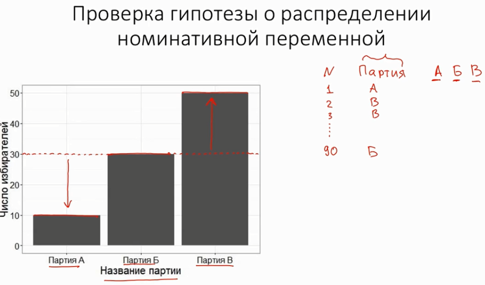

### Проверка гипотезы о взаимосвязи двух номинативных переменных

Дaнные о том, подействовало ли лекарство на больного

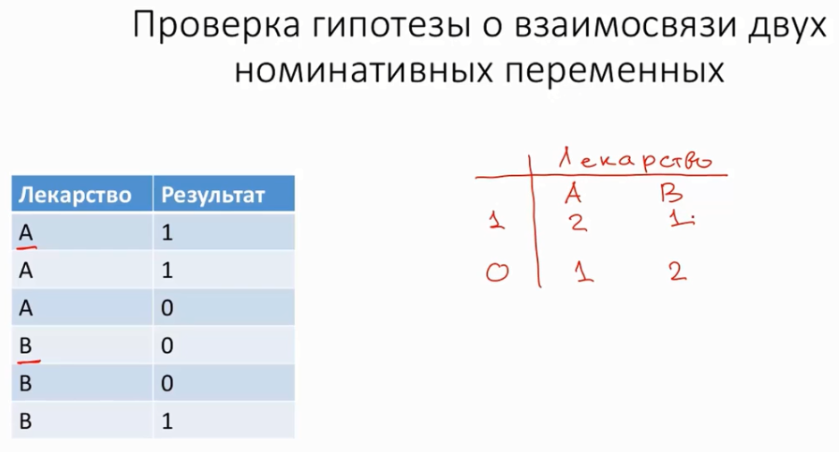

Обе переменные номинативные --- лекарство а, лекарство б. Поправился или не поправился

### Более сложные модели

Хотим предсказать, как влияют другие переменные на выздаровление.

Зависимая переменная нашего анализа будет являться номинативная переменная с двумя градациями. Такой тип регрессии называется логистическая регрессия.

## Расстояние Пирсона

Поговорим о том, как проверять гипотезу о различаях некоторого наблюдаемого распределения и предсказанного теоретического.

В случае номинативных данных основным показателем является подсчёт частоты встречаемости признака.

Гипотеза о том что некоторое наблюдаемое эмперическое распределение частот отличается от теоретического.
Для этого пойдём знакомым путём --- проверим п-уровень значимости. 
Зафиксируем насколько сильно отклоняется предсказанное от теоретического.

Для начала проверим гипотезу о том, что орёл и решка выпадает равновероятно.

### Подброс монетки

Результат бросания монетки это --- номинативная переменная орёл или решка.
Подбрасываем 60 раз. Предположим орёл выпал 40 раз, решка 20.

Нулевая гипотеза: распределение орла и решки равновероятна.

Альтернативная гипотеза: распределение орла отлично от распределения решки. Иными словами

$$H_0: p_{орла} = 0.5$$
$$H_1: p_{орла} \neq 0.5$$

Первое что мы должны сделать --- проверить на сколько отклоняются предсказанные от полученных.

Наблюдаемые обозначим буквой O (англ. Observe). Предсказанные E (Expected).


|              | Орёл | Решка| 
| --------     |:----:|:----:|
| Observe (O)  | $40$ | $20$ |
| Expected (E) | $30$ | $30$ |

Итак как работает статистика --- она говорит, окей есть нулевая гипотеза, есть ожидаемые резуьтаты, есть эмпирические данные. Смотрим есть ли расхождения. Нужно получить некое численное значение.

Далее мы говорим: а если бы нулевая гипотеза была верна, и мы много раз повторяли эксперимент, то как бы вела некая интересующая нас статистика.

Первое что приходит на ум: смотреть разность ожидаемых и наблюдаемых.

$$d = (O_1-E_1) + (O_2-E_2) = (40-30) + (20-30) = 0$$

Это не самый лучший вариант, посколько в итоге мы получили что отклонений нет

Можно возвести в квадрат разности, чтобы избавиться от минуса.

$$d^2 = (O_1-E_1)^2 + (O_2-E_2)^2 = (40-30)^2 + (20-30)^2 = 200$$
Но такой вариант тоже плохой. Потому что в такой формуле получается, что одно и то же значение  $d^2$  может характеризовать как довольно значительные, так и практически несущественные расхождения между наблюдаемыми и ожидаемыми частотами. Если бы у нас была другая выборка:

|              | Орёл   | Решка  | 
| --------     |:------:|:------:|
| Observe (O)  | $1040$ | $1020$ |
| Expected (E) | $1030$ | $1030$ |

То мы получили бы точно такое же численное значение

$$d^2 = (O_1-E_1)^2 + (O_2-E_2)^2 = (1040-1030)^2 + (1020-1030)^2 = 200$$

Пирсон тоже понял что такой подход неправильный. И математически доказал, что корректна будет формула

$$X^2_{Pearson} = \sum_{i=1}^{k}\bigg(\frac{O_i-E_i}{\sqrt{E_i}}\bigg)^2$$
k --- это все наши ячейки. Из этой формулы следует два простых вывода:

* Расстояние хи-квадрат Пирсона может равняться нулю.

* Расстояние хи-квадрат не может быть отрицательным.

Или в нашем случае это будет

$$X^2_{Pearson} = \sum_{i=1}^{k}\bigg(\frac{O_i-E_i}{\sqrt{E_i}}\bigg)^2 = (\frac{(40-30)}{\sqrt{30}})^ 2 - (\frac{(20-30)}{\sqrt{30}})^2 = \frac{100}{30} + \frac{100}{30} \approx 6.7 $$

Теперь второй вопрос --- если верна нулевая гипотеза, как бы вёл себя этот показатель $\chi^2$ при многократном повторении. И для этого нам надо познакомиться с распределением $\chi^2$

### Пример

В одном из опытов эмпирическое распределение частот некоторого цвета гороха приняло следующий вид: $O = \{18,55,27\}$

Чему будут равны ожидаемые значения частот, если предполагаемое теоретическое распределение имеет следующий вид: 1:2:1

Решение: У нас есть суммарное количество появления разных признаков $18+55+27=100$.
Есть суммарное отношение ожидаемых частот $1+2+1=4$.
Получаем что одна часть ожидаемого признака равняется $25$. Значит ожидаемые значения частот равны $E = \{25,50,25\}$

### Пример 2

Рассчитаем для этого случая значение $\chi^2$

$$X^2_{Pearson} = (\frac{(18-25)}{\sqrt{25}})^2 + (\frac{(55-50)}{\sqrt{50}})^2 + (\frac{(27-25)}{\sqrt{25}})^2 = \frac{196+50+16}{100}=2.62$$

## Распределение Хи-квадрат Пирсона

Как будет выглядеть распределение?

Один из действенных подходов --- сделать симуляцию.

### Симуляция распределения

Итак что будем симулировать:

  1. 60 раз подбрасываем монетку. 
  
  2. Записываем сколько выпало орлов, а сколько решек.

  3. Ожидаем что выпадет 30 на 30.

  4. Считаем критерий хи-квадрат.
  
  5. Повторяем пункты 1-4 100 раз
  
100 раз повторяется эксперимент с подбрасыванием симметричной монетки 60 раз. 
Расстояние хи-квадрат рассчитывается для каждого эксперимента:

```{r}
chi_square_distance <- function() {
  e <- c(30, 30)
  sum((table(sample(x = 2, size = 60, replace = TRUE)) - e) ^ 2 / e)
}

results <- replicate(100, chi_square_distance())
hist(results)
```

Так замечательно, а теперь мы хотим знать --- какова вероятность получить такие или ещё более выраженные отклонения.

Если верна нулевая гипотеза --- то чаще всего отклонения между ожидаемым числом и наблюдаемым не будут большие. Сильные отклонения будут встречаться реже.

Это говорит, о том, что распределение будет нормальным

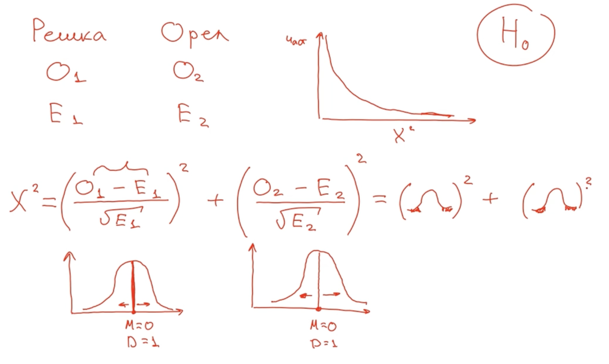

### Определение распределения Хи-квадрат

Мы вяснили --- если мы многократно повторяем эксперимент, и смотрим не сумма, а каждое слагаемое в отдельности.
То оказывается, что если верна нулевая гипотеза, то отклонения чаще всего не значительны и будут встречаться равновероятно как в одну так и в другую сторону.

Распределение Хи-квадрат с k-степенями свободы --- это распределение суммы квадратов k-независимых стандартных нормальных случайных величин.

Стандартное распределение --- нормальное распределение, где среднее равно нулю, а дисперсия единице.

Независимые --- это тот факт, что каждое последующее измерение не зависит от измерения предыдущего.

Для того чтобы понять откуда берётся каждое значение в распределении Хи-квадрат с двумя степенями свободы, давайте визуализируем весь процесс.

Предположим мы сделали программу, которая генерирует две стандартные случайные величины.

Вероятность получить значение хи-квадрат равное или большее 5.9 равняется 0.05. Это и есть критическое значение для 

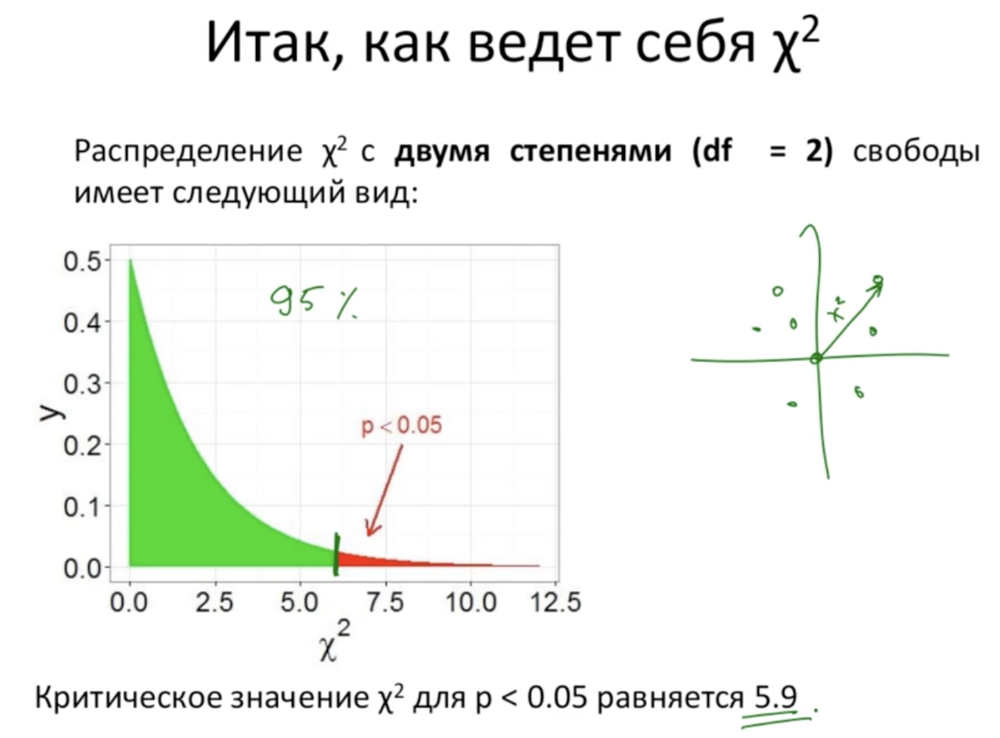

При достаточно большом количестве степеней свободы, распределение $\chi^2$ стремится к нормальному.

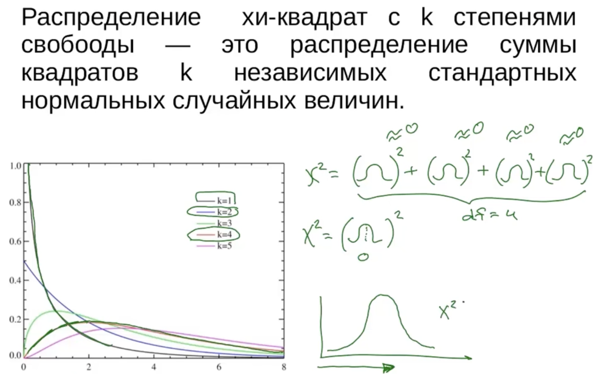

## Расчёт p-уровня значимости

Итак, вспомним наши данные

|              | Орёл | Решка| 
| --------     |:----:|:----:|
| Observe (O)  | $40$ | $20$ |
| Expected (E) | $30$ | $30$ |

И распределение Хи-квадрат для этих данных.

$$X^2_{Pearson} = \bigg(\frac{O_1-E_1}{\sqrt{E_1}}\bigg)^2 + \bigg(\frac{O_2-E_2}{\sqrt{E_2}}\bigg)^2 $$

Если бы каждое из этих слогаемых было бы стандартным нормальным распределением в квадрате, то формула расстояния идеально бы описывалась нормальным распределением. 

Но эти измерения должны дыть независимы. Зная что выпало в первой ячейке, зная общее значение выпаших частот, зная ожидаемое распределение, мы всегда знаем чему равно второе слагаемое.

При этом нарушается требование независимости. Это является ярким подтверждением того, что получившееся распределение имеет только одну степень свободы

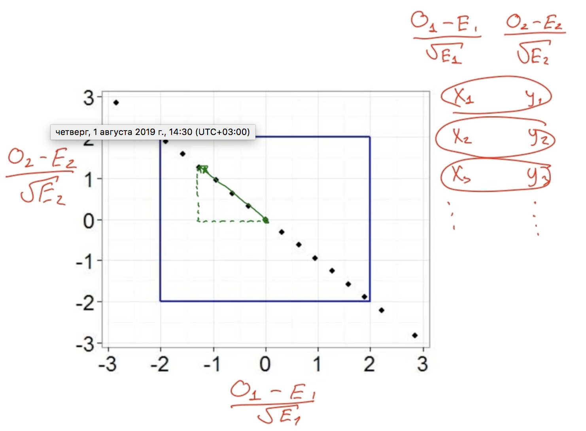

Когда у нас несколько переменных (n = 4) и точное значение выборки(u) то при знании v1, v2,v3 мы сможем точно сказать v4.
v4 = u - (v1+v2+v3). То есть, нам не надо знать значение последней переменной n-1

Эта логика может быть обобщена для общего случая.

Итак, мы посморели чему равен критерий, теперь можно при помощи табличных данных установить чему будет равен p-уровень значимости.

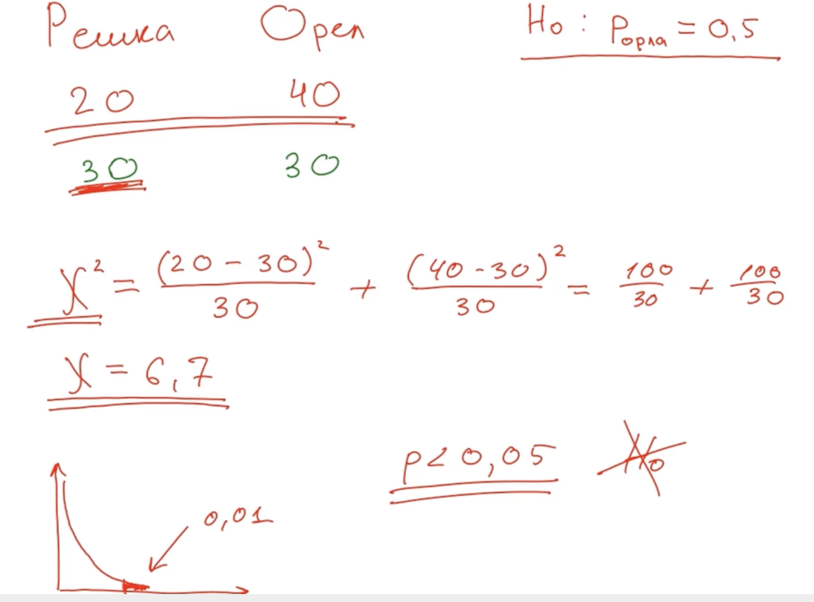

Табличные значения можно посмотреть на сайте.

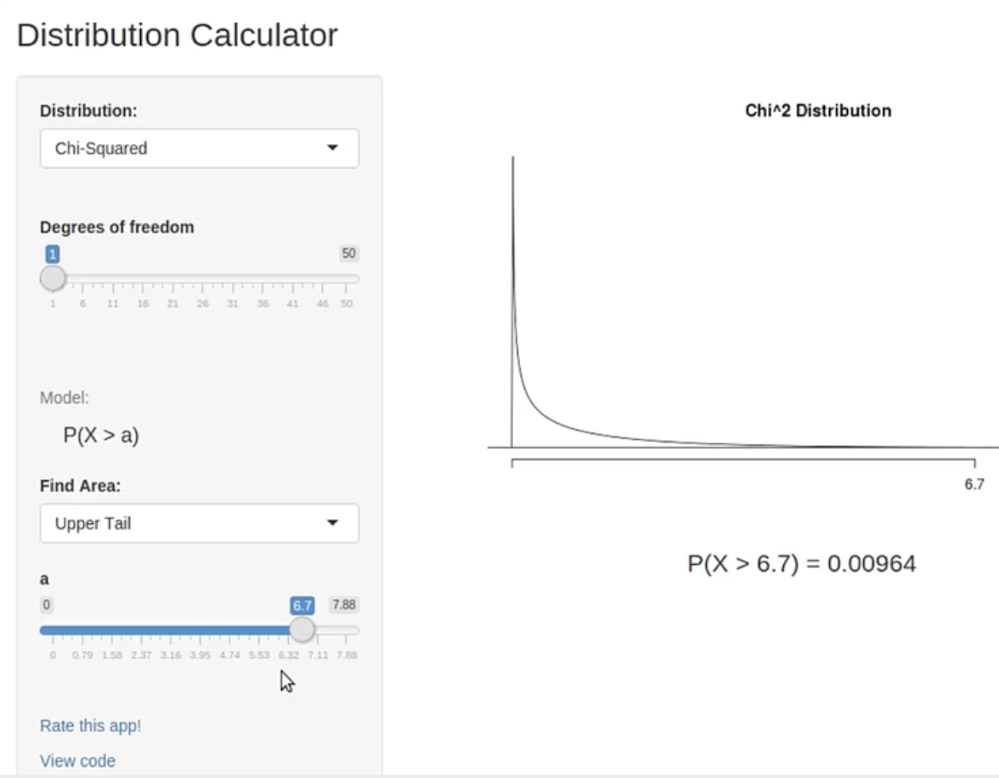

### Задача

Какой процент наблюдений лежит в диапазоне от 2 до 4 у распределения хи-квадрат с двумя степенями свободы?

[Калькулятор p-уровня значимости](https://gallery.shinyapps.io/dist_calc/)

Ответ: 

  * Для 4 --- P(X > 3.99) =
  
  * Для 2 --- P(X > 2) = 0.368
  
  Ответ: $$0.368 -  0.136 =  0.233$$

### Задача

Теперь рассчитаем p-уровень значимости для нашего примера с игральной костью. Напомню, что мы получили следующие значения наблюдаемых частот (от единички до шестерки):

10,10,10,5,10,15 

Проверьте нулевую гипотезу о том, что эмпирическое распределение частот не отличается от равномерного. В поле для ответа введите получившийся p-уровень значимости. 

[Калькулятор p-уровня значимости](https://gallery.shinyapps.io/dist_calc/)

Решение 
  * df = 5

  * O = $\{10,10,10,5,10,15\}$

  * E = $\{10,10,10,10,10,10\}$
  
$$\chi^2 = 4 \times \bigg(\frac{10-10}{\sqrt{10}}\bigg)^2 + \bigg(\frac{5-10}{\sqrt{10}}\bigg)^2 + \bigg(\frac{15-10}{\sqrt{10}}\bigg)^2 = 0 + \frac{25}{10} +\frac{25}{10} = 5$$

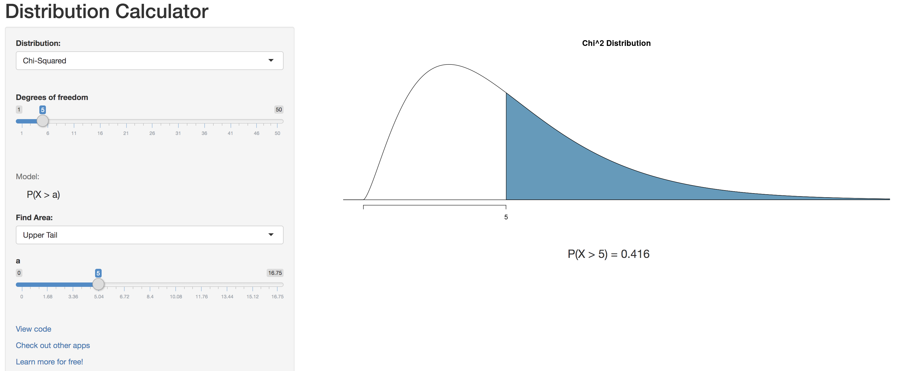

### Задача

Вернемся к нашему примеру с политическими партиями! Проверьте гипотезу о том, что в ГС нет никаких различий в предпочтениях трех партий. Введите в поле для ответа получившееся значение статистики хи-квадрат с точностью хотя бы до одной цифры после запятой.

  * партия А = 10 голосов
  
  * партия Б = 30 г.
  
  * партия В = 50 г.

df = 2

Нулевая гипотеза --- распределение для всех партий одинаково. Т.е. если всего 90 голосов, то 

  * E = $\{30, 30, 30\}$

  * O = $\{10, 30, 50\}$
  
$$\chi^2 = \bigg(\frac{10-30}{\sqrt{30}}\bigg)^2 + 0 + \bigg(\frac{50-30}{\sqrt{30}}\bigg)^2 =\frac{80}{3} = 26.67$$

Проинтерпритиуем полученный рузельтат.

p < 0.05 --- отклоняем нулевую гипотезу.

Принимаем альтернативную гипотезу, что распределение предпочтений избирателей отличается от равномерного.
Отвергаем нулевую гипотезу о том, что число сторонников каждой из трех партий в генеральной совокупности одинаково.

```{r}
(0.53 * 1500) - 1500

45 * 45 * 2 / 750
```

### Задача

В 2013 году Эдвард Сноуден передал СМИ секретную информацию АНБ, касающуюся слежки американских спецслужб за информационными коммуникациями между гражданами. Однако его поступок вызвал неоднозначную реакцию в обществе. Исследовательский центр USA TODAY провел опрос 1500 граждан США с целью выяснить, воспринимают ли они поступок Сноудена как положительный или отрицательный. 53% опрошенных респондентов оценили разоблачение положительно.

При помощи теста хи-квадрат проверьте нулевую гипотезу о том, что в генеральной совокупности распределение отношения к поступку Сноудена является равномерным, то есть 50 на 50.

Решение

  * n = 1500
  
  * df = 1
  
  * E = $\{750; 750\}$

  * O = $ \{0.53 * 1500; 0.47 * 1500\} = \{795; 705\}$
  
  * Нулевая гипотеза --- в генеральной совокупности распределение отношения к поступку Сноудена является равномерным, то есть 50 на 50.
  
  * Альтернативная --- распределение отношения является не равномерным
  
  $$\chi^2 = \bigg(\frac{795-750}{\sqrt{750}}\bigg)^2 + 0 + \bigg(\frac{705-750}{\sqrt{750}}\bigg)^2 =\frac{4050}{750} = 5.4$$
  
  * $P(X > 5.4) = 0.0201$ --- отвергаем нулевую гипотезу, принимаем альтернативную.
  
## Как при помощи критерия Хи-квадрат проверять гипотезу о взаимосвязи двух номинативных переменных

Идея такая же --- мы сравниваем две частоты ожидаемые и полученные.

В таблице сопряженности мы просто подбиваем итоговые распределения по двум перменным.

Далее формулируем нулевую гипотезу и альтернативную. В примере со студентами-биологами может быть следующая таблица:

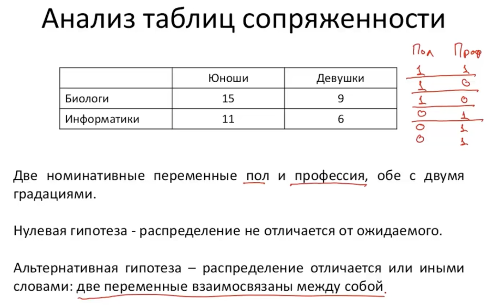

Итак. Немного расширим нашу таблицу

Нулевая гипотеза --- распределение никак не зависит от пола и профессии.


### Расчёт ожидаемых значений 

Как тогда заполнить таблицу ожидаемых значений? Можно просто поделить общее число человек на 4 и в каждой ячейке записать по примерно 10 человек. Но это плохой подход.

Тот факт что две переменные не зависят между собой, надо интерпритировать следующим образом --- распределение соотношения мужчин и женщин как для биологов так и для информатиков.

Например если распределение Ж-М для информатиков 30 на 70. То и для биологов должно быть такое же распределение 30 на 70.

Если у нас дисбаланс классов, мы должны заполнить табличку сопряжённости так, как если бы распределение признаков было в классах одинаково.

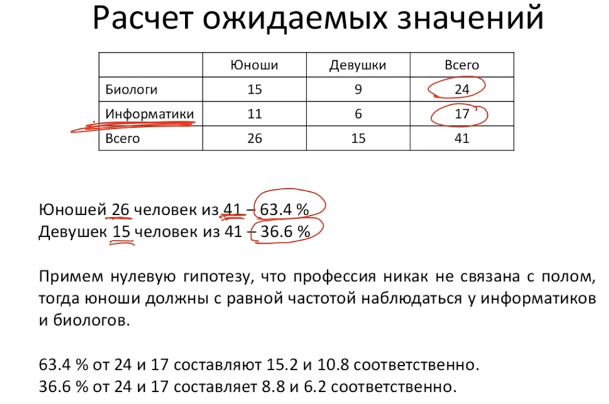

Итак, теперь в общем виде это выглядит так:

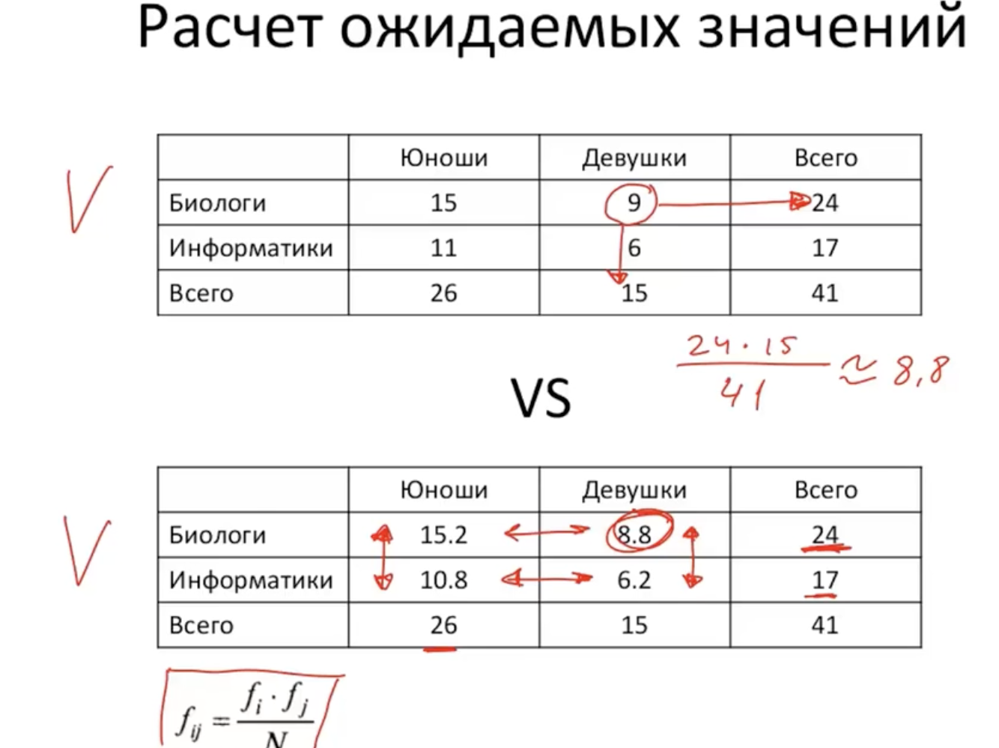

Где:

  * $f_i$ --- число наблюдений в $i$−ой строке
  
  * $f_j$ --- число наблюдений в $j$−ом столбце
  
  * $N$ --- общее число наблюдений в таблице
  
Переведём это в программные вычисления
  
```{r}
O <- matrix(c(15, 11, 9, 6), ncol = 2)
E <- outer(rowSums(O), colSums(O)) / sum(O)
# выводим результаты
print(addmargins(O))
print(addmargins(E))

# готовое решение
print(chisq.test(O)$expected)

# Задача
O1 <- matrix(c(10, 5, 6, 15), ncol = 2)

chisq.test(O1)$expected
```

### Расчёт значения Хи-квадрат 

Само вычсиление не должно вызывать трудности.

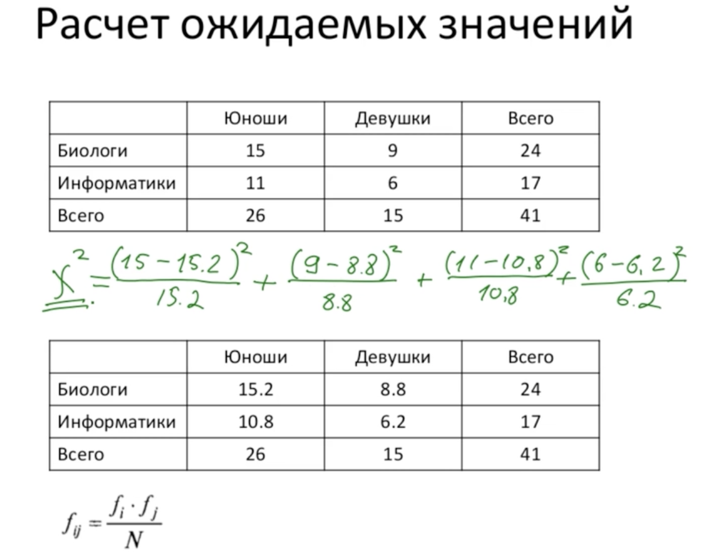

Основной вопрос в том --- сколько степеней свободы у этого распределения.

С одной стороны можно подумать, что здесь 4 степень свободы --- по числу ячеек. Но это на самом деле не верно.

Потому что зная только одно значение ячейки и сумму во всех остальных ячейках мы можем вычислить значение в каждой ячейке.

Это означает что корректной t-статистикой будет значение степеней свободы равное 1.

$$df = 1$$

###  Поправка Йетса

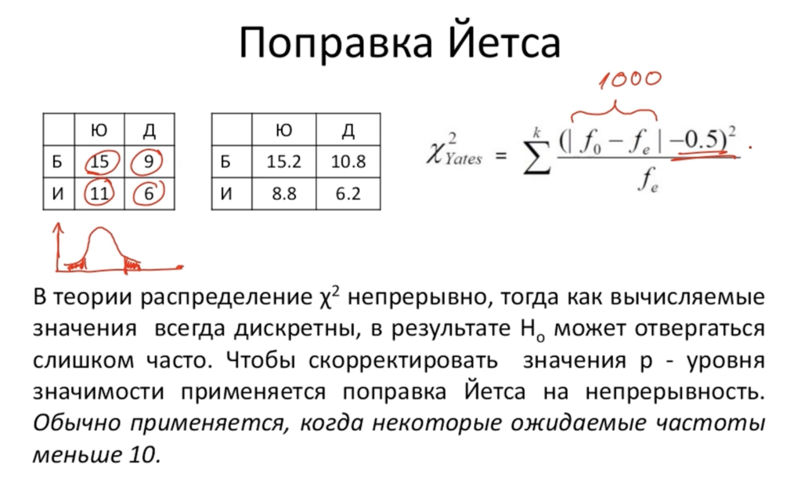

###  Расчёт P-уровня значимости

На слайде ошибка, но ход мыслей один и тот же.

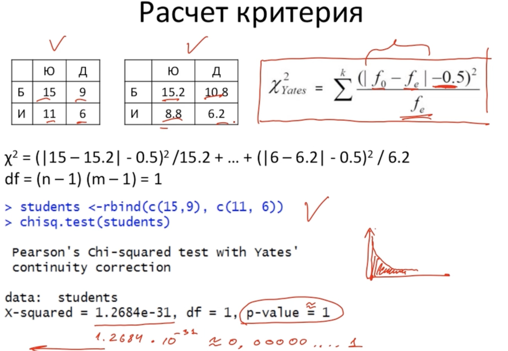

Вот корректное вычисление:

```{r}
O <- matrix(c(15, 11, 9, 6), ncol = 2)
E <- outer(rowSums(O), colSums(O)) / sum(O)
test <- sum((O - E)^2 / E)
df <- (ncol(O) - 1) * (nrow(O) - 1)
pval <- pchisq(test, df, lower.tail = FALSE)
# сравним результат
print(list(chisq = test, df = df, p.value = pval))
print(chisq.test(O, correct = FALSE))
```

### Итоги

Критерий Хи-квадрат Пирсона это метод который позволяет нам анализировать номинативные данные.

Первый тип гипотезы --- распределение частот некоторого признака отличается от заданного теоретического.

Второй --- две переменные взаимосвязаны между собой.

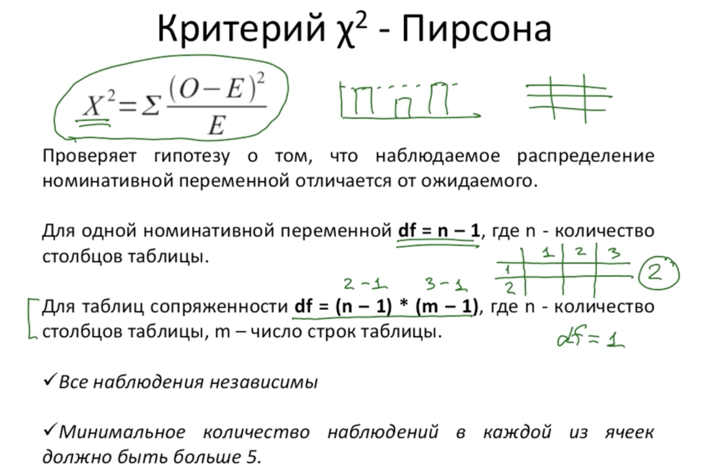

Этот критерий говорит о поведении данных в сумме, но мы не можем сказать в какой именно ячейке было отклонение.

Например в случае голосования за партии --- единственное что мы можем сказать, что распределение выбора партий отличается от равномерного.

### Задача 

Перед знаком стоп некоторые водители останавливаются полностью, другие лишь сбавляют скорость, но некоторые не останавливаются вообще. Важнейший вопрос, есть ли взаимосвязь между полом и стилем вождения автомобиля!  Ниже представлена таблица сопряженности данных исследования, посвященного этому вопросу.

|           | Муж | Жен | 
| --------  |:---:|:---:|
| Тормозят  | 20  | 15  |
| Притормаж | 11  | 12  |
| Не тормоз | 7   | 9   |

```{r}
O <- matrix(c(20, 11, 7, 15, 12, 9), ncol = 2)
E <- outer(rowSums(O), colSums(O)) / sum(O)
test <- sum((O - E)^2 / E)

print(chisq.test(O, correct = FALSE))

```

##  Уточним результаты

Очень популярен анализ остатков. Разберём пример

Нельзя ли снизить риск тромбоза назначением небольших доз аспирина?

```{r}
#воспроизведём данные
patients <- rbind(c(18, 7), c(6, 13))
#подпишем строки и столбцы
colnames(patients) <- c("Yes", "No")
rownames(patients) <- c("Placebo", "Aspirin")
#вот график, который нам нужен
mosaicplot(patients, color=T, shade=T, ylab="Thrombosis", xlab="Group")
#а вот так можно в точности воспроизвести рисунок, который мы видели
mosaicplot(patients, color=T, shade=T, ylab="Thrombosis", xlab="Group", cex.axis=1, main="")
```


Разберемся, как здесь отображены наши данные. Ширина и высота каждого прямоугольника пропорциональны наблюдаемым частотам в соответствующих строках и столбцах. Цвет прямоугольника показывает величину стандартизированного остатка; если она по модулю больше 2, то прямоугольник будет полупрозрачным, если больше 4, то соответствующий прямоугольник будет закрашен.

Итого:
- размер прямоугольников  соответствует количеству наблюдений.
- цвет прямоугольников - величине значимости отклонения ожидаемых и наблюдаемых частот в этой ячейке.
- если значения стандартизированных остатков больше 3х, можно считать, что в этой ячейке зафиксированы значимые отклонения.

Кстати, давайте сдвинем наше распределение так, чтобы в нашем графике появились закрашенные ячейки.

```{r}
#воссоздадим таблицу
patients2 <- rbind(c(25, 1), c(3, 30))
#подпишем строки и столбцы
colnames(patients2) <- c("Yes", "No")
rownames(patients2) <- c("Placebo", "Aspirin")
#вот наш график
mosaicplot(patients2, color=T, shade=T, ylab="Thrombosis", xlab="Group", cex.axis=1, main="")
```

### Задача

Обратимся к данным о катастрофе «Титаника». На графике представлена взаимосвязь пола пассажира «Титаника» и того, выжил он или нет в катастрофе. Размеры прямоугольников отвечают за пропорции наблюдений в той или иной ячейке, а цвет прямоугольников — за значение стандартизованного остатка в ячейках. Какие выводы мы можем сделать, проанализировав данный график?

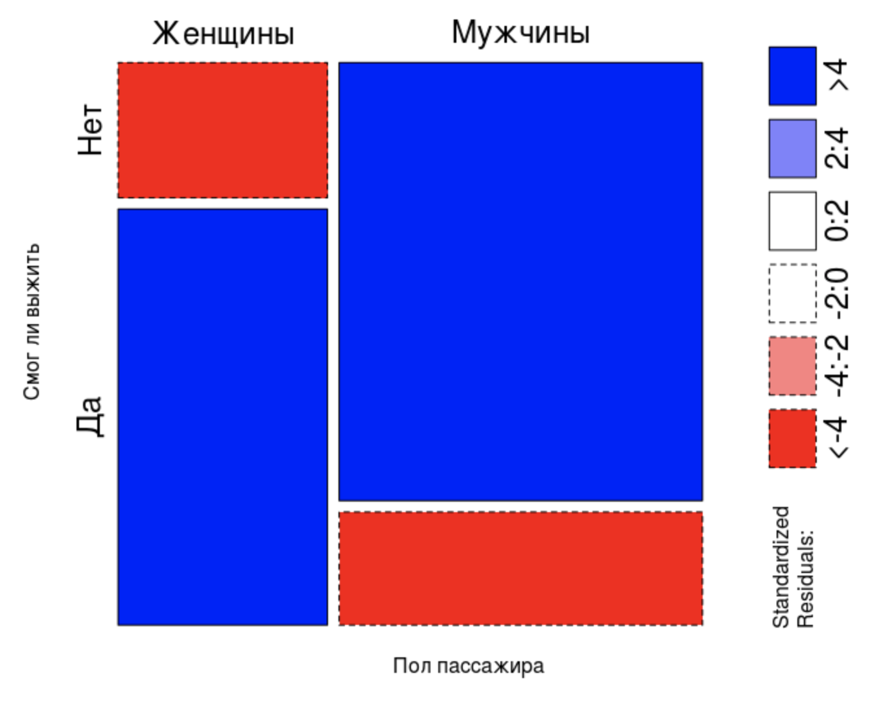

Ответ:

  *  Есть все основания отклонить нулевую гипотезу об отсутствии взаимосвязи пола и вероятности выжить в катастрофе.
  
  * Значимые отклонения между наблюдаемыми и ожидаемыми результатами получены во всех ячейках, что позволяет говорить: мужчины вероятнее погибнут, чем выживут, а женщины — наоборот.
  
  * На борту Титаника большинство пассажиров - мужчины
  
### Задача

А теперь изучим данные о взаимосвязи шанса выжить в кораблекрушении «Титаника» и класса билета пассажира. В данном случае график стандартизированных остатков построен по результатам таблицы сопряженности 3 на 2.

Какие выводы мы можем сделать в данном случае?

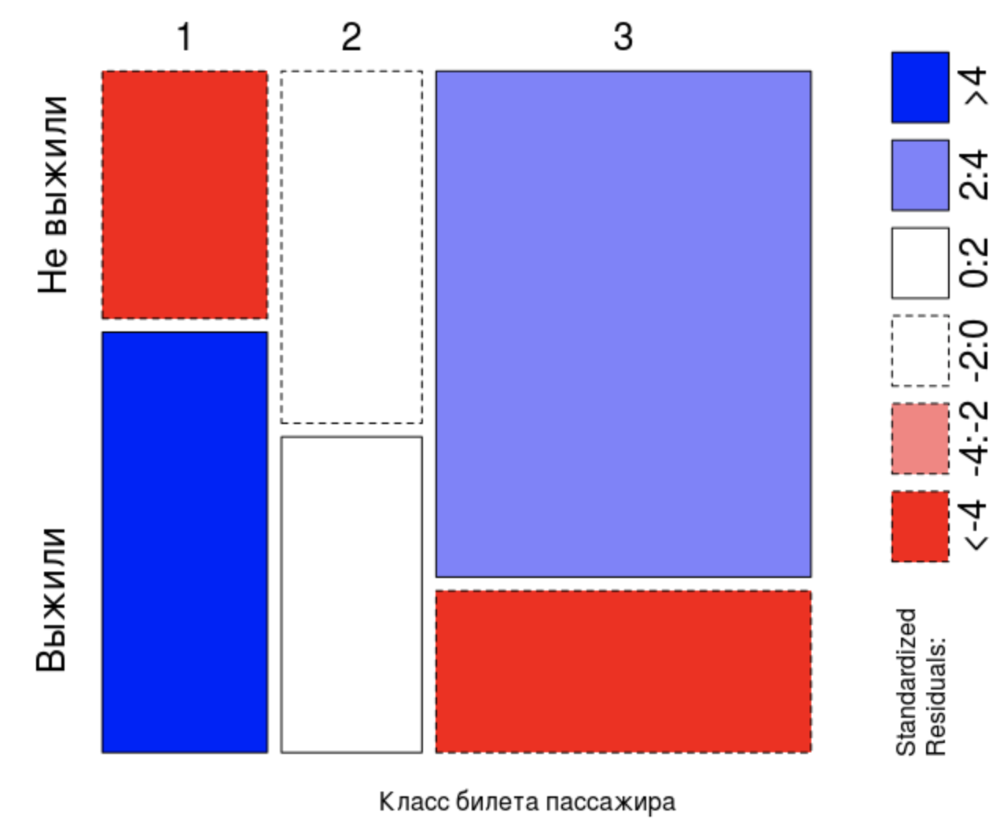

Ответ: 

  * Для пассажира с билетом первого класса вероятность выжить выше вероятности погибнуть.
  
  * Наши данные не позволяют нам сделать вывод о статистически значимом различии в вероятности выжить или погибнуть у пассажиров второго класса.
  
  * Пассажиры из третьего класса чаще погибали в катастрофе, чем пассажиры второго класса.
  

###  Задача

Допустим, мы решили провести исследование, целью которого было доказать влияние интересов водителей на безопасность их вождения. На выборке из 100 человек мы зафиксировали следующие показатели: смотрит ли человек онлайн-курсы на Stepic и попадал ли водитель в ДТП за последний год. В результате мы получили следующие данные:

```{r}
#воссоздадим таблицу
dtp <- rbind(c(10, 40), c(35, 15))
#подпишем строки и столбцы
colnames(dtp) <- c("Был в ДТП", "Не был в ДТП")
rownames(dtp) <- c("Проходит курсы", "Не проходит курсы")
#вот наш график
mosaicplot(dtp, color=T, shade=T, xlab="ДТП", ylab="Group", cex.axis=1, main="")

test <- chisq.test(dtp)
test
```

 Ответ
 
Не стоит забывать, что ошибка корреляции может быть совершена и при использовании критерия хи-квадрат. Полученные данные говорят лишь о взаимосвязи двух переменных, но при таком дизайне исследования мы не можем быть уверены в наличии причинно-следственной связи между переменными!


## Точный критерий Фишера

Анализ таблицы сопряженности, в которой экстремально мало наблюдений, в некоторых ячейках число ожидаемых и наблюдаемых частот может быть меньше пяти


При малых объёмах выборки (менее 5 наблюдений в ячейке) некорректно использовать Хи-квадрат.
Для того чтобы исправить эту ситуацию используется Точный критерий Фишера.

В основании этого критерия лежит простая идея --- предположим нет никакой связи между двумя группами.

Допустим есть такая группа:


Критерий говорит --- окей, если у нас есть выборка из 8 пациентов и верна нулевая гипотеза. Т.е. нет никакой взаимосвязи между вероятностью выздровления и тем типом лекарства который пациент использовал.
Тогда какова вероятность если мы выберем случайно 4 человек из Л1 и выберем случайно четырёх человек из Л2 и получим обратную картину.

Точный критерий Фишера можно применять и для больших выборок.

### Как работает точный критерий Фишера

Использем запись в общем виде


Нулевая гипотеза --- вероятность поправиться от лекарства 1 = вероятности лекарства 2. Нет никаких различий между использованием двух лекарств. Допустим эта вероятность = 0.5

Тогда можно ввести следующее обоззначение

X --- кол-во положительных исходов у пациентов №1

Y --- кол-во положительных исходов у пациентов №2

Какова вероятность, что мы веберем 10 пациентов (Л1), мы знаем что вероятность полож исхода = 0.5.
Какова вероятность, что мы будем набюлюдать троих человек с положительным исходом.

Это биноминальное распределение. Уравнение Бернулли нам поможет.

Если мы хотим ответить на поставленный вопрос. Вероятность будет равняться по формулле Бернулли, на скрине выше


Итак в общем виде это будет выглядеть вот так


Теперь если говорить про наш пример, то всё будет выглядеть вот так: 

Для вычисления биномиальных коэффициентов (сочетаний) в R используется функция choose (n, k)

```{r}
choose(4, 3)*choose(4, 1)/choose(8, 4)
```

### Итоги

* Критерий хи-квадрат --- Анализ таблицы сопряженности произвольного размера, где значения ожидаемых и наблюдаемых частот в каждой ячейке больше 10

* Критерий хи-квадрат с поправкой Йетса --- Анализ таблицы сопряженности два на два, где значения ожидаемых и наблюдаемых частот в каждой ячейке больше 5, но меньше 10

* Точный критерий Фишера --- Анализ таблицы сопряженности, в которой экстремально мало наблюдений, в некоторых ячейках число ожидаемых и наблюдаемых частот может быть меньше пяти

### Задача

Напишите функцию smart_test, которая получает на вход dataframe с двумя номинативными переменными с произвольным числом градаций. Функция должна проверять гипотезу о независимости этих двух переменных при помощи критерия хи - квадрат или точного критерия Фишера.

Если хотя бы в одной ячейке таблицы сопряженности двух переменных меньше 5 наблюдений, функция должна рассчитывать точный критерий Фишера и возвращать вектор из одного элемента: получившегося p - уровня значимости.

Если наблюдений достаточно для расчета хи-квадрат (во всех ячейках больше либо равно 5 наблюдений), тогда функция должна применять критерий хи-квадрат и возвращать вектор из трех элементов: значение хи-квадрат, число степеней свободы,  p-уровня значимости.