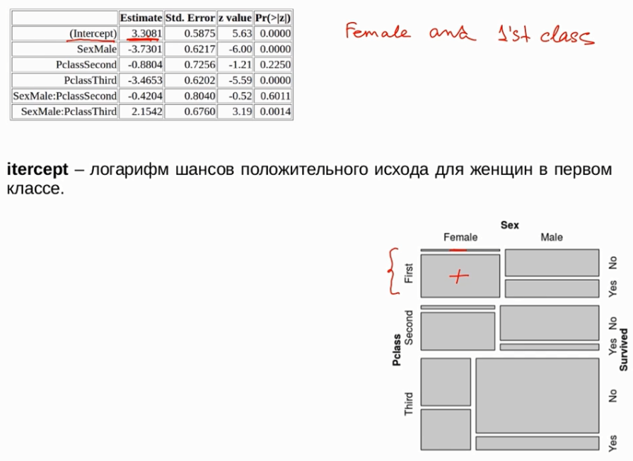

# Логистическая регрессия

При помощи логит можно строить регрессии на нескольких переменных.

Зависимая переменная должна иметь две градации.

## Постановка задачи


Основная идея: 

  * зависимая переменная --- номинативная переменная с двумя градациями
  
  * независимые переменные --- могут быть как номинативные, так и ранговые, количественные.
  
Есть масса задач:

  * принадлежит этот снимок здоровому или нездоровому пациенту
  
  * спам на почту пришёл или не спам
  
  * запрещённый это багаж или разрешённый
  
  * прошёл человек тестирование или не прошёл
  
Основная логика:

У нас есть некоторая зависимая переменная.

Пусть будет --- получил студент сертификат или не получил.

х1 --- сколько посетил лекций

х2 --- время которое провёл на рок концертах. (количественная)

х3 --- читал книжки по статистике или не читал (номинативная)


И тут первая проблема --- зависимая переменная имеет только две градации, а независимая может принимать значения $[-\infty; +\infty]$


Но это не трудно исправить. Мы переведём дело в вероятности. Тогда у нас будет слева уравнения количественная переменная со значениями от 0 до 1.

Как примирить вероятность с линейной комбинацией признаков?


Достаточно рассчитать натуральные логарифмы.

Итак, давайте перейдём от вероятности к логарифмам шансов.

Шансы определяются просто --- это отношение вероятности успеха к вероятности неудачи

* при стремлении вероятности к единичке, шансы (Odds) будут принимать очень большие значения.

* при стремлении вероятности к нулю, шансы будут принимать очень малые близкие к нулю значения 


тем самым половины проблемы решена --- мы теперь имеем значения от нуля до бесконечности. Теперь чтобы отодвинуть значения к минус бесконечности нужно взять натуральный логарифм от шансов (Odds)


Теперь построим несколько другой график.

По оси икс вероятность, по оски игрек логарифм шансов.

Логарифм может быть взять от сильно большого числа, так и от сильно маленького отрицательного.

Например 

* если у нас будет логарифм шансов 2000. Логарифм положительный --- шансы больше 1, вероятность положительного исхода больше отрицательного.

* если логарифм -1000. Логарифм отрицательный --- шансы меньше единицы, вероятность отрицательного исхода больше положительного.

Таким образом можно свести задачу к тому, что в правой части будет линейная комбинация предикторов, а в левой части мы будем предсказывать логарифм шансов нашего исхода.

Тем самым мы всегда сможем докапаться до вероятности --- избавивишись сначала от логарифмов, потом от шансов.

```{r echo=FALSE, out.width="100%", fig.align='center'}
knitr::include_graphics(".img/logit.png")
```

Тут стоит сказать что

n — это натуральный логарифм, здесь Вы совершенно правы, а с обозначением log небольшая путаница: эти три буквы должны бы обозначать логарифм вообще, но во многих языках программирования, в том числе в R, основа по умолчанию  — это e (а функции ln там вовсе нет). Поскольку сопровождающие курс примеры приведены на R, так и получилось.

### Задача 

Предположим, мы подбросили монетку 100 раз, и 70 раз выпал орел. Чему равняется натуральный логарифм шансов выпадения решки?

Чтобы не запутаться, давайте в этом задании рассматривать как "успех" - выпадение решки.

#### Решение

Успех --- выпадение решки

Неуспех --- выпадение орла

Тогда по формуле

$$ odds = \frac{P_+}{1 - P_+} = \frac{3}{7}$$
итого получаем

```{r}
log(3/7)
```

### Задача 

Предположим, что мы получили логарифм шансов выпадения решки, равный -1. Тогда вероятность выпадения решки равняется:

#### Решение

$ln(x)=y$ это эквивалентно выражению $x = e^y$. Или для нашей задачи $odds = e^{-1}$. Тогда $odds = \frac{p}{1-p}=e^{-1}$ тогда $p = \frac{e^{-1}}{1 + e^{-1}}$

Где p это вероятность выпадения решки.

```{r}
e <- exp(1)

e^(-1) / (e^(-1) + 1)
```

## Модель без предикторов

Итак, мы получаем уравнение, слева у которого количественная перменная значения которой это натуральный логарифм от минус до плюс бесконечности. Справа разного рода переменные (предикторы) с коэффициентами.

$$z = b_0 + b_1x_1 + ... + b_ix_i$$

О том как выбирать коэффициенты поговорим позже. Это делается методом максимального правдоподобия. Но логика не сложная --- коэффициенты выбираем так, чтобы всё максимально предсказывалось.

Свободный член регрессии $b_0$ (intercept)  - это логарифм шанса положительного исхода.

### Построение модели

Используем данные "титаник"

```{r}
library(dplyr)
library(ggplot2)
library(vcd)

titanic <- read.csv("https://stepic.org/media/attachments/course/524/train.csv")
titanic <- na.omit(titanic)
glimpse(titanic)
titanic <- mutate(titanic, 
                  Survived = factor(Survived, labels = c("No", "Yes")), 
                  Pclass = factor(Pclass, labels = c("First", "Second", "Third")), 
                  Sex = factor(Sex, labels = c("Female", "Male")))

titanic <- as_tibble(titanic)
```

Построим мозаичный график, для составления первичного понимания данных

```{r}
mosaic(~ Sex + Survived | Pclass, data=titanic)
```

Построим простую модель --- без предикторов.

```{r}
simple_fit <- glm(Survived ~ 1, titanic, family = "binomial")
```

Посмотрим какой коэффициент у этой модели
```{r}
coef(simple_fit)
```

Мы видим что в нашем случае существует только один "Intercept" и значение этого коэффициента равно -0.38.

Что означает эта модель на практике? Мы хотим сказать следующее. 
У нас есть зависимая переменная `Survived`, т.е. переменная Y и мы хотим построить модель где Y равняется одному числу Y - intercept. 

Иными словами мы хотим предсказать для некоторых данных о пассажире выжил он или нет только одно число.

Итак, что же это за число? Какое мы должны подобрать число, чтобы наша модель была самой лучшей. 
Построим простую табличку,

```{r}
table(titanic$Survived)
```

Она показывает распределение частот нашей номинативной переменной. 420 челове погибло, 290 выжило. Теперь мы можем расчитать шанс того, что случайный пассажир нашей выборки выживет.

```{r}
odds <- 290 / 424
odds
```

Он меньше единички, это разумно --- если шанс меньше единички, вероятно положительного исхода меньше чем отрицательного.

Берём логарифм шанса:

```{r}
log(odds)
```

И видим знакомое нам число. Теперь если вернёмся к нашей модели

```{r}
summary(simple_fit)$coefficient
```

То значение Estimate и будет значение Intercept.

Ещё раз посмотрим на наши выводы. Мы говорим подбери нам одно число, которое максимально удачно спрогнозирует нам какое значение зависимой переменной мы получим для любого нового случайного пассажира.

Регрессионная модель не может ничего лучше чем предсказать грубо говоря, вероятно которую мы считали по нашей выборки. И мы вытащим логарифм шансов.

Итак --- Intercept вот в такой модели без предикторов это будет просто натуральный логарифм шансов положительного исхода по всей нашей выборке. 

Такая регрессионая модель решает задачу. У нас есть отрицательный Intercept, и он статистически значимо отличается от нуля. Что это одначает --- логарифм шансов значимо меньше нуля, значит шансы значимо меньше единицы, значит вероятность выжить значимо меньше чем умереть. 

### Что означают другие коэффициенты в этой модели?

Если верна нулевая гипотеза, мы не должны встречать часто значимые отклонения.


  * Std. Error --- это стандартное отклонение Intercept, которое мы получаем
  
  * z value


### Задача 

Свободный член логистической регрессии без предикторов, равный 0.5, означает, что:

#### Решение

Если `ln(odds)= 0.5` тогда шансы (odds) положительного исхода равны

```{r}
e <- exp(1)
e^(0.5)
```

вероятность положительного исхода равна

```{r}
e^(0.5) / (e^(0.5) + 1)
```


### Задача 

P < 0.05 для свободного члена логистической регрессии означает, что:
(укажите верные высказывания)


Вероятности двух исходов зависимой переменной значимо различаются между собой

Распределение исходов в нашей выборке значимо отличается от равномерного


### Задача 

С помощью логистической регрессии без предикторов мы захотели узнать, правда ли, что сдавая Анатолию Дмитриевичу, легче провалить экзамен, чем сдать. В нашей выборке было 50 студентов. Часть из них сдала экзамен (положительный исход), а часть - нет (отрицательный исход). Свободный член нашей регрессии оказался равен -0.8472979. Сколько человек всё-таки сдало экзамен?

#### Решение

Шансы (odds) положительного исхода равны

```{r}
e^(-0.8472979)
```

тогда вероятность положительного исхода равна

```{r}
e^(-0.8472979) / (e^(-0.8472979) + 1)
```

Тогда, при условии, что положительный шанс равен 30%, а всего 50 студентов, то сдадут экзамен

```{r}
e^(-0.8472979) / (e^(-0.8472979) + 1) * 50
```

15 человек

## Модель с одним номинативным предиктором

Для создания модели используется следующая запись

```{r}
fit1 <- glm(Survived ~ Sex, titanic, family = "binomial")
coef(fit1)
```

Итак --- зависимая переменная (выжил-не выжил), независимая перменная, т.е предиктор, это пол.

Что мы имеем, Intercept стал положительным числом, а перменная "пол" представлена только одной градацией. И значение при этой градации -2,5 примерно

Давайте разбираться. Давайте построим табличку сопряжённости между полом и выжили или нет человек. и посмотрим сколько наблюдений попало в какую

```{r}
table(titanic$Survived, titanic$Sex)
```

Таблица говорит --- что возможно есть взаимосвязь, что женщины выживают чаще. Тогда мы можем рассчитать шанс выжить отдельно.

Шанс выжить для мужчин равен отношению числа положительных исходов (выжил), к числу отрицательных (погиб). Для женщин тоже самое

```{r}
(odds_male <- 93 / 360)
(odds_female <- 197 / 64)
```

Но шанс для мужщин выжить заметно меньше единицы, а для женщин выше единицы.

Теперь рассчитаем натуральный логарифм шанса выжить для женщин

```{r}
log(odds_female)
```

Возвращаемся к нашим коээфициентам:

```{r}
coef(fit1)
```

Это и есть Intercept. Тогда что же будет за число при SexMale.

Это так называемое отношение шансов. Мы берём шансы для муж и делим на шансы для жен. То есть сравним шансы выжить. 

```{r}
(odds_ratio <- odds_male / odds_female)
```

Эти шансы оказались довольно небольшим числом сильно меньше единицы. Это означает что шансы для женщин сильно превышают шансы для мужчин.

Теперь берём логарифм этого отношения

```{r}
log(odds_ratio)
```

Это будет наш второй коэффициент

### Интерпретация результатов

Первый вопрос:  почему в качестве предикторов в таблице указано только одно значение градации предиктора?

Ответ: Предположим наши данные образованы следующим способом

| Номер  | Выжил  |Sex_female  |Sex_male  |
| ------ | ------ | ---------- | -------- |
| 1      | 0      |0           |1         |
| 2      | 1      |0           |1         |

Примерно таким образом машина достраивает нашу модель. Но нам с точки зрения здравого смысла достаточно знать только один столбец пола.

Такой способ кодирования справедлив для любой номинативной линейной регрессии. 

Итак, одна из градаций уходит в Intercept.
Какую градацию выбрать, R решает автоматически в алфавитном порядке.

Интерсепт это логарифм для одной из градаций. А второй коэффициент это значение при изменении с одной градации на другую.

Посмотрим, на коэффициенты ещё раз

```{r}
summary(fit1)
```

Если наш пасажи жен. то его вероятность выжить будет равна интерсепту. Если пассажир мужчина, вероятность выжить будет равна. Интерсепту плюс коэффициент при переходе к другому полу


### Задача 

Как я уже говорил, очень часто при интерпретации результатов логистической регрессии для удобства рассчитывают значение экспоненты коэффициентов, чтобы избавиться от натурального логарифма.  

В задачах я иногда буду просить вас проинтерпретировать именно значение экспоненты исходных коэффициентов.

```{r}
summary(fit1)$coefficients
```

Давайте убедимся, что мы с вами одинаково понимаем, как это происходит!)


### Задача 

А что мы могли бы сделать с нашей регрессионной моделью, чтобы получить значение логарифма шансов для мужчин? 

  * Построить модель заново, но отсортировать уровни фактора таким образом, чтобы значение Male стало референтным. Тогда в intercept сохранится нужное нам значение 
  * В уже имеющейся модели к значению intercept прибавить значение коэффициента sexMale


#### Решение

```{r}
e^(1.124321) + e^(-2.477825)
```

### Итоги

Когда в качестве предиктора выступает одна номинативная переменная, мы смотрим на коэффициенты и смотрим какой градации нету среди коэффициентов. 

Значит в Interceprt лежит именно эта градация. Точнее там натуральный логарифм шансов положительного исхода.

А коэффициент при второй градации это сила изменения шансов с одной градции на другую. Точнее отношение шансов. А ещё точнее логарифм отношения.


```{r}
e^(0.6451) / (1 + e^(0.6451))
```


Как определить предикто статистически значим? Логика простая --- сравним модель с предиктором и модель без предиктора. И если значения остатков стали меньше, значит модель стала лучше

## Модель с двумя номинативным предиктором

Включим ещё одну переменную класс билета в модель.

Построим эту модель, добавим эту переменную вместе с взаимодействием

```{r}
fit2 <- glm(Survived ~ Sex * Pclass, titanic, family = "binomial")
coef(fit2)
summary(fit2)
```

Что является Интерсептом? 
Посмотрим на главные компоненты. 
Там сейчас находится SexMale, PclassSecond, PclassThird. 
Это означает что в (Intercept) сейчас находится женщины в первом классе.
Как это рассчитать?

Построим табличку которая показывает взаимосвязь между полом пассажира, их класса, и выжил пассажир или нет.

```{r}
table(titanic$Survived, titanic$Pclass , titanic$Sex)
```


По этим данным мы можем рассчитать значения для базового уровня, который сейчас находится в Intercept.

```{r}
female_p1_odds <- 82 / 3
log(female_p1_odds)
```



Разберёмся с остальными коэффициентами
