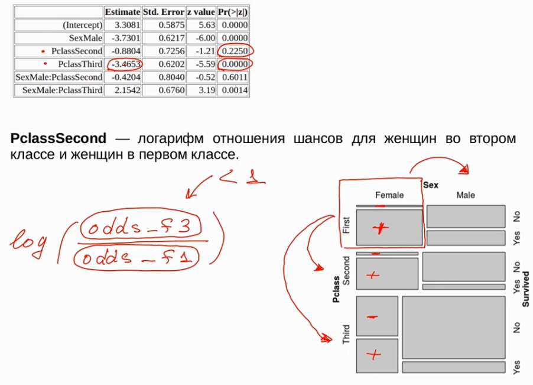
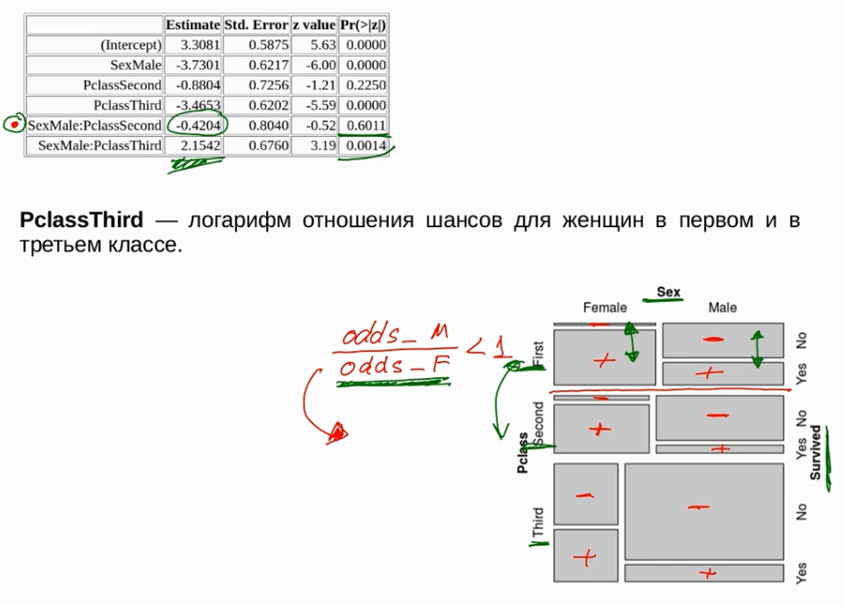
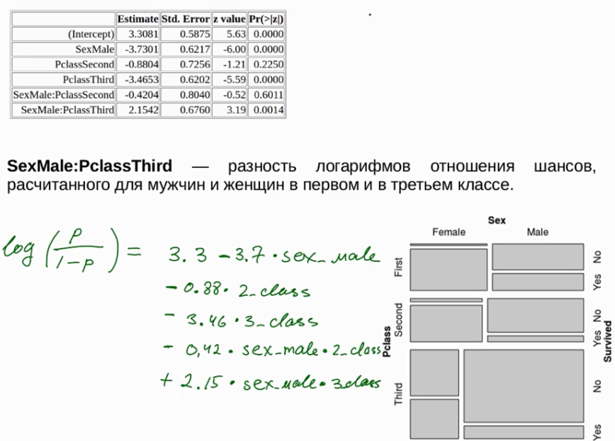
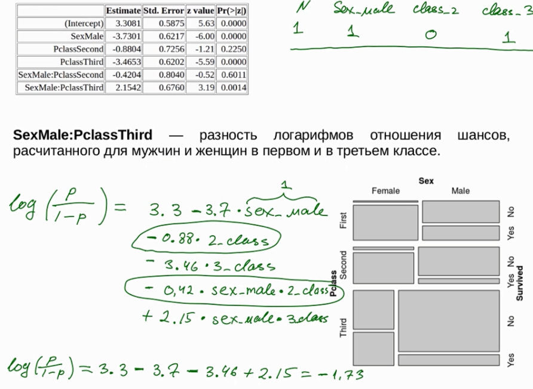
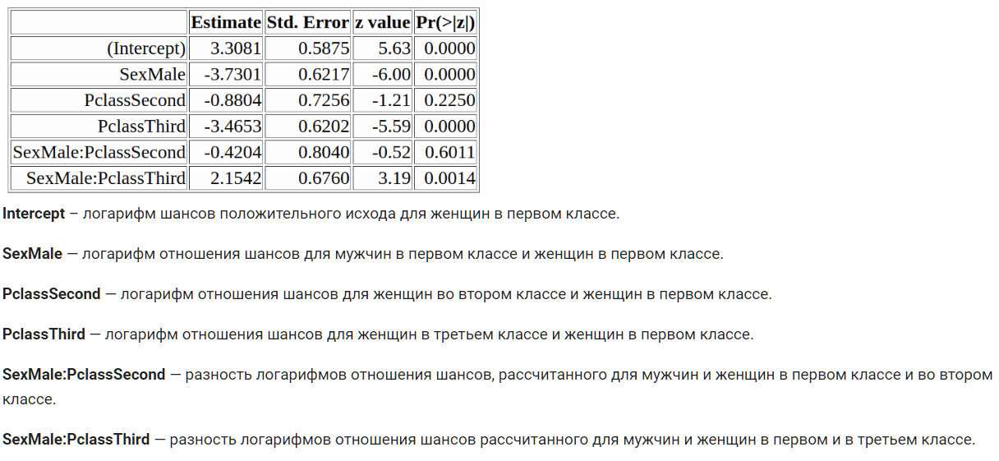
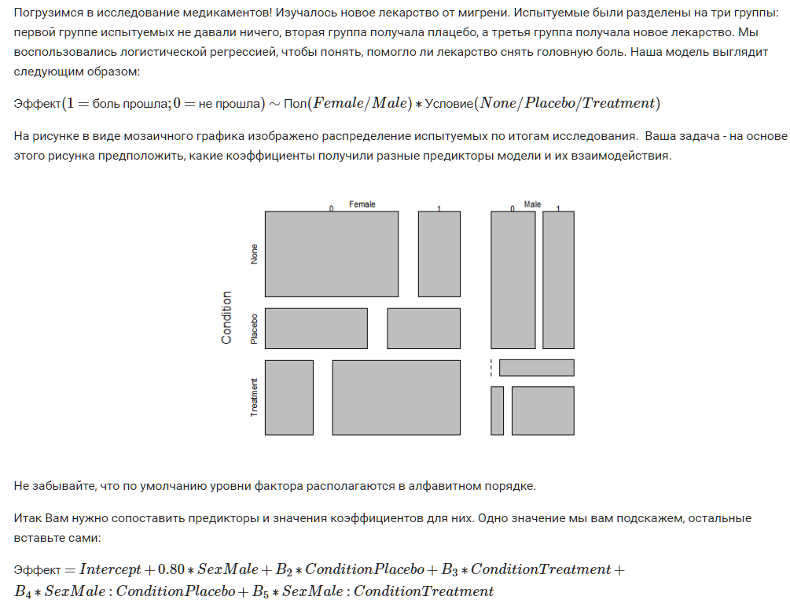

# –õ–æ–≥–∏—Å—Ç–∏—á–µ—Å–∫–∞—è —Ä–µ–≥—Ä–µ—Å—Å–∏—è

–ü—Ä–∏ –ø–æ–º–æ—â–∏ –ª–æ–≥–∏—Ç –º–æ–∂–Ω–æ —Å—Ç—Ä–æ–∏—Ç—å —Ä–µ–≥—Ä–µ—Å—Å–∏–∏ –Ω–∞ –Ω–µ—Å–∫–æ–ª—å–∫–∏—Ö –ø–µ—Ä–µ–º–µ–Ω–Ω—ã—Ö.

–ó–∞–≤–∏—Å–∏–º–∞—è –ø–µ—Ä–µ–º–µ–Ω–Ω–∞—è –¥–æ–ª–∂–Ω–∞ –∏–º–µ—Ç—å –¥–≤–µ –≥—Ä–∞–¥–∞—Ü–∏–∏.

## –ü–æ—Å—Ç–∞–Ω–æ–≤–∫–∞ –∑–∞–¥–∞—á–∏


–û—Å–Ω–æ–≤–Ω–∞—è –∏–¥–µ—è: 

  * –∑–∞–≤–∏—Å–∏–º–∞—è –ø–µ—Ä–µ–º–µ–Ω–Ω–∞—è --- –Ω–æ–º–∏–Ω–∞—Ç–∏–≤–Ω–∞—è –ø–µ—Ä–µ–º–µ–Ω–Ω–∞—è —Å –¥–≤—É–º—è –≥—Ä–∞–¥–∞—Ü–∏—è–º–∏
  
  * –Ω–µ–∑–∞–≤–∏—Å–∏–º—ã–µ –ø–µ—Ä–µ–º–µ–Ω–Ω—ã–µ --- –º–æ–≥—É—Ç –±—ã—Ç—å –∫–∞–∫ –Ω–æ–º–∏–Ω–∞—Ç–∏–≤–Ω—ã–µ, —Ç–∞–∫ –∏ —Ä–∞–Ω–≥–æ–≤—ã–µ, –∫–æ–ª–∏—á–µ—Å—Ç–≤–µ–Ω–Ω—ã–µ.
  
–ï—Å—Ç—å –º–∞—Å—Å–∞ –∑–∞–¥–∞—á:

  * –ø—Ä–∏–Ω–∞–¥–ª–µ–∂–∏—Ç —ç—Ç–æ—Ç —Å–Ω–∏–º–æ–∫ –∑–¥–æ—Ä–æ–≤–æ–º—É –∏–ª–∏ –Ω–µ–∑–¥–æ—Ä–æ–≤–æ–º—É –ø–∞—Ü–∏–µ–Ω—Ç—É
  
  * —Å–ø–∞–º –Ω–∞ –ø–æ—á—Ç—É –ø—Ä–∏—à—ë–ª –∏–ª–∏ –Ω–µ —Å–ø–∞–º
  
  * –∑–∞–ø—Ä–µ—â—ë–Ω–Ω—ã–π —ç—Ç–æ –±–∞–≥–∞–∂ –∏–ª–∏ —Ä–∞–∑—Ä–µ—à—ë–Ω–Ω—ã–π
  
  * –ø—Ä–æ—à—ë–ª —á–µ–ª–æ–≤–µ–∫ —Ç–µ—Å—Ç–∏—Ä–æ–≤–∞–Ω–∏–µ –∏–ª–∏ –Ω–µ –ø—Ä–æ—à—ë–ª
  
–û—Å–Ω–æ–≤–Ω–∞—è –ª–æ–≥–∏–∫–∞:

–£ –Ω–∞—Å –µ—Å—Ç—å –Ω–µ–∫–æ—Ç–æ—Ä–∞—è –∑–∞–≤–∏—Å–∏–º–∞—è –ø–µ—Ä–µ–º–µ–Ω–Ω–∞—è.

–ü—É—Å—Ç—å –±—É–¥–µ—Ç --- –ø–æ–ª—É—á–∏–ª —Å—Ç—É–¥–µ–Ω—Ç —Å–µ—Ä—Ç–∏—Ñ–∏–∫–∞—Ç –∏–ª–∏ –Ω–µ –ø–æ–ª—É—á–∏–ª.

—Ö1 --- —Å–∫–æ–ª—å–∫–æ –ø–æ—Å–µ—Ç–∏–ª –ª–µ–∫—Ü–∏–π

—Ö2 --- –≤—Ä–µ–º—è –∫–æ—Ç–æ—Ä–æ–µ –ø—Ä–æ–≤—ë–ª –Ω–∞ —Ä–æ–∫ –∫–æ–Ω—Ü–µ—Ä—Ç–∞—Ö. (–∫–æ–ª–∏—á–µ—Å—Ç–≤–µ–Ω–Ω–∞—è)

—Ö3 --- —á–∏—Ç–∞–ª –∫–Ω–∏–∂–∫–∏ –ø–æ —Å—Ç–∞—Ç–∏—Å—Ç–∏–∫–µ –∏–ª–∏ –Ω–µ —á–∏—Ç–∞–ª (–Ω–æ–º–∏–Ω–∞—Ç–∏–≤–Ω–∞—è)


–ò —Ç—É—Ç –ø–µ—Ä–≤–∞—è –ø—Ä–æ–±–ª–µ–º–∞ --- –∑–∞–≤–∏—Å–∏–º–∞—è –ø–µ—Ä–µ–º–µ–Ω–Ω–∞—è –∏–º–µ–µ—Ç —Ç–æ–ª—å–∫–æ –¥–≤–µ –≥—Ä–∞–¥–∞—Ü–∏–∏, –∞ –Ω–µ–∑–∞–≤–∏—Å–∏–º–∞—è –º–æ–∂–µ—Ç –ø—Ä–∏–Ω–∏–º–∞—Ç—å –∑–Ω–∞—á–µ–Ω–∏—è $[-\infty; +\infty]$


–ù–æ —ç—Ç–æ –Ω–µ —Ç—Ä—É–¥–Ω–æ –∏—Å–ø—Ä–∞–≤–∏—Ç—å. –ú—ã –ø–µ—Ä–µ–≤–µ–¥—ë–º –¥–µ–ª–æ –≤ –≤–µ—Ä–æ—è—Ç–Ω–æ—Å—Ç–∏. –¢–æ–≥–¥–∞ —É –Ω–∞—Å –±—É–¥–µ—Ç —Å–ª–µ–≤–∞ —É—Ä–∞–≤–Ω–µ–Ω–∏—è –∫–æ–ª–∏—á–µ—Å—Ç–≤–µ–Ω–Ω–∞—è –ø–µ—Ä–µ–º–µ–Ω–Ω–∞—è —Å–æ –∑–Ω–∞—á–µ–Ω–∏—è–º–∏ –æ—Ç 0 –¥–æ 1.

–ö–∞–∫ –ø—Ä–∏–º–∏—Ä–∏—Ç—å –≤–µ—Ä–æ—è—Ç–Ω–æ—Å—Ç—å —Å –ª–∏–Ω–µ–π–Ω–æ–π –∫–æ–º–±–∏–Ω–∞—Ü–∏–µ–π –ø—Ä–∏–∑–Ω–∞–∫–æ–≤?


–î–æ—Å—Ç–∞—Ç–æ—á–Ω–æ —Ä–∞—Å—Å—á–∏—Ç–∞—Ç—å –Ω–∞—Ç—É—Ä–∞–ª—å–Ω—ã–µ –ª–æ–≥–∞—Ä–∏—Ñ–º—ã.

–ò—Ç–∞–∫, –¥–∞–≤–∞–π—Ç–µ –ø–µ—Ä–µ–π–¥—ë–º –æ—Ç –≤–µ—Ä–æ—è—Ç–Ω–æ—Å—Ç–∏ –∫ –ª–æ–≥–∞—Ä–∏—Ñ–º–∞–º —à–∞–Ω—Å–æ–≤.

–®–∞–Ω—Å—ã –æ–ø—Ä–µ–¥–µ–ª—è—é—Ç—Å—è –ø—Ä–æ—Å—Ç–æ --- —ç—Ç–æ –æ—Ç–Ω–æ—à–µ–Ω–∏–µ –≤–µ—Ä–æ—è—Ç–Ω–æ—Å—Ç–∏ —É—Å–ø–µ—Ö–∞ –∫ –≤–µ—Ä–æ—è—Ç–Ω–æ—Å—Ç–∏ –Ω–µ—É–¥–∞—á–∏

* –ø—Ä–∏ —Å—Ç—Ä–µ–º–ª–µ–Ω–∏–∏ –≤–µ—Ä–æ—è—Ç–Ω–æ—Å—Ç–∏ –∫ –µ–¥–∏–Ω–∏—á–∫–µ, —à–∞–Ω—Å—ã (Odds) –±—É–¥—É—Ç –ø—Ä–∏–Ω–∏–º–∞—Ç—å –æ—á–µ–Ω—å –±–æ–ª—å—à–∏–µ –∑–Ω–∞—á–µ–Ω–∏—è.

* –ø—Ä–∏ —Å—Ç—Ä–µ–º–ª–µ–Ω–∏–∏ –≤–µ—Ä–æ—è—Ç–Ω–æ—Å—Ç–∏ –∫ –Ω—É–ª—é, —à–∞–Ω—Å—ã –±—É–¥—É—Ç –ø—Ä–∏–Ω–∏–º–∞—Ç—å –æ—á–µ–Ω—å –º–∞–ª—ã–µ –±–ª–∏–∑–∫–∏–µ –∫ –Ω—É–ª—é –∑–Ω–∞—á–µ–Ω–∏—è 


—Ç–µ–º —Å–∞–º—ã–º –ø–æ–ª–æ–≤–∏–Ω—ã –ø—Ä–æ–±–ª–µ–º—ã —Ä–µ—à–µ–Ω–∞ --- –º—ã —Ç–µ–ø–µ—Ä—å –∏–º–µ–µ–º –∑–Ω–∞—á–µ–Ω–∏—è –æ—Ç –Ω—É–ª—è –¥–æ –±–µ—Å–∫–æ–Ω–µ—á–Ω–æ—Å—Ç–∏. –¢–µ–ø–µ—Ä—å —á—Ç–æ–±—ã –æ—Ç–æ–¥–≤–∏–Ω—É—Ç—å –∑–Ω–∞—á–µ–Ω–∏—è –∫ –º–∏–Ω—É—Å –±–µ—Å–∫–æ–Ω–µ—á–Ω–æ—Å—Ç–∏ –Ω—É–∂–Ω–æ –≤–∑—è—Ç—å –Ω–∞—Ç—É—Ä–∞–ª—å–Ω—ã–π –ª–æ–≥–∞—Ä–∏—Ñ–º –æ—Ç —à–∞–Ω—Å–æ–≤ (Odds)


–¢–µ–ø–µ—Ä—å –ø–æ—Å—Ç—Ä–æ–∏–º –Ω–µ—Å–∫–æ–ª—å–∫–æ –¥—Ä—É–≥–æ–π –≥—Ä–∞—Ñ–∏–∫.

–ü–æ –æ—Å–∏ –∏–∫—Å –≤–µ—Ä–æ—è—Ç–Ω–æ—Å—Ç—å, –ø–æ –æ—Å–∫–∏ –∏–≥—Ä–µ–∫ –ª–æ–≥–∞—Ä–∏—Ñ–º —à–∞–Ω—Å–æ–≤.

–õ–æ–≥–∞—Ä–∏—Ñ–º –º–æ–∂–µ—Ç –±—ã—Ç—å –≤–∑—è—Ç—å –æ—Ç —Å–∏–ª—å–Ω–æ –±–æ–ª—å—à–æ–≥–æ —á–∏—Å–ª–∞, —Ç–∞–∫ –∏ –æ—Ç —Å–∏–ª—å–Ω–æ –º–∞–ª–µ–Ω—å–∫–æ–≥–æ –æ—Ç—Ä–∏—Ü–∞—Ç–µ–ª—å–Ω–æ–≥–æ.

–ù–∞–ø—Ä–∏–º–µ—Ä 

* –µ—Å–ª–∏ —É –Ω–∞—Å –±—É–¥–µ—Ç –ª–æ–≥–∞—Ä–∏—Ñ–º —à–∞–Ω—Å–æ–≤ 2000. –õ–æ–≥–∞—Ä–∏—Ñ–º –ø–æ–ª–æ–∂–∏—Ç–µ–ª—å–Ω—ã–π --- —à–∞–Ω—Å—ã –±–æ–ª—å—à–µ 1, –≤–µ—Ä–æ—è—Ç–Ω–æ—Å—Ç—å –ø–æ–ª–æ–∂–∏—Ç–µ–ª—å–Ω–æ–≥–æ –∏—Å—Ö–æ–¥–∞ –±–æ–ª—å—à–µ –æ—Ç—Ä–∏—Ü–∞—Ç–µ–ª—å–Ω–æ–≥–æ.

* –µ—Å–ª–∏ –ª–æ–≥–∞—Ä–∏—Ñ–º -1000. –õ–æ–≥–∞—Ä–∏—Ñ–º –æ—Ç—Ä–∏—Ü–∞—Ç–µ–ª—å–Ω—ã–π --- —à–∞–Ω—Å—ã –º–µ–Ω—å—à–µ –µ–¥–∏–Ω–∏—Ü—ã, –≤–µ—Ä–æ—è—Ç–Ω–æ—Å—Ç—å –æ—Ç—Ä–∏—Ü–∞—Ç–µ–ª—å–Ω–æ–≥–æ –∏—Å—Ö–æ–¥–∞ –±–æ–ª—å—à–µ –ø–æ–ª–æ–∂–∏—Ç–µ–ª—å–Ω–æ–≥–æ.

–¢–∞–∫–∏–º –æ–±—Ä–∞–∑–æ–º –º–æ–∂–Ω–æ —Å–≤–µ—Å—Ç–∏ –∑–∞–¥–∞—á—É –∫ —Ç–æ–º—É, —á—Ç–æ –≤ –ø—Ä–∞–≤–æ–π —á–∞—Å—Ç–∏ –±—É–¥–µ—Ç –ª–∏–Ω–µ–π–Ω–∞—è –∫–æ–º–±–∏–Ω–∞—Ü–∏—è –ø—Ä–µ–¥–∏–∫—Ç–æ—Ä–æ–≤, –∞ –≤ –ª–µ–≤–æ–π —á–∞—Å—Ç–∏ –º—ã –±—É–¥–µ–º –ø—Ä–µ–¥—Å–∫–∞–∑—ã–≤–∞—Ç—å –ª–æ–≥–∞—Ä–∏—Ñ–º —à–∞–Ω—Å–æ–≤ –Ω–∞—à–µ–≥–æ –∏—Å—Ö–æ–¥–∞.

–¢–µ–º —Å–∞–º—ã–º –º—ã –≤—Å–µ–≥–¥–∞ —Å–º–æ–∂–µ–º –¥–æ–∫–∞–ø–∞—Ç—å—Å—è –¥–æ –≤–µ—Ä–æ—è—Ç–Ω–æ—Å—Ç–∏ --- –∏–∑–±–∞–≤–∏–≤–∏—à–∏—Å—å —Å–Ω–∞—á–∞–ª–∞ –æ—Ç –ª–æ–≥–∞—Ä–∏—Ñ–º–æ–≤, –ø–æ—Ç–æ–º –æ—Ç —à–∞–Ω—Å–æ–≤.

```{r echo=FALSE, out.width="100%", fig.align='center'}
knitr::include_graphics(".img/logit.png")
```

–¢—É—Ç —Å—Ç–æ–∏—Ç —Å–∫–∞–∑–∞—Ç—å —á—Ç–æ

n — это натуральный логарифм, здесь Вы совершенно правы, а с обозначением log небольшая путаница: эти три буквы должны бы обозначать логарифм вообще, но во многих языках программирования, в том числе в R, основа по умолчанию  — это e (а функции ln там вовсе нет). Поскольку сопровождающие курс примеры приведены на R, так и получилось.

### –ó–∞–¥–∞—á–∞ 

–ü—Ä–µ–¥–ø–æ–ª–æ–∂–∏–º, –º—ã –ø–æ–¥–±—Ä–æ—Å–∏–ª–∏ –º–æ–Ω–µ—Ç–∫—É 100 —Ä–∞–∑, –∏ 70 —Ä–∞–∑ –≤—ã–ø–∞–ª –æ—Ä–µ–ª. –ß–µ–º—É —Ä–∞–≤–Ω—è–µ—Ç—Å—è –Ω–∞—Ç—É—Ä–∞–ª—å–Ω—ã–π –ª–æ–≥–∞—Ä–∏—Ñ–º —à–∞–Ω—Å–æ–≤ –≤—ã–ø–∞–¥–µ–Ω–∏—è —Ä–µ—à–∫–∏?

–ß—Ç–æ–±—ã –Ω–µ –∑–∞–ø—É—Ç–∞—Ç—å—Å—è, –¥–∞–≤–∞–π—Ç–µ –≤ —ç—Ç–æ–º –∑–∞–¥–∞–Ω–∏–∏ —Ä–∞—Å—Å–º–∞—Ç—Ä–∏–≤–∞—Ç—å –∫–∞–∫ "—É—Å–ø–µ—Ö" - –≤—ã–ø–∞–¥–µ–Ω–∏–µ —Ä–µ—à–∫–∏.

#### –†–µ—à–µ–Ω–∏–µ

–£—Å–ø–µ—Ö --- –≤—ã–ø–∞–¥–µ–Ω–∏–µ —Ä–µ—à–∫–∏

–ù–µ—É—Å–ø–µ—Ö --- –≤—ã–ø–∞–¥–µ–Ω–∏–µ –æ—Ä–ª–∞

–¢–æ–≥–¥–∞ –ø–æ —Ñ–æ—Ä–º—É–ª–µ

$$ odds = \frac{P_+}{1 - P_+} = \frac{3}{7}$$
–∏—Ç–æ–≥–æ –ø–æ–ª—É—á–∞–µ–º

```{r}
log(3/7)
```

### –ó–∞–¥–∞—á–∞ 

–ü—Ä–µ–¥–ø–æ–ª–æ–∂–∏–º, —á—Ç–æ –º—ã –ø–æ–ª—É—á–∏–ª–∏ –ª–æ–≥–∞—Ä–∏—Ñ–º —à–∞–Ω—Å–æ–≤ –≤—ã–ø–∞–¥–µ–Ω–∏—è —Ä–µ—à–∫–∏, —Ä–∞–≤–Ω—ã–π -1. –¢–æ–≥–¥–∞ –≤–µ—Ä–æ—è—Ç–Ω–æ—Å—Ç—å –≤—ã–ø–∞–¥–µ–Ω–∏—è —Ä–µ—à–∫–∏ —Ä–∞–≤–Ω—è–µ—Ç—Å—è:

#### –†–µ—à–µ–Ω–∏–µ

$ln(x)=y$ —ç—Ç–æ —ç–∫–≤–∏–≤–∞–ª–µ–Ω—Ç–Ω–æ –≤—ã—Ä–∞–∂–µ–Ω–∏—é $x = e^y$. –ò–ª–∏ –¥–ª—è –Ω–∞—à–µ–π –∑–∞–¥–∞—á–∏ $odds = e^{-1}$. –¢–æ–≥–¥–∞ $odds = \frac{p}{1-p}=e^{-1}$ —Ç–æ–≥–¥–∞ $p = \frac{e^{-1}}{1 + e^{-1}}$

–ì–¥–µ p —ç—Ç–æ –≤–µ—Ä–æ—è—Ç–Ω–æ—Å—Ç—å –≤—ã–ø–∞–¥–µ–Ω–∏—è —Ä–µ—à–∫–∏.

```{r}
e <- exp(1)

e^(-1) / (e^(-1) + 1)
```

## –ú–æ–¥–µ–ª—å –±–µ–∑ –ø—Ä–µ–¥–∏–∫—Ç–æ—Ä–æ–≤

–ò—Ç–∞–∫, –º—ã –ø–æ–ª—É—á–∞–µ–º —É—Ä–∞–≤–Ω–µ–Ω–∏–µ, —Å–ª–µ–≤–∞ —É –∫–æ—Ç–æ—Ä–æ–≥–æ –∫–æ–ª–∏—á–µ—Å—Ç–≤–µ–Ω–Ω–∞—è –ø–µ—Ä–º–µ–Ω–Ω–∞—è –∑–Ω–∞—á–µ–Ω–∏—è –∫–æ—Ç–æ—Ä–æ–π —ç—Ç–æ –Ω–∞—Ç—É—Ä–∞–ª—å–Ω—ã–π –ª–æ–≥–∞—Ä–∏—Ñ–º –æ—Ç –º–∏–Ω—É—Å –¥–æ –ø–ª—é—Å –±–µ—Å–∫–æ–Ω–µ—á–Ω–æ—Å—Ç–∏. –°–ø—Ä–∞–≤–∞ —Ä–∞–∑–Ω–æ–≥–æ —Ä–æ–¥–∞ –ø–µ—Ä–µ–º–µ–Ω–Ω—ã–µ (–ø—Ä–µ–¥–∏–∫—Ç–æ—Ä—ã) —Å –∫–æ—ç—Ñ—Ñ–∏—Ü–∏–µ–Ω—Ç–∞–º–∏.

$$z = b_0 + b_1x_1 + ... + b_ix_i$$

–û —Ç–æ–º –∫–∞–∫ –≤—ã–±–∏—Ä–∞—Ç—å –∫–æ—ç—Ñ—Ñ–∏—Ü–∏–µ–Ω—Ç—ã –ø–æ–≥–æ–≤–æ—Ä–∏–º –ø–æ–∑–∂–µ. –≠—Ç–æ –¥–µ–ª–∞–µ—Ç—Å—è –º–µ—Ç–æ–¥–æ–º –º–∞–∫—Å–∏–º–∞–ª—å–Ω–æ–≥–æ –ø—Ä–∞–≤–¥–æ–ø–æ–¥–æ–±–∏—è. –ù–æ –ª–æ–≥–∏–∫–∞ –Ω–µ —Å–ª–æ–∂–Ω–∞—è --- –∫–æ—ç—Ñ—Ñ–∏—Ü–∏–µ–Ω—Ç—ã –≤—ã–±–∏—Ä–∞–µ–º —Ç–∞–∫, —á—Ç–æ–±—ã –≤—Å—ë –º–∞–∫—Å–∏–º–∞–ª—å–Ω–æ –ø—Ä–µ–¥—Å–∫–∞–∑—ã–≤–∞–ª–æ—Å—å.

–°–≤–æ–±–æ–¥–Ω—ã–π —á–ª–µ–Ω —Ä–µ–≥—Ä–µ—Å—Å–∏–∏ $b_0$ (intercept)  - —ç—Ç–æ –ª–æ–≥–∞—Ä–∏—Ñ–º —à–∞–Ω—Å–∞ –ø–æ–ª–æ–∂–∏—Ç–µ–ª—å–Ω–æ–≥–æ –∏—Å—Ö–æ–¥–∞.

### –ü–æ—Å—Ç—Ä–æ–µ–Ω–∏–µ –º–æ–¥–µ–ª–∏

–ò—Å–ø–æ–ª—å–∑—É–µ–º –¥–∞–Ω–Ω—ã–µ "—Ç–∏—Ç–∞–Ω–∏–∫"

```{r}
library(dplyr)
library(ggplot2)
library(vcd)

titanic <- read.csv("https://stepic.org/media/attachments/course/524/train.csv")
titanic <- na.omit(titanic)
glimpse(titanic)
titanic <- mutate(titanic, 
                  Survived = factor(Survived, labels = c("No", "Yes")), 
                  Pclass = factor(Pclass, labels = c("First", "Second", "Third")), 
                  Sex = factor(Sex, labels = c("Female", "Male")))

titanic <- as_tibble(titanic)
```

–ü–æ—Å—Ç—Ä–æ–∏–º –º–æ–∑–∞–∏—á–Ω—ã–π –≥—Ä–∞—Ñ–∏–∫, –¥–ª—è —Å–æ—Å—Ç–∞–≤–ª–µ–Ω–∏—è –ø–µ—Ä–≤–∏—á–Ω–æ–≥–æ –ø–æ–Ω–∏–º–∞–Ω–∏—è –¥–∞–Ω–Ω—ã—Ö

```{r}
mosaic(~ Sex + Survived | Pclass, data=titanic)
```

–ü–æ—Å—Ç—Ä–æ–∏–º –ø—Ä–æ—Å—Ç—É—é –º–æ–¥–µ–ª—å --- –±–µ–∑ –ø—Ä–µ–¥–∏–∫—Ç–æ—Ä–æ–≤.

```{r}
simple_fit <- glm(Survived ~ 1, titanic, family = "binomial")
```

–ü–æ—Å–º–æ—Ç—Ä–∏–º –∫–∞–∫–æ–π –∫–æ—ç—Ñ—Ñ–∏—Ü–∏–µ–Ω—Ç —É —ç—Ç–æ–π –º–æ–¥–µ–ª–∏
```{r}
coef(simple_fit)
```

–ú—ã –≤–∏–¥–∏–º —á—Ç–æ –≤ –Ω–∞—à–µ–º —Å–ª—É—á–∞–µ —Å—É—â–µ—Å—Ç–≤—É–µ—Ç —Ç–æ–ª—å–∫–æ –æ–¥–∏–Ω "Intercept" –∏ –∑–Ω–∞—á–µ–Ω–∏–µ —ç—Ç–æ–≥–æ –∫–æ—ç—Ñ—Ñ–∏—Ü–∏–µ–Ω—Ç–∞ —Ä–∞–≤–Ω–æ -0.38.

–ß—Ç–æ –æ–∑–Ω–∞—á–∞–µ—Ç —ç—Ç–∞ –º–æ–¥–µ–ª—å –Ω–∞ –ø—Ä–∞–∫—Ç–∏–∫–µ? –ú—ã —Ö–æ—Ç–∏–º —Å–∫–∞–∑–∞—Ç—å —Å–ª–µ–¥—É—é—â–µ–µ. 
–£ –Ω–∞—Å –µ—Å—Ç—å –∑–∞–≤–∏—Å–∏–º–∞—è –ø–µ—Ä–µ–º–µ–Ω–Ω–∞—è `Survived`, —Ç.–µ. –ø–µ—Ä–µ–º–µ–Ω–Ω–∞—è Y –∏ –º—ã —Ö–æ—Ç–∏–º –ø–æ—Å—Ç—Ä–æ–∏—Ç—å –º–æ–¥–µ–ª—å –≥–¥–µ Y —Ä–∞–≤–Ω—è–µ—Ç—Å—è –æ–¥–Ω–æ–º—É —á–∏—Å–ª—É Y - intercept. 

–ò–Ω—ã–º–∏ —Å–ª–æ–≤–∞–º–∏ –º—ã —Ö–æ—Ç–∏–º –ø—Ä–µ–¥—Å–∫–∞–∑–∞—Ç—å –¥–ª—è –Ω–µ–∫–æ—Ç–æ—Ä—ã—Ö –¥–∞–Ω–Ω—ã—Ö –æ –ø–∞—Å—Å–∞–∂–∏—Ä–µ –≤—ã–∂–∏–ª –æ–Ω –∏–ª–∏ –Ω–µ—Ç —Ç–æ–ª—å–∫–æ –æ–¥–Ω–æ —á–∏—Å–ª–æ.

–ò—Ç–∞–∫, —á—Ç–æ –∂–µ —ç—Ç–æ –∑–∞ —á–∏—Å–ª–æ? –ö–∞–∫–æ–µ –º—ã –¥–æ–ª–∂–Ω—ã –ø–æ–¥–æ–±—Ä–∞—Ç—å —á–∏—Å–ª–æ, —á—Ç–æ–±—ã –Ω–∞—à–∞ –º–æ–¥–µ–ª—å –±—ã–ª–∞ —Å–∞–º–æ–π –ª—É—á—à–µ–π. 
–ü–æ—Å—Ç—Ä–æ–∏–º –ø—Ä–æ—Å—Ç—É—é —Ç–∞–±–ª–∏—á–∫—É,

```{r}
table(titanic$Survived)
```

–û–Ω–∞ –ø–æ–∫–∞–∑—ã–≤–∞–µ—Ç —Ä–∞—Å–ø—Ä–µ–¥–µ–ª–µ–Ω–∏–µ —á–∞—Å—Ç–æ—Ç –Ω–∞—à–µ–π –Ω–æ–º–∏–Ω–∞—Ç–∏–≤–Ω–æ–π –ø–µ—Ä–µ–º–µ–Ω–Ω–æ–π. 420 —á–µ–ª–æ–≤–µ –ø–æ–≥–∏–±–ª–æ, 290 –≤—ã–∂–∏–ª–æ. –¢–µ–ø–µ—Ä—å –º—ã –º–æ–∂–µ–º —Ä–∞—Å—á–∏—Ç–∞—Ç—å —à–∞–Ω—Å —Ç–æ–≥–æ, —á—Ç–æ —Å–ª—É—á–∞–π–Ω—ã–π –ø–∞—Å—Å–∞–∂–∏—Ä –Ω–∞—à–µ–π –≤—ã–±–æ—Ä–∫–∏ –≤—ã–∂–∏–≤–µ—Ç.

```{r}
odds <- 290 / 424
odds
```

–û–Ω –º–µ–Ω—å—à–µ –µ–¥–∏–Ω–∏—á–∫–∏, —ç—Ç–æ —Ä–∞–∑—É–º–Ω–æ --- –µ—Å–ª–∏ —à–∞–Ω—Å –º–µ–Ω—å—à–µ –µ–¥–∏–Ω–∏—á–∫–∏, –≤–µ—Ä–æ—è—Ç–Ω–æ –ø–æ–ª–æ–∂–∏—Ç–µ–ª—å–Ω–æ–≥–æ –∏—Å—Ö–æ–¥–∞ –º–µ–Ω—å—à–µ —á–µ–º –æ—Ç—Ä–∏—Ü–∞—Ç–µ–ª—å–Ω–æ–≥–æ.

–ë–µ—Ä—ë–º –ª–æ–≥–∞—Ä–∏—Ñ–º —à–∞–Ω—Å–∞:

```{r}
log(odds)
```

–ò –≤–∏–¥–∏–º –∑–Ω–∞–∫–æ–º–æ–µ –Ω–∞–º —á–∏—Å–ª–æ. –¢–µ–ø–µ—Ä—å –µ—Å–ª–∏ –≤–µ—Ä–Ω—ë–º—Å—è –∫ –Ω–∞—à–µ–π –º–æ–¥–µ–ª–∏

```{r}
summary(simple_fit)$coefficient
```

–¢–æ –∑–Ω–∞—á–µ–Ω–∏–µ Estimate –∏ –±—É–¥–µ—Ç –∑–Ω–∞—á–µ–Ω–∏–µ Intercept.

–ï—â—ë —Ä–∞–∑ –ø–æ—Å–º–æ—Ç—Ä–∏–º –Ω–∞ –Ω–∞—à–∏ –≤—ã–≤–æ–¥—ã. –ú—ã –≥–æ–≤–æ—Ä–∏–º –ø–æ–¥–±–µ—Ä–∏ –Ω–∞–º –æ–¥–Ω–æ —á–∏—Å–ª–æ, –∫–æ—Ç–æ—Ä–æ–µ –º–∞–∫—Å–∏–º–∞–ª—å–Ω–æ —É–¥–∞—á–Ω–æ —Å–ø—Ä–æ–≥–Ω–æ–∑–∏—Ä—É–µ—Ç –Ω–∞–º –∫–∞–∫–æ–µ –∑–Ω–∞—á–µ–Ω–∏–µ –∑–∞–≤–∏—Å–∏–º–æ–π –ø–µ—Ä–µ–º–µ–Ω–Ω–æ–π –º—ã –ø–æ–ª—É—á–∏–º –¥–ª—è –ª—é–±–æ–≥–æ –Ω–æ–≤–æ–≥–æ —Å–ª—É—á–∞–π–Ω–æ–≥–æ –ø–∞—Å—Å–∞–∂–∏—Ä–∞.

–†–µ–≥—Ä–µ—Å—Å–∏–æ–Ω–Ω–∞—è –º–æ–¥–µ–ª—å –Ω–µ –º–æ–∂–µ—Ç –Ω–∏—á–µ–≥–æ –ª—É—á—à–µ —á–µ–º –ø—Ä–µ–¥—Å–∫–∞–∑–∞—Ç—å –≥—Ä—É–±–æ –≥–æ–≤–æ—Ä—è, –≤–µ—Ä–æ—è—Ç–Ω–æ –∫–æ—Ç–æ—Ä—É—é –º—ã —Å—á–∏—Ç–∞–ª–∏ –ø–æ –Ω–∞—à–µ–π –≤—ã–±–æ—Ä–∫–∏. –ò –º—ã –≤—ã—Ç–∞—â–∏–º –ª–æ–≥–∞—Ä–∏—Ñ–º —à–∞–Ω—Å–æ–≤.

–ò—Ç–∞–∫ --- Intercept –≤–æ—Ç –≤ —Ç–∞–∫–æ–π –º–æ–¥–µ–ª–∏ –±–µ–∑ –ø—Ä–µ–¥–∏–∫—Ç–æ—Ä–æ–≤ —ç—Ç–æ –±—É–¥–µ—Ç –ø—Ä–æ—Å—Ç–æ –Ω–∞—Ç—É—Ä–∞–ª—å–Ω—ã–π –ª–æ–≥–∞—Ä–∏—Ñ–º —à–∞–Ω—Å–æ–≤ –ø–æ–ª–æ–∂–∏—Ç–µ–ª—å–Ω–æ–≥–æ –∏—Å—Ö–æ–¥–∞ –ø–æ –≤—Å–µ–π –Ω–∞—à–µ–π –≤—ã–±–æ—Ä–∫–µ. 

–¢–∞–∫–∞—è —Ä–µ–≥—Ä–µ—Å—Å–∏–æ–Ω–∞—è –º–æ–¥–µ–ª—å —Ä–µ—à–∞–µ—Ç –∑–∞–¥–∞—á—É. –£ –Ω–∞—Å –µ—Å—Ç—å –æ—Ç—Ä–∏—Ü–∞—Ç–µ–ª—å–Ω—ã–π Intercept, –∏ –æ–Ω —Å—Ç–∞—Ç–∏—Å—Ç–∏—á–µ—Å–∫–∏ –∑–Ω–∞—á–∏–º–æ –æ—Ç–ª–∏—á–∞–µ—Ç—Å—è –æ—Ç –Ω—É–ª—è. –ß—Ç–æ —ç—Ç–æ –æ–¥–Ω–∞—á–∞–µ—Ç --- –ª–æ–≥–∞—Ä–∏—Ñ–º —à–∞–Ω—Å–æ–≤ –∑–Ω–∞—á–∏–º–æ –º–µ–Ω—å—à–µ –Ω—É–ª—è, –∑–Ω–∞—á–∏—Ç —à–∞–Ω—Å—ã –∑–Ω–∞—á–∏–º–æ –º–µ–Ω—å—à–µ –µ–¥–∏–Ω–∏—Ü—ã, –∑–Ω–∞—á–∏—Ç –≤–µ—Ä–æ—è—Ç–Ω–æ—Å—Ç—å –≤—ã–∂–∏—Ç—å –∑–Ω–∞—á–∏–º–æ –º–µ–Ω—å—à–µ —á–µ–º —É–º–µ—Ä–µ—Ç—å. 

### –ß—Ç–æ –æ–∑–Ω–∞—á–∞—é—Ç –¥—Ä—É–≥–∏–µ –∫–æ—ç—Ñ—Ñ–∏—Ü–∏–µ–Ω—Ç—ã –≤ —ç—Ç–æ–π –º–æ–¥–µ–ª–∏?

–ï—Å–ª–∏ –≤–µ—Ä–Ω–∞ –Ω—É–ª–µ–≤–∞—è –≥–∏–ø–æ—Ç–µ–∑–∞, –º—ã –Ω–µ –¥–æ–ª–∂–Ω—ã –≤—Å—Ç—Ä–µ—á–∞—Ç—å —á–∞—Å—Ç–æ –∑–Ω–∞—á–∏–º—ã–µ –æ—Ç–∫–ª–æ–Ω–µ–Ω–∏—è.


  * Std. Error --- —ç—Ç–æ —Å—Ç–∞–Ω–¥–∞—Ä—Ç–Ω–æ–µ –æ—Ç–∫–ª–æ–Ω–µ–Ω–∏–µ Intercept, –∫–æ—Ç–æ—Ä–æ–µ –º—ã –ø–æ–ª—É—á–∞–µ–º
  
  * z value


### –ó–∞–¥–∞—á–∞ 

–°–≤–æ–±–æ–¥–Ω—ã–π —á–ª–µ–Ω –ª–æ–≥–∏—Å—Ç–∏—á–µ—Å–∫–æ–π —Ä–µ–≥—Ä–µ—Å—Å–∏–∏ –±–µ–∑ –ø—Ä–µ–¥–∏–∫—Ç–æ—Ä–æ–≤, —Ä–∞–≤–Ω—ã–π 0.5, –æ–∑–Ω–∞—á–∞–µ—Ç, —á—Ç–æ:

#### –†–µ—à–µ–Ω–∏–µ

–ï—Å–ª–∏ `ln(odds)= 0.5` —Ç–æ–≥–¥–∞ —à–∞–Ω—Å—ã (odds) –ø–æ–ª–æ–∂–∏—Ç–µ–ª—å–Ω–æ–≥–æ –∏—Å—Ö–æ–¥–∞ —Ä–∞–≤–Ω—ã

```{r}
e <- exp(1)
e^(0.5)
```

–≤–µ—Ä–æ—è—Ç–Ω–æ—Å—Ç—å –ø–æ–ª–æ–∂–∏—Ç–µ–ª—å–Ω–æ–≥–æ –∏—Å—Ö–æ–¥–∞ —Ä–∞–≤–Ω–∞

```{r}
e^(0.5) / (e^(0.5) + 1)
```


### –ó–∞–¥–∞—á–∞ 

P < 0.05 –¥–ª—è —Å–≤–æ–±–æ–¥–Ω–æ–≥–æ —á–ª–µ–Ω–∞ –ª–æ–≥–∏—Å—Ç–∏—á–µ—Å–∫–æ–π —Ä–µ–≥—Ä–µ—Å—Å–∏–∏ –æ–∑–Ω–∞—á–∞–µ—Ç, —á—Ç–æ:
(—É–∫–∞–∂–∏—Ç–µ –≤–µ—Ä–Ω—ã–µ –≤—ã—Å–∫–∞–∑—ã–≤–∞–Ω–∏—è)


–í–µ—Ä–æ—è—Ç–Ω–æ—Å—Ç–∏ –¥–≤—É—Ö –∏—Å—Ö–æ–¥–æ–≤ –∑–∞–≤–∏—Å–∏–º–æ–π –ø–µ—Ä–µ–º–µ–Ω–Ω–æ–π –∑–Ω–∞—á–∏–º–æ —Ä–∞–∑–ª–∏—á–∞—é—Ç—Å—è –º–µ–∂–¥—É —Å–æ–±–æ–π

–†–∞—Å–ø—Ä–µ–¥–µ–ª–µ–Ω–∏–µ –∏—Å—Ö–æ–¥–æ–≤ –≤ –Ω–∞—à–µ–π –≤—ã–±–æ—Ä–∫–µ –∑–Ω–∞—á–∏–º–æ –æ—Ç–ª–∏—á–∞–µ—Ç—Å—è –æ—Ç —Ä–∞–≤–Ω–æ–º–µ—Ä–Ω–æ–≥–æ


### –ó–∞–¥–∞—á–∞ 

–° –ø–æ–º–æ—â—å—é –ª–æ–≥–∏—Å—Ç–∏—á–µ—Å–∫–æ–π —Ä–µ–≥—Ä–µ—Å—Å–∏–∏ –±–µ–∑ –ø—Ä–µ–¥–∏–∫—Ç–æ—Ä–æ–≤ –º—ã –∑–∞—Ö–æ—Ç–µ–ª–∏ —É–∑–Ω–∞—Ç—å, –ø—Ä–∞–≤–¥–∞ –ª–∏, —á—Ç–æ —Å–¥–∞–≤–∞—è –ê–Ω–∞—Ç–æ–ª–∏—é –î–º–∏—Ç—Ä–∏–µ–≤–∏—á—É, –ª–µ–≥—á–µ –ø—Ä–æ–≤–∞–ª–∏—Ç—å —ç–∫–∑–∞–º–µ–Ω, —á–µ–º —Å–¥–∞—Ç—å. –í –Ω–∞—à–µ–π –≤—ã–±–æ—Ä–∫–µ –±—ã–ª–æ 50 —Å—Ç—É–¥–µ–Ω—Ç–æ–≤. –ß–∞—Å—Ç—å –∏–∑ –Ω–∏—Ö —Å–¥–∞–ª–∞ —ç–∫–∑–∞–º–µ–Ω (–ø–æ–ª–æ–∂–∏—Ç–µ–ª—å–Ω—ã–π –∏—Å—Ö–æ–¥), –∞ —á–∞—Å—Ç—å - –Ω–µ—Ç (–æ—Ç—Ä–∏—Ü–∞—Ç–µ–ª—å–Ω—ã–π –∏—Å—Ö–æ–¥). –°–≤–æ–±–æ–¥–Ω—ã–π —á–ª–µ–Ω –Ω–∞—à–µ–π —Ä–µ–≥—Ä–µ—Å—Å–∏–∏ –æ–∫–∞–∑–∞–ª—Å—è —Ä–∞–≤–µ–Ω -0.8472979. –°–∫–æ–ª—å–∫–æ —á–µ–ª–æ–≤–µ–∫ –≤—Å—ë-—Ç–∞–∫–∏ —Å–¥–∞–ª–æ —ç–∫–∑–∞–º–µ–Ω?

#### –†–µ—à–µ–Ω–∏–µ

–®–∞–Ω—Å—ã (odds) –ø–æ–ª–æ–∂–∏—Ç–µ–ª—å–Ω–æ–≥–æ –∏—Å—Ö–æ–¥–∞ —Ä–∞–≤–Ω—ã

```{r}
e^(-0.8472979)
```

—Ç–æ–≥–¥–∞ –≤–µ—Ä–æ—è—Ç–Ω–æ—Å—Ç—å –ø–æ–ª–æ–∂–∏—Ç–µ–ª—å–Ω–æ–≥–æ –∏—Å—Ö–æ–¥–∞ —Ä–∞–≤–Ω–∞

```{r}
e^(-0.8472979) / (e^(-0.8472979) + 1)
```

–¢–æ–≥–¥–∞, –ø—Ä–∏ —É—Å–ª–æ–≤–∏–∏, —á—Ç–æ –ø–æ–ª–æ–∂–∏—Ç–µ–ª—å–Ω—ã–π —à–∞–Ω—Å —Ä–∞–≤–µ–Ω 30%, –∞ –≤—Å–µ–≥–æ 50 —Å—Ç—É–¥–µ–Ω—Ç–æ–≤, —Ç–æ —Å–¥–∞–¥—É—Ç —ç–∫–∑–∞–º–µ–Ω

```{r}
e^(-0.8472979) / (e^(-0.8472979) + 1) * 50
```

15 —á–µ–ª–æ–≤–µ–∫

## –ú–æ–¥–µ–ª—å —Å –æ–¥–Ω–∏–º –Ω–æ–º–∏–Ω–∞—Ç–∏–≤–Ω—ã–º –ø—Ä–µ–¥–∏–∫—Ç–æ—Ä–æ–º

–î–ª—è —Å–æ–∑–¥–∞–Ω–∏—è –º–æ–¥–µ–ª–∏ –∏—Å–ø–æ–ª—å–∑—É–µ—Ç—Å—è —Å–ª–µ–¥—É—é—â–∞—è –∑–∞–ø–∏—Å—å

```{r}
fit1 <- glm(Survived ~ Sex, titanic, family = "binomial")
coef(fit1)
```

–ò—Ç–∞–∫ --- –∑–∞–≤–∏—Å–∏–º–∞—è –ø–µ—Ä–µ–º–µ–Ω–Ω–∞—è (–≤—ã–∂–∏–ª-–Ω–µ –≤—ã–∂–∏–ª), –Ω–µ–∑–∞–≤–∏—Å–∏–º–∞—è –ø–µ—Ä–º–µ–Ω–Ω–∞—è, —Ç.–µ –ø—Ä–µ–¥–∏–∫—Ç–æ—Ä, —ç—Ç–æ –ø–æ–ª.

–ß—Ç–æ –º—ã –∏–º–µ–µ–º, Intercept —Å—Ç–∞–ª –ø–æ–ª–æ–∂–∏—Ç–µ–ª—å–Ω—ã–º —á–∏—Å–ª–æ–º, –∞ –ø–µ—Ä–º–µ–Ω–Ω–∞—è "–ø–æ–ª" –ø—Ä–µ–¥—Å—Ç–∞–≤–ª–µ–Ω–∞ —Ç–æ–ª—å–∫–æ –æ–¥–Ω–æ–π –≥—Ä–∞–¥–∞—Ü–∏–µ–π. –ò –∑–Ω–∞—á–µ–Ω–∏–µ –ø—Ä–∏ —ç—Ç–æ–π –≥—Ä–∞–¥–∞—Ü–∏–∏ -2,5 –ø—Ä–∏–º–µ—Ä–Ω–æ

–î–∞–≤–∞–π—Ç–µ —Ä–∞–∑–±–∏—Ä–∞—Ç—å—Å—è. –î–∞–≤–∞–π—Ç–µ –ø–æ—Å—Ç—Ä–æ–∏–º —Ç–∞–±–ª–∏—á–∫—É —Å–æ–ø—Ä—è–∂—ë–Ω–Ω–æ—Å—Ç–∏ –º–µ–∂–¥—É –ø–æ–ª–æ–º –∏ –≤—ã–∂–∏–ª–∏ –∏–ª–∏ –Ω–µ—Ç —á–µ–ª–æ–≤–µ–∫. –∏ –ø–æ—Å–º–æ—Ç—Ä–∏–º —Å–∫–æ–ª—å–∫–æ –Ω–∞–±–ª—é–¥–µ–Ω–∏–π –ø–æ–ø–∞–ª–æ –≤ –∫–∞–∫—É—é

```{r}
table(titanic$Survived, titanic$Sex)
```

–¢–∞–±–ª–∏—Ü–∞ –≥–æ–≤–æ—Ä–∏—Ç --- —á—Ç–æ –≤–æ–∑–º–æ–∂–Ω–æ –µ—Å—Ç—å –≤–∑–∞–∏–º–æ—Å–≤—è–∑—å, —á—Ç–æ –∂–µ–Ω—â–∏–Ω—ã –≤—ã–∂–∏–≤–∞—é—Ç —á–∞—â–µ. –¢–æ–≥–¥–∞ –º—ã –º–æ–∂–µ–º —Ä–∞—Å—Å—á–∏—Ç–∞—Ç—å —à–∞–Ω—Å –≤—ã–∂–∏—Ç—å –æ—Ç–¥–µ–ª—å–Ω–æ.

–®–∞–Ω—Å –≤—ã–∂–∏—Ç—å –¥–ª—è –º—É–∂—á–∏–Ω —Ä–∞–≤–µ–Ω –æ—Ç–Ω–æ—à–µ–Ω–∏—é —á–∏—Å–ª–∞ –ø–æ–ª–æ–∂–∏—Ç–µ–ª—å–Ω—ã—Ö –∏—Å—Ö–æ–¥–æ–≤ (–≤—ã–∂–∏–ª), –∫ —á–∏—Å–ª—É –æ—Ç—Ä–∏—Ü–∞—Ç–µ–ª—å–Ω—ã—Ö (–ø–æ–≥–∏–±). –î–ª—è –∂–µ–Ω—â–∏–Ω —Ç–æ–∂–µ —Å–∞–º–æ–µ

```{r}
(odds_male <- 93 / 360)
(odds_female <- 197 / 64)
```

–ù–æ —à–∞–Ω—Å –¥–ª—è –º—É–∂—â–∏–Ω –≤—ã–∂–∏—Ç—å –∑–∞–º–µ—Ç–Ω–æ –º–µ–Ω—å—à–µ –µ–¥–∏–Ω–∏—Ü—ã, –∞ –¥–ª—è –∂–µ–Ω—â–∏–Ω –≤—ã—à–µ –µ–¥–∏–Ω–∏—Ü—ã.

–¢–µ–ø–µ—Ä—å —Ä–∞—Å—Å—á–∏—Ç–∞–µ–º –Ω–∞—Ç—É—Ä–∞–ª—å–Ω—ã–π –ª–æ–≥–∞—Ä–∏—Ñ–º —à–∞–Ω—Å–∞ –≤—ã–∂–∏—Ç—å –¥–ª—è –∂–µ–Ω—â–∏–Ω

```{r}
log(odds_female)
```

–í–æ–∑–≤—Ä–∞—â–∞–µ–º—Å—è –∫ –Ω–∞—à–∏–º –∫–æ—ç—ç—Ñ–∏—Ü–∏–µ–Ω—Ç–∞–º:

```{r}
coef(fit1)
```

–≠—Ç–æ –∏ –µ—Å—Ç—å Intercept. –¢–æ–≥–¥–∞ —á—Ç–æ –∂–µ –±—É–¥–µ—Ç –∑–∞ —á–∏—Å–ª–æ –ø—Ä–∏ SexMale.

–≠—Ç–æ —Ç–∞–∫ –Ω–∞–∑—ã–≤–∞–µ–º–æ–µ –æ—Ç–Ω–æ—à–µ–Ω–∏–µ —à–∞–Ω—Å–æ–≤. –ú—ã –±–µ—Ä—ë–º —à–∞–Ω—Å—ã –¥–ª—è –º—É–∂ –∏ –¥–µ–ª–∏–º –Ω–∞ —à–∞–Ω—Å—ã –¥–ª—è –∂–µ–Ω. –¢–æ –µ—Å—Ç—å —Å—Ä–∞–≤–Ω–∏–º —à–∞–Ω—Å—ã –≤—ã–∂–∏—Ç—å. 

```{r}
(odds_ratio <- odds_male / odds_female)
```

–≠—Ç–∏ —à–∞–Ω—Å—ã –æ–∫–∞–∑–∞–ª–∏—Å—å –¥–æ–≤–æ–ª—å–Ω–æ –Ω–µ–±–æ–ª—å—à–∏–º —á–∏—Å–ª–æ–º —Å–∏–ª—å–Ω–æ –º–µ–Ω—å—à–µ –µ–¥–∏–Ω–∏—Ü—ã. –≠—Ç–æ –æ–∑–Ω–∞—á–∞–µ—Ç —á—Ç–æ —à–∞–Ω—Å—ã –¥–ª—è –∂–µ–Ω—â–∏–Ω —Å–∏–ª—å–Ω–æ –ø—Ä–µ–≤—ã—à–∞—é—Ç —à–∞–Ω—Å—ã –¥–ª—è –º—É–∂—á–∏–Ω.

–¢–µ–ø–µ—Ä—å –±–µ—Ä—ë–º –ª–æ–≥–∞—Ä–∏—Ñ–º —ç—Ç–æ–≥–æ –æ—Ç–Ω–æ—à–µ–Ω–∏—è

```{r}
log(odds_ratio)
```

–≠—Ç–æ –±—É–¥–µ—Ç –Ω–∞—à –≤—Ç–æ—Ä–æ–π –∫–æ—ç—Ñ—Ñ–∏—Ü–∏–µ–Ω—Ç

### –ò–Ω—Ç–µ—Ä–ø—Ä–µ—Ç–∞—Ü–∏—è —Ä–µ–∑—É–ª—å—Ç–∞—Ç–æ–≤

–ü–µ—Ä–≤—ã–π –≤–æ–ø—Ä–æ—Å:  –ø–æ—á–µ–º—É –≤ –∫–∞—á–µ—Å—Ç–≤–µ –ø—Ä–µ–¥–∏–∫—Ç–æ—Ä–æ–≤ –≤ —Ç–∞–±–ª–∏—Ü–µ —É–∫–∞–∑–∞–Ω–æ —Ç–æ–ª—å–∫–æ –æ–¥–Ω–æ –∑–Ω–∞—á–µ–Ω–∏–µ –≥—Ä–∞–¥–∞—Ü–∏–∏ –ø—Ä–µ–¥–∏–∫—Ç–æ—Ä–∞?

–û—Ç–≤–µ—Ç: –ü—Ä–µ–¥–ø–æ–ª–æ–∂–∏–º –Ω–∞—à–∏ –¥–∞–Ω–Ω—ã–µ –æ–±—Ä–∞–∑–æ–≤–∞–Ω—ã —Å–ª–µ–¥—É—é—â–∏–º —Å–ø–æ—Å–æ–±–æ–º

| –ù–æ–º–µ—Ä  | –í—ã–∂–∏–ª  |Sex_female  |Sex_male  |
| ------ | ------ | ---------- | -------- |
| 1      | 0      |0           |1         |
| 2      | 1      |0           |1         |

–ü—Ä–∏–º–µ—Ä–Ω–æ —Ç–∞–∫–∏–º –æ–±—Ä–∞–∑–æ–º –º–∞—à–∏–Ω–∞ –¥–æ—Å—Ç—Ä–∞–∏–≤–∞–µ—Ç –Ω–∞—à—É –º–æ–¥–µ–ª—å. –ù–æ –Ω–∞–º —Å —Ç–æ—á–∫–∏ –∑—Ä–µ–Ω–∏—è –∑–¥—Ä–∞–≤–æ–≥–æ —Å–º—ã—Å–ª–∞ –¥–æ—Å—Ç–∞—Ç–æ—á–Ω–æ –∑–Ω–∞—Ç—å —Ç–æ–ª—å–∫–æ –æ–¥–∏–Ω —Å—Ç–æ–ª–±–µ—Ü –ø–æ–ª–∞.

–¢–∞–∫–æ–π —Å–ø–æ—Å–æ–± –∫–æ–¥–∏—Ä–æ–≤–∞–Ω–∏—è —Å–ø—Ä–∞–≤–µ–¥–ª–∏–≤ –¥–ª—è –ª—é–±–æ–π –Ω–æ–º–∏–Ω–∞—Ç–∏–≤–Ω–æ–π –ª–∏–Ω–µ–π–Ω–æ–π —Ä–µ–≥—Ä–µ—Å—Å–∏–∏. 

–ò—Ç–∞–∫, –æ–¥–Ω–∞ –∏–∑ –≥—Ä–∞–¥–∞—Ü–∏–π —É—Ö–æ–¥–∏—Ç –≤ Intercept.
–ö–∞–∫—É—é –≥—Ä–∞–¥–∞—Ü–∏—é –≤—ã–±—Ä–∞—Ç—å, R —Ä–µ—à–∞–µ—Ç –∞–≤—Ç–æ–º–∞—Ç–∏—á–µ—Å–∫–∏ –≤ –∞–ª—Ñ–∞–≤–∏—Ç–Ω–æ–º –ø–æ—Ä—è–¥–∫–µ.

–ò–Ω—Ç–µ—Ä—Å–µ–ø—Ç —ç—Ç–æ –ª–æ–≥–∞—Ä–∏—Ñ–º –¥–ª—è –æ–¥–Ω–æ–π –∏–∑ –≥—Ä–∞–¥–∞—Ü–∏–π. –ê –≤—Ç–æ—Ä–æ–π –∫–æ—ç—Ñ—Ñ–∏—Ü–∏–µ–Ω—Ç —ç—Ç–æ –∑–Ω–∞—á–µ–Ω–∏–µ –ø—Ä–∏ –∏–∑–º–µ–Ω–µ–Ω–∏–∏ —Å –æ–¥–Ω–æ–π –≥—Ä–∞–¥–∞—Ü–∏–∏ –Ω–∞ –¥—Ä—É–≥—É—é.

–ü–æ—Å–º–æ—Ç—Ä–∏–º, –Ω–∞ –∫–æ—ç—Ñ—Ñ–∏—Ü–∏–µ–Ω—Ç—ã –µ—â—ë —Ä–∞–∑

```{r}
summary(fit1)
```

–ï—Å–ª–∏ –Ω–∞—à –ø–∞—Å–∞–∂–∏ –∂–µ–Ω. —Ç–æ –µ–≥–æ –≤–µ—Ä–æ—è—Ç–Ω–æ—Å—Ç—å –≤—ã–∂–∏—Ç—å –±—É–¥–µ—Ç —Ä–∞–≤–Ω–∞ –∏–Ω—Ç–µ—Ä—Å–µ–ø—Ç—É. –ï—Å–ª–∏ –ø–∞—Å—Å–∞–∂–∏—Ä –º—É–∂—á–∏–Ω–∞, –≤–µ—Ä–æ—è—Ç–Ω–æ—Å—Ç—å –≤—ã–∂–∏—Ç—å –±—É–¥–µ—Ç —Ä–∞–≤–Ω–∞. –ò–Ω—Ç–µ—Ä—Å–µ–ø—Ç—É –ø–ª—é—Å –∫–æ—ç—Ñ—Ñ–∏—Ü–∏–µ–Ω—Ç –ø—Ä–∏ –ø–µ—Ä–µ—Ö–æ–¥–µ –∫ –¥—Ä—É–≥–æ–º—É –ø–æ–ª—É


### –ó–∞–¥–∞—á–∞ 

–ö–∞–∫ —è —É–∂–µ –≥–æ–≤–æ—Ä–∏–ª, –æ—á–µ–Ω—å —á–∞—Å—Ç–æ –ø—Ä–∏ –∏–Ω—Ç–µ—Ä–ø—Ä–µ—Ç–∞—Ü–∏–∏ —Ä–µ–∑—É–ª—å—Ç–∞—Ç–æ–≤ –ª–æ–≥–∏—Å—Ç–∏—á–µ—Å–∫–æ–π —Ä–µ–≥—Ä–µ—Å—Å–∏–∏ –¥–ª—è —É–¥–æ–±—Å—Ç–≤–∞ —Ä–∞—Å—Å—á–∏—Ç—ã–≤–∞—é—Ç –∑–Ω–∞—á–µ–Ω–∏–µ —ç–∫—Å–ø–æ–Ω–µ–Ω—Ç—ã –∫–æ—ç—Ñ—Ñ–∏—Ü–∏–µ–Ω—Ç–æ–≤, —á—Ç–æ–±—ã –∏–∑–±–∞–≤–∏—Ç—å—Å—è –æ—Ç –Ω–∞—Ç—É—Ä–∞–ª—å–Ω–æ–≥–æ –ª–æ–≥–∞—Ä–∏—Ñ–º–∞.  

–í –∑–∞–¥–∞—á–∞—Ö —è –∏–Ω–æ–≥–¥–∞ –±—É–¥—É –ø—Ä–æ—Å–∏—Ç—å –≤–∞—Å –ø—Ä–æ–∏–Ω—Ç–µ—Ä–ø—Ä–µ—Ç–∏—Ä–æ–≤–∞—Ç—å –∏–º–µ–Ω–Ω–æ –∑–Ω–∞—á–µ–Ω–∏–µ —ç–∫—Å–ø–æ–Ω–µ–Ω—Ç—ã –∏—Å—Ö–æ–¥–Ω—ã—Ö –∫–æ—ç—Ñ—Ñ–∏—Ü–∏–µ–Ω—Ç–æ–≤.

```{r}
summary(fit1)$coefficients
```

–î–∞–≤–∞–π—Ç–µ —É–±–µ–¥–∏–º—Å—è, —á—Ç–æ –º—ã —Å –≤–∞–º–∏ –æ–¥–∏–Ω–∞–∫–æ–≤–æ –ø–æ–Ω–∏–º–∞–µ–º, –∫–∞–∫ —ç—Ç–æ –ø—Ä–æ–∏—Å—Ö–æ–¥–∏—Ç!)


### –ó–∞–¥–∞—á–∞ 

–ê —á—Ç–æ –º—ã –º–æ–≥–ª–∏ –±—ã —Å–¥–µ–ª–∞—Ç—å —Å –Ω–∞—à–µ–π —Ä–µ–≥—Ä–µ—Å—Å–∏–æ–Ω–Ω–æ–π –º–æ–¥–µ–ª—å—é, —á—Ç–æ–±—ã –ø–æ–ª—É—á–∏—Ç—å –∑–Ω–∞—á–µ–Ω–∏–µ –ª–æ–≥–∞—Ä–∏—Ñ–º–∞ —à–∞–Ω—Å–æ–≤ –¥–ª—è –º—É–∂—á–∏–Ω? 

  * –ü–æ—Å—Ç—Ä–æ–∏—Ç—å –º–æ–¥–µ–ª—å –∑–∞–Ω–æ–≤–æ, –Ω–æ –æ—Ç—Å–æ—Ä—Ç–∏—Ä–æ–≤–∞—Ç—å —É—Ä–æ–≤–Ω–∏ —Ñ–∞–∫—Ç–æ—Ä–∞ —Ç–∞–∫–∏–º –æ–±—Ä–∞–∑–æ–º, —á—Ç–æ–±—ã –∑–Ω–∞—á–µ–Ω–∏–µ Male —Å—Ç–∞–ª–æ —Ä–µ—Ñ–µ—Ä–µ–Ω—Ç–Ω—ã–º. –¢–æ–≥–¥–∞ –≤ intercept —Å–æ—Ö—Ä–∞–Ω–∏—Ç—Å—è –Ω—É–∂–Ω–æ–µ –Ω–∞–º –∑–Ω–∞—á–µ–Ω–∏–µ 
  * –í —É–∂–µ –∏–º–µ—é—â–µ–π—Å—è –º–æ–¥–µ–ª–∏ –∫ –∑–Ω–∞—á–µ–Ω–∏—é intercept –ø—Ä–∏–±–∞–≤–∏—Ç—å –∑–Ω–∞—á–µ–Ω–∏–µ –∫–æ—ç—Ñ—Ñ–∏—Ü–∏–µ–Ω—Ç–∞ sexMale


#### –†–µ—à–µ–Ω–∏–µ

```{r}
e^(1.124321) + e^(-2.477825)
```

### –ò—Ç–æ–≥–∏

–ö–æ–≥–¥–∞ –≤ –∫–∞—á–µ—Å—Ç–≤–µ –ø—Ä–µ–¥–∏–∫—Ç–æ—Ä–∞ –≤—ã—Å—Ç—É–ø–∞–µ—Ç –æ–¥–Ω–∞ –Ω–æ–º–∏–Ω–∞—Ç–∏–≤–Ω–∞—è –ø–µ—Ä–µ–º–µ–Ω–Ω–∞—è, –º—ã —Å–º–æ—Ç—Ä–∏–º –Ω–∞ –∫–æ—ç—Ñ—Ñ–∏—Ü–∏–µ–Ω—Ç—ã –∏ —Å–º–æ—Ç—Ä–∏–º –∫–∞–∫–æ–π –≥—Ä–∞–¥–∞—Ü–∏–∏ –Ω–µ—Ç—É —Å—Ä–µ–¥–∏ –∫–æ—ç—Ñ—Ñ–∏—Ü–∏–µ–Ω—Ç–æ–≤. 

–ó–Ω–∞—á–∏—Ç –≤ Interceprt –ª–µ–∂–∏—Ç –∏–º–µ–Ω–Ω–æ —ç—Ç–∞ –≥—Ä–∞–¥–∞—Ü–∏—è. –¢–æ—á–Ω–µ–µ —Ç–∞–º –Ω–∞—Ç—É—Ä–∞–ª—å–Ω—ã–π –ª–æ–≥–∞—Ä–∏—Ñ–º —à–∞–Ω—Å–æ–≤ –ø–æ–ª–æ–∂–∏—Ç–µ–ª—å–Ω–æ–≥–æ –∏—Å—Ö–æ–¥–∞.

–ê –∫–æ—ç—Ñ—Ñ–∏—Ü–∏–µ–Ω—Ç –ø—Ä–∏ –≤—Ç–æ—Ä–æ–π –≥—Ä–∞–¥–∞—Ü–∏–∏ —ç—Ç–æ —Å–∏–ª–∞ –∏–∑–º–µ–Ω–µ–Ω–∏—è —à–∞–Ω—Å–æ–≤ —Å –æ–¥–Ω–æ–π –≥—Ä–∞–¥—Ü–∏–∏ –Ω–∞ –¥—Ä—É–≥—É—é. –¢–æ—á–Ω–µ–µ –æ—Ç–Ω–æ—à–µ–Ω–∏–µ —à–∞–Ω—Å–æ–≤. –ê –µ—â—ë —Ç–æ—á–Ω–µ–µ –ª–æ–≥–∞—Ä–∏—Ñ–º –æ—Ç–Ω–æ—à–µ–Ω–∏—è.


```{r}
e^(0.6451) / (1 + e^(0.6451))
```


–ö–∞–∫ –æ–ø—Ä–µ–¥–µ–ª–∏—Ç—å –ø—Ä–µ–¥–∏–∫—Ç–æ —Å—Ç–∞—Ç–∏—Å—Ç–∏—á–µ—Å–∫–∏ –∑–Ω–∞—á–∏–º? –õ–æ–≥–∏–∫–∞ –ø—Ä–æ—Å—Ç–∞—è --- —Å—Ä–∞–≤–Ω–∏–º –º–æ–¥–µ–ª—å —Å –ø—Ä–µ–¥–∏–∫—Ç–æ—Ä–æ–º –∏ –º–æ–¥–µ–ª—å –±–µ–∑ –ø—Ä–µ–¥–∏–∫—Ç–æ—Ä–∞. –ò –µ—Å–ª–∏ –∑–Ω–∞—á–µ–Ω–∏—è –æ—Å—Ç–∞—Ç–∫–æ–≤ —Å—Ç–∞–ª–∏ –º–µ–Ω—å—à–µ, –∑–Ω–∞—á–∏—Ç –º–æ–¥–µ–ª—å —Å—Ç–∞–ª–∞ –ª—É—á—à–µ

## –ú–æ–¥–µ–ª—å —Å –¥–≤—É–º—è –Ω–æ–º–∏–Ω–∞—Ç–∏–≤–Ω—ã–º –ø—Ä–µ–¥–∏–∫—Ç–æ—Ä–æ–º

–í–∫–ª—é—á–∏–º –µ—â—ë –æ–¥–Ω—É –ø–µ—Ä–µ–º–µ–Ω–Ω—É—é –∫–ª–∞—Å—Å –±–∏–ª–µ—Ç–∞ –≤ –º–æ–¥–µ–ª—å.

–ü–æ—Å—Ç—Ä–æ–∏–º —ç—Ç—É –º–æ–¥–µ–ª—å, –¥–æ–±–∞–≤–∏–º —ç—Ç—É –ø–µ—Ä–µ–º–µ–Ω–Ω—É—é –≤–º–µ—Å—Ç–µ —Å –≤–∑–∞–∏–º–æ–¥–µ–π—Å—Ç–≤–∏–µ–º

```{r}
fit2 <- glm(Survived ~ Sex * Pclass, titanic, family = "binomial")
coef(fit2)
summary(fit2)
```

–ß—Ç–æ —è–≤–ª—è–µ—Ç—Å—è –ò–Ω—Ç–µ—Ä—Å–µ–ø—Ç–æ–º? 
–ü–æ—Å–º–æ—Ç—Ä–∏–º –Ω–∞ –≥–ª–∞–≤–Ω—ã–µ –∫–æ–º–ø–æ–Ω–µ–Ω—Ç—ã. 
–¢–∞–º —Å–µ–π—á–∞—Å –Ω–∞—Ö–æ–¥–∏—Ç—Å—è SexMale, PclassSecond, PclassThird. 
–≠—Ç–æ –æ–∑–Ω–∞—á–∞–µ—Ç —á—Ç–æ –≤ (Intercept) —Å–µ–π—á–∞—Å –Ω–∞—Ö–æ–¥–∏—Ç—Å—è –∂–µ–Ω—â–∏–Ω—ã –≤ –ø–µ—Ä–≤–æ–º –∫–ª–∞—Å—Å–µ.
–ö–∞–∫ —ç—Ç–æ —Ä–∞—Å—Å—á–∏—Ç–∞—Ç—å?

–ü–æ—Å—Ç—Ä–æ–∏–º —Ç–∞–±–ª–∏—á–∫—É –∫–æ—Ç–æ—Ä–∞—è –ø–æ–∫–∞–∑—ã–≤–∞–µ—Ç –≤–∑–∞–∏–º–æ—Å–≤—è–∑—å –º–µ–∂–¥—É –ø–æ–ª–æ–º –ø–∞—Å—Å–∞–∂–∏—Ä–∞, –∏—Ö –∫–ª–∞—Å—Å–∞, –∏ –≤—ã–∂–∏–ª –ø–∞—Å—Å–∞–∂–∏—Ä –∏–ª–∏ –Ω–µ—Ç.

```{r}
table(titanic$Survived, titanic$Pclass , titanic$Sex)
```


–ü–æ —ç—Ç–∏–º –¥–∞–Ω–Ω—ã–º –º—ã –º–æ–∂–µ–º —Ä–∞—Å—Å—á–∏—Ç–∞—Ç—å –∑–Ω–∞—á–µ–Ω–∏—è –¥–ª—è –±–∞–∑–æ–≤–æ–≥–æ —É—Ä–æ–≤–Ω—è, –∫–æ—Ç–æ—Ä—ã–π —Å–µ–π—á–∞—Å –Ω–∞—Ö–æ–¥–∏—Ç—Å—è –≤ Intercept.

```{r}
female_p1_odds <- 82 / 3
log(female_p1_odds)
```


–†–∞–∑–±–µ—Ä—ë–º—Å—è —Å –æ—Å—Ç–∞–ª—å–Ω—ã–º–∏ –∫–æ—ç—Ñ—Ñ–∏—Ü–∏–µ–Ω—Ç–∞–º–∏.

* Intercept --- –ª–æ–≥–∞–∏—Ñ–º —à–∞–Ω—Å–æ–≤ –≤—ã–∂–∏—Ç—å –¥–ª—è –∂–µ–Ω—â–∏–Ω –≤ –ø–µ—Ä–≤–æ–º –∫–ª–∞—Å—Å–µ

* SexMale --- —ç—Ç–æ –∫–æ—ç—Ñ—Ñ–∏—Ü–∏–µ–Ω—Ç –ø–µ—Ä–µ—Ö–æ–¥–∞. –≠—Ç–æ –ª–æ–≥–∞—Ä–∏—Ñ–º –æ—Ç–Ω–æ—à–µ–Ω–∏—è —à–∞–Ω—Å–æ–≤ –¥–ª—è –º—É–∂—á–∏–Ω –≤ –ø–µ—Ä–≤–æ–º –∫–ª–∞—Å—Å–µ –∏ —à–∞–Ω—Å—ã –¥–ª—è –∂–µ–Ω—â–∏–Ω –≤ –ø–µ—Ä–≤–æ–º –∫–ª–∞—Å—Å–µ

–ß—Ç–æ–±—ã –ø–æ–Ω—è—Ç—å –æ—Ç–∫—É–¥–∞ —ç—Ç–æ –≤–æ–∑–Ω–∏–∫–∞–µ—Ç –ø–æ—Å–º–æ—Ç—Ä–∏–º –Ω–∞ —Ç–∞–±–ª–∏—á–∫—É, –∫–æ—Ç–æ—Ä–∞—è –ø–æ–∫–∞–∑—ã–≤–∞–µ—Ç —á–∏—Å–ª–æ –ø–∞—Å—Å–∞–∂–∏—Ä–æ–≤ –≤ —Ä–∞–∑–Ω—ã—Ö –≥—Ä—É–ø–ø–∞—Ö:


```{r}
table(titanic$Survived, titanic$Pclass , titanic$Sex)
```

–ü–æ—Å–º–æ—Ç—Ä–∏–º –Ω–∞ —à–∞–Ω—Å—ã –≤—ã–∂–∏—Ç—å —É –º—É–∂—á–∏–Ω –∏ –∂–µ–Ω—â–∏–Ω –≤ –ø–µ—Ä–≤–æ–º –∫–ª–∞—Å—Å–µ

```{r}
female_p1_odds <- 82 / 3
male_p1_odds <- 40  /  61 
log(male_p1_odds)
log(male_p1_odds / female_p1_odds )
```

–ò—Ç–∞–∫ —É—Ç–æ—á–Ω–∏–º —Ä–µ–∑—É–ª—å—Ç–∞—Ç—ã: SexMale --- –ø–µ—Ä–µ—Ö–æ–¥ —Å –æ–¥–Ω–æ–π –≥—Ä–∞–¥–∞—Ü–∏–∏ –Ω–∞ –¥—Ä—É–≥—É—é. –¢.–µ. –º—ã –ø–µ—Ä–µ—Ö–æ–¥–∏–º –æ—Ç –∂–µ–Ω—â–∏–Ω –≤ –ø–µ—Ä–≤–æ–º –∫–ª–∞—Å—Å–µ –Ω–∞ –º—É–∂—á–∏–Ω –≤ –ø–µ—Ä–≤–æ–º –∫–ª–∞—Å—Å–µ. –î—Ä—É–≥–∏–º–∏ —Å–ª–æ–≤–∞–º–∏ SexMale --- —ç—Ç–æ –ª–æ–≥–∞—Ä–∏—Ñ–º –æ—Ç–Ω–æ—à–µ–Ω–∏—è —à–∞–Ω—Å–æ–≤ –¥–ª—è –º—É–∂—á–∏–Ω –≤ –ø–µ—Ä–≤–æ–º –∫–ª–∞—Å—Å–µ –∏ –∂–µ–Ω—â–∏–Ω –≤ –ø–µ—Ä–≤–æ–º –∫–ª–∞—Å—Å–µ.

–ö–û—Ä–æ—á–µ –æ—Ñ–∏–≥–µ–Ω–Ω–æ –ê–Ω–∞—Ç–æ–ª–∏–π –æ–±—ä—è—Å–Ω—è–µ—Ç. –ú—ã —Ñ–∏–∫—Å–∏—Ä—É–µ–º –∑–Ω–∞—á–µ–Ω–∏–µ –∏–Ω—Ç–µ—Ä—Å–µ–ø—Ç–∞ –∏ –¥–æ–±–∞–≤–ª—è–µ–º –æ–ø—Ä–µ–¥–µ–ª—ë–Ω–Ω—ã–π –∫–æ—ç—Ñ—Ñ–∏—Ü–∏–µ–Ω—Ç –ø—Ä–∏ –ø–µ—Ä–µ—Ö–æ–¥–µ –≤ –¥—Ä—É–≥–æ–π

*  PclassSecond --- –ª–æ–≥–∞—Ä–∏—Ñ–º –æ—Ç–Ω–æ—à–µ–Ω–∏—è —à–∞–Ω—Å–æ–≤ –¥–ª—è –∂–µ–Ω—â–∏–Ω –≤–æ –≤—Ç–æ—Ä–æ–º –∫–ª–∞—Å—Å–µ –∏ –∂–µ–Ω—â–∏–Ω –≤ –ø–µ—Ä–≤–æ–º –∫–ª–∞—Å—Å–µ

*  PclassThird --- –ª–æ–≥–∞—Ä–∏—Ñ–º –æ—Ç–Ω–æ—à–µ–Ω–∏—è —à–∞–Ω—Å–æ–≤ –¥–ª—è –∂–µ–Ω—â–∏–Ω –≤ —Ç—Ä–µ—Ç—å–µ–º –∫–ª–∞—Å—Å–µ –∏ –∂–µ–Ω—â–∏–Ω –≤ –ø–µ—Ä–≤–æ–º –∫–ª–∞—Å—Å–µ

–ü—Ä–∏ —ç—Ç–æ–º –º—ã —Ä–∞—Å—Å–º–∞—Ç—Ä–∏–≤–∞–µ–º —Ç–æ–ª—å–∫–æ –∂–µ–Ω—â–∏–Ω –ø–æ–∫–∞ —á—Ç–æ. –ú–û–∂–Ω–æ –∑–∞–º–µ—Ç–∏—Ç—å —á—Ç–æ PclassSecond —Å—Ç–∞—Ç–∏—Å—Ç–∏—á–µ—Å–∫–∏ –Ω–µ–∑–Ω–∞—á–∏–º. –≠—Ç–æ —Å–ø—Ä–∞–≤–µ–¥–ª–∏–≤–æ, –ø–æ—Ç–æ–º—É —á—Ç–æ —Ä–∞—Å–ø—Ä–µ–¥–µ–ª–µ–Ω–∏–µ –ø—Ä–∏–º–µ—Ä–Ω–æ –æ–¥–∏–Ω–∞–∫–æ–≤–æ–µ –∏ —É –∂–µ–Ω—â–∏–Ω –≤ –ø–µ—Ä–≤–æ–º –∫–ª–∞—Å—Å–µ –∏ —É –∂–µ–Ω—â–∏–Ω –≤–æ –≤—Ç–æ—Ä–æ–º –∫–ª–∞—Å—Å–µ.



–£–±–µ–¥–∏–º—Å—è –≤ —Ç–æ–º, —á—Ç–æ –º—ã –≤—Å—ë –¥–µ–ª–∞–µ–º –ø—Ä–∞–≤–∏–ª—å–Ω–æ:

```{r}
# PclassSecond
female_p2_odds <- 68  /  6 
log(female_p2_odds / female_p1_odds )

# PclassThird
female_p3_odds <- 47  /  55 
log(female_p3_odds / female_p1_odds )
```

## –í–∑–∞–∏–º–æ–¥–µ–π—Å—Ç–≤–∏–µ –Ω–æ–º–∏–Ω–∞—Ç–∏–≤–Ω—ã—Ö –ø—Ä–µ–¥–∏–∫—Ç–æ—Ä–æ–≤

–í–∑–∞–∏–º–æ–¥–µ–π—Å—Ç–≤–∏–µ –¥–≤—É—Ö –ø–µ—Ä–µ–º–µ–Ω–Ω—ã—Ö –≥–æ–≤–æ—Ä–∏—Ç –Ω–∞–º –æ —Ç–æ–º, —á—Ç–æ –≤–∑–∞–∏–º–æ—Å–≤—è–∑—å –º–µ–∂–¥—É –ø–æ–ª–æ–º –ø–∞—Å—Å–∞–∂–∏—Ä–∞ –∏ —Ç–µ–º –≤—ã–∂–∏–≤–µ—Ç –æ–Ω –∏–ª–∏ –Ω–µ—Ç –ø—Ä–æ—è–≤–ª—è–µ–∏—Ç—Å—è –ø–æ —Ä–∞–∑–Ω–æ–º—É –≤ –∑–∞–≤–∏—Å–∏–º–æ—Å—Ç–∏ –æ—Ç —Ç–æ–≥–æ –≥–æ–≤–æ—Ä–∏–º –º—ã –ø—Ä–æ 1, 2 –∏–ª–∏ 3 –∫–ª–∞—Å—Å.

–ö–∞–∫ —ç—Ç–æ –≤—Å—ë —Å—á–∏—Ç–∞–µ—Ç—Å—è

–ü–æ—Å—á–∏—Ç–∞–µ–º –æ—Ç–Ω–æ—à–µ–Ω–∏–µ –ø–æ–ª–æ–∂–∏—Ç–µ–ª—å–Ω—ã—Ö –∏—Å—Ö–æ–¥–æ–≤ –¥–ª—è –º—É–∂—á–∏–Ω –≤—Ç–æ—Ä–æ–≥–æ –∫–ª–∞—Å—Å–∞, —á—Ç–æ–±—ã –ø–æ—Å–º–æ—Ç—Ä–µ—Ç—å —Ä–∞–∑–Ω–æ—Å—Ç—å –ª–æ–≥–∞—Ä–∏—Ñ–º–æ–≤ —à–∞–Ω—Å–æ–≤ –≤—ã–∂–∏—Ç—å —É –º—É–∂—á–∏–Ω –≤—Ç–æ—Ä–æ–≥–æ –∫–ª–∞—Å—Å–∞ –∫ –∂–µ–Ω—â–∏–Ω–∞–º –≤—Ç–æ—Ä–æ–≥–æ –∫–ª–∞—Å—Å–∞ –º–∏–Ω—É—Å —Ä–∞–∑–Ω–æ—Å—Ç—å –ª–æ–≥–∞—Ä–∏—Ñ–º–æ–≤ —Ç–∞–∫–æ–≥–æ –∂–µ –æ—Ç–Ω–æ—à–µ–Ω–∏—è –Ω–æ –¥–ª—è –ø—Ä–µ–¥—Å—Ç–∞–≤–∏—Ç–µ–ª–µ–π –ø–µ—Ä–≤–æ–≥–æ –∫–ª–∞—Å—Å–∞.

```{r}
table(titanic$Survived, titanic$Pclass , titanic$Sex)

# SexMale:PclassSecond
male_p2_odds <- 15 / 84
log(male_p2_odds / female_p2_odds ) - log(male_p1_odds / female_p1_odds )
```

–†–∞–∑–Ω–æ—Å—Ç—å –ª–æ–≥–∞—Ä–∏—Ñ–º–æ–≤ –±—É–¥–µ—Ç –Ω–µ –æ—á–µ–Ω—å –±–æ–ª—å—à–æ–π, –Ω–æ —á—Ç–æ –≤–∞–∂–Ω–æ --- —Å—Ç–∞—Ç–∏—Å—Ç–∏—á–µ—Å–∫–∏ –Ω–µ –±—É–¥–µ—Ç –æ—Ç–ª–∏—á–∞—Ç—å—Å—è –æ—Ç –Ω—É–ª—è. –ü–æ—Ç–æ–º—É —á—Ç–æ –º—ã –≤—ã—è—Å–Ω–∏–ª–∏, —á—Ç–æ –ø—Ä–æ–ø–æ—Ä—Ü–∏—è –≤—ã–∂–∏–≤—à–∏—Ö –º—É–∂—á–∏–Ω –∫ –∂–µ–Ω–∑–∏–Ω–∞–º –±—É–¥–µ—Ç –Ω–µ —Å–∏–ª—å–Ω–æ –æ—Ç–ª–∏—á–∞—Ç—å—Å—è –¥–ª—è –ø—Ä–µ–¥—Å—Ç–∞–≤–∏—Ç–µ–ª–µ–π –ø–µ—Ä–≤–æ–≥–æ –∏ –≤—Ç–æ—Ä–æ–≥–æ –∫–ª–∞—Å—Å–∞.

–ü–µ—Ä–µ–π–¥—ë–º –Ω–∞ —Ç—Ä–µ—Ç–∏–π –∫–ª–∞—Å—Å

```{r}
#Sexmale:factorThird 
male_p3_odds <- 38 / 215
log(male_p3_odds / female_p3_odds ) - log(male_p1_odds / female_p1_odds )
```

–ü–æ —Ç–∞–∫–æ–π –∂–µ –ª–æ–≥–∏–∫–µ —Ä–∞—Å—Å—á–∏—Ç–∞–µ–º —Ä–∞–∑–Ω–æ—Å—Ç—å –ª–æ–≥–∞—Ä–∏—Ñ–º–æ–≤ –¥–ª—è –ø—Ä–µ–¥—Å—Ç–∞–≤–∏—Ç–µ–ª–µ–π 3-–≥–æ –∏ 1-–≥–æ –∫–ª–∞—Å—Å–∞. –≠—Ç–∞ —Ä–∞–∑–Ω–æ—Å—Ç—å —Å—Ç–∞—Ç–∏—Å—Ç–∏—á–µ—Å–∫–∏ –∑–Ω–∞—á–∏–º–æ –æ—Ç–ª–∏—á–∞–µ—Ç—Å—è –æ—Ç –Ω—É–ª—è. –ß—Ç–æ –≥–æ–≤–æ—Ä–∏—Ç –Ω–∞–º –æ –∑–Ω–∞—á–∏–º–æ–º –≤–∑–∞–∏–º–æ–¥–µ–π—Å—Ç–≤–∏–∏ —Ñ–∞–∫—Ç–æ—Ä–æ–≤.
–ò–Ω—ã–º–∏ —Å–ª–æ–≤–∞–º–∏ –≤–∑–∞–∏–º–æ—Å–≤—è–∑—å –º–µ–∂–¥—É –ø–æ–ª–æ–º –∏ —Ç–µ–º –≤—ã–∂–∏–ª –∏–ª–∏ –Ω–µ—Ç –ø–∞—Å—Å–∞–∂–∏—Ä –ø—Ä–æ—è–≤–ª—è–µ—Ç—Å—è –ø–æ —Ä–∞–∑–Ω–æ–º—É –¥–ª—è –ø—Ä–µ–¥—Å—Ç–∞–≤–∏—Ç–µ–ª–µ–π –ø–µ—Ä–≤–æ–≥–æ –∏ —Ç—Ä–µ—Ç—å–µ–≥–æ –∫–ª–∞—Å—Å–∞.



–ó–∞–ø–∏—à–µ–º –Ω–∞—à–µ –æ–∫–æ–Ω—á–∞—Ç–µ–ª—å–Ω–æ–µ —É—Ä–∞–≤–Ω–µ–Ω–∏–µ



–ö–∞–∫ –Ω–∞–º —ç—Ç–æ –ø—Ä–æ–∏–Ω—Ç–µ—Ä–ø—Ä–∏—Ç–∏—Ä–æ–≤–∞—Ç—å.

–ü—Ä–µ–¥–ø–æ–ª–æ–∂–∏–º –ø–æ–ª—É—á–∞–µ–º –Ω–æ–≤–æ–≥–æ –∏—Å–ø—ã—Ç—É–µ–º–æ–≥–æ --- –º—É–∂—á–∏–Ω–∞, –∏–∑ —Ç—Ä–µ—Ç—å–µ–≥–æ –∫–ª–∞—Å—Å–∞. –ö–∞–∫ –Ω–∞–º –ø—Ä–µ–¥—Å–∫–∞–∑–∞—Ç—å –ª–æ–≥–∞—Ä–∏—Ñ–º —à–∞–Ω—Å–∞ –≤—ã–∂–∏—Ç—å?

–ì–æ–≤–æ—Ä–∏–º --- –∫–µ–º –±—ã —Ç—ã –Ω–∏ –±—ã–ª, –º—ã –±–µ—Ä—ë–º –∑–Ω–∞—á–µ–Ω–∏–µ Intercept (—Ä–∞—Å—Å—á–∏—Ç–∞–Ω–æ–µ –¥–ª—è –∂–µ–Ω—â–∏–Ω—ã –≤ –ø–µ—Ä–≤–æ–º –∫–ª–∞—Å—Å–µ). –ò —Ç–µ–ø–µ—Ä—å –Ω–∞—á–Ω—ë–º –¥–≤–∏–≥–∞—Ç—å —ç—Ç–æ –∑–Ω–∞—á–µ–Ω–∏–µ, –≤ –∑–∞–≤–∏—Å–∏–º–æ—Å—Ç–∏ –æ—Ç –ø–∞—Ä–∞–º–µ—Ç—Ä–æ–≤ –Ω–∞—à–µ–≥–æ –∏—Å–ø—ã—Ç—É–µ–º–æ–≥–æ.



–†–∞—Å—Å—á–∏—Ç–∞–µ–º –≤–µ—Ä–æ—è—Ç–Ω–æ—Å—Ç—å –≤—ã–∂–∏—Ç—å –¥–ª—è –Ω–∞—à–µ–≥–æ –∏—Å–ø—ã—Ç—É–µ–º–æ–≥–æ. –î–ª—è —ç—Ç–æ–≥–æ —Å–Ω–∞—á–∞–ª–∞ –ø–æ—Å–º–æ—Ç—Ä–∏–º –∫–∞–∫–∏–µ —à–∞–Ω—Å—ã:

```{r}
exp(-1.733052)
```

–≠—Ç–æ –ª–æ–≥–∞—Ä–∏—Ñ–º, —á—Ç–æ–±—ã –∏–∑–±–∞–≤–∏—Ç—Å—è –æ—Ç –ª–æ–≥–∞—Ä–∏—Ñ–º–∞ –ø–æ—Å—á–∏—Ç–∞–µ–º –∑–Ω–∞—á–µ–Ω–∏–µ —ç–∫—Å–ø–æ–Ω–µ–Ω—Ç—ã

–ê —Ç–µ–ø–µ—Ä—å —á–µ–º—É —Ä–∞–≤–Ω–∞ –≤–µ—Ä–æ—è—Ç–Ω–æ—Å—Ç—å:

```{r}
exp(-1.733052) / (exp(-1.733052) + 1)
```

–¢–æ –µ—Å—Ç—å —É –º—É–∂–∏–∫–∞ –∏–∑ –≤—Ç–æ—Ä–æ–≥–æ –∫–ª–∞—Å—Å–∞ –±—ã–ª–∞ –≤–µ—Ä–æ—è—Ç–Ω–æ—Å—Ç—å –≤—ã–∂–∏—Ç—å 15%

### –°—Ä–∞–≤–Ω–µ–Ω–∏–µ –º–æ–¥–µ–ª–µ–π

–°—Ä–∞–≤–Ω–∏–≤–∞—Ç—å –±—É–¥–µ–º —Å –ø—Ä–æ—Å—Ç–æ–π –º–æ–¥–µ–ª—å—é, –≥–¥–µ –µ—Å—Ç—å —Ç–æ–ª—å–∫–æ –ø–æ–ª

```{r}
fit1 <- glm(Survived ~ Sex, titanic, family = "binomial")
fit2 <- glm(Survived ~ Sex * Pclass, titanic, family = "binomial")

anova(fit1, fit2, test="Chisq")
```

–í—Ç–æ—Ä–∞—è –º–æ–¥–µ–ª—å —Ä–∞–±–æ—Ç–∞–µ—Ç –ª—É—á—à–µ.


### –ò—Ç–æ–≥



### –ó–∞–¥–∞—á–∞



#### –†–µ—à–µ–Ω–∏–µ

  1. Intercept = Female + None  (–ë–æ–ª—å –ø—Ä–æ—à–ª–∞) –≤–∏–¥–Ω–æ —á—Ç–æ —à–∞–Ω—Å–æ–≤ –±–æ–ª–∏ –ø—Ä–æ–π—Ç–∏ –º–∞–ª–æ, –≤ –æ—Ç–Ω–æ—à–µ–Ω–∏–∏ —ç—Ç–æ–≥–æ –ø–æ–∫–∞–∑–∞—Ç–µ–ª—è –≤—Å–µ –æ—Å—Ç–∞–ª—å–Ω–æ–µ –≤ —Ç–µ–Ω–¥–µ–Ω—Ü–∏–∏ —Ä–∞—Å—Ç–µ—Ç, –ø–æ—ç—Ç–æ–º—É –ø–æ–∫–∞–∑–∞—Ç–µ–ª—å –æ—Ç—Ä–∏—Ü–∞—Ç–µ–ª—å–Ω—ã–π

  2. –¥–∞–ª–µ–µ –∑–∞–∫—Ä–µ–ø–ª—è–µ–º  Female –∏ —Å–º–æ—Ç—Ä–∏–º —Ç–µ–Ω–¥–µ–Ω—Ü–∏–∏ –≤ —ç—Ç–æ–º —Ä–∞–∑—Ä–µ–∑–µ –¥–ª—è ConditionPlacebo ConditionTreatment. –í–∏–¥–∏–º —Ä–æ—Å—Ç

3.  SexMale:ConditionPlacebo ln Placebo (–æ–≥—Ä–æ–º–Ω—ã–π —à–∞–Ω—Å —É –º—É–∂—á–∏–Ω –≤—ã—Ä–æ—Å/—à–∞–Ω—Å —É –∂–µ–Ω—â–∏–Ω –ø–æ–¥—Ä–æ—Å) - ln None (–Ω–µ–±–æ–ª—å—à–æ–π —à–∞–Ω—Å/ –º–∞–ª–µ–Ω—å–∫–∏–π —à–∞–Ω—Å)

4. SexMale:ConditionTreatment

ln Treatment (—à–∞–Ω—Å —É –º—É–∂—á–∏–Ω –≤—ã—Ä–æ—Å/—à–∞–Ω—Å —É –∂–µ–Ω—â–∏–Ω —Å –±–æ–ª—å—à–µ–π —Ç–µ–Ω–¥–µ–Ω—Ü–∏–µ–π —á–µ–º —É –º—É–∂—á–∏–Ω) -  ln  None (–Ω–µ–±–æ–ª—å—à–æ–π —à–∞–Ω—Å/ –º–∞–ª–µ–Ω—å–∫–∏–π —à–∞–Ω—Å)

–£—Ä–∞–≤–Ω–µ–Ω–∏–µ —Ä–µ–≥—Ä–µ—Å—Å–∏–∏ –∏–º–µ–µ—Ç –≤–∏–¥

$$–≠—Ñ—Ñ–µ–∫—Ç = -1.15 + 0.80‚àóSexMale+0.82‚àóConditionPlacebo+2.13‚àóConditionTreatment+16.11‚àóSexMale:ConditionPlacebo+
-0.17‚àóSexMale:ConditionTreatment$$


### –ó–∞–¥–∞—á–∞

–ü–æ—Å–ª–µ —Ç–æ–≥–æ –∫–∞–∫ –≤—ã –≤–æ—Å—Å—Ç–∞–Ω–æ–≤–∏–ª–∏ —Ñ–æ—Ä–º—É–ª—É —Ä–µ–≥—Ä–µ—Å—Å–∏–∏ –≤ –ø—Ä–µ–¥—ã–¥—É—â–µ–º –ø—Ä–∏–º–µ—Ä–µ, —Ä–∞—Å—Å—á–∏—Ç–∞–π—Ç–µ —Å –µ—ë –ø–æ–º–æ—â—å—é –≤–µ—Ä–æ—è—Ç–Ω–æ—Å—Ç—å —Å–Ω—è—Ç—å –≥–æ–ª–æ–≤–Ω—É—é –±–æ–ª—å –ø–æ—Å–ª–µ –ø—Ä–∏—ë–º–∞ –Ω–∞—Å—Ç–æ—è—â–µ–≥–æ –ª–µ–∫–∞—Ä—Å—Ç–≤–∞ –º—É–∂—á–∏–Ω–æ–π. 

#### –†–µ—à–µ–Ω–∏–µ

–ù–∞–π–¥—ë–º –ª–æ–≥–∞—Ä–∏—Ñ–º —à–∞–Ω—Å–æ–≤

```{r}
-1.15 + 0.8 + 0 + 2.13 - 0.17
```

–¢–µ–ø–µ—Ä—å –Ω–∞–π–¥—ë–º —à–∞–Ω—Å—ã

```{r}
exp(-1.15 + 0.8 + 0 + 2.13 - 0.17)
```

–¢–µ–ø–µ—Ä—å –Ω–∞–π–¥—ë–º –≤–µ—Ä–æ—è—Ç–Ω–æ—Å—Ç—å

```{r}
exp(-1.15 + 0.8 + 0 + 2.13 - 0.17) / (exp(-1.15 + 0.8 + 0 + 2.13 - 0.17 ) + 1)
```

### –ó–∞–¥–∞—á–∞


```{r}
f0 <- glm(Survived ~ 1, titanic, family = "binomial")
f1 <- glm(Survived ~ Sex, titanic, family = "binomial")
f2 <- glm(Survived ~ Sex * Pclass, titanic, family = "binomial")
f3 <- glm(Survived ~ Sex + Pclass, titanic, family = "binomial")
f4 <- glm(Survived ~ Sex + Age, titanic, family = "binomial")
f5 <- glm(Survived ~ Age, titanic, family = "binomial")


plot(predict(f3, type = 'response'))
```


## –ö–æ–≥–¥–∞ –Ω—É–∂–Ω–æ –∏—Å–ø–æ–ª—å–∑–æ–≤–∞—Ç—å –Ω–µ–ø–∞—Ä–∞–º–µ—Ç—Ä–∏—á–µ—Å–∫–∏–µ –º–µ—Ç–æ–¥—ã –∏ –ø–æ—á–µ–º—É?


–ß—Ç–æ –ø—Ä–æ–∏—Å—Ö–æ–¥–∏—Ç –µ—Å–ª–∏ –Ω–∞—Ä—É—à–∞–µ—Ç—Å—è –Ω–æ—Ä–º–∞–ª—å–Ω–æ—Å—Ç—å —Ä–∞—Å–ø—Ä–µ–¥–µ–ª–µ–Ω–∏—è –∏–ª–∏ –æ–±—ä—ë–º –≤—ã–±–æ—Ä–∫–∏ –º–∞–ª?


### –ó–∞–¥–∞—á–∞

–†–µ–∞–ª–∏–∑–æ–≤–∞—Ç—å —Ç–∞–∫–∏–µ –∂–µ —Ç—Ä–∏ –∫—Ä–∏–≤—ã–µ –∫–∞–∫ –≤ –ª–µ–∫—Ü–∏–∏

```{r}
samples_number <- 10000
sample_size <- 3
d <- data.frame(x = rnorm(sample_size*samples_number), 
                sample = rep(1:samples_number, each=sample_size))

d %>% 
  group_by(sample) %>% 
  arrange(x, .by_group = TRUE) %>%
  mutate(n = 1:3) %>%
  ggplot(aes(x, fill = factor(n))) + geom_density(alpha=.2)
```


### –ö–∞–∫ —Å —ç—Ç–∏–º –∂–∏—Ç—å?

–ß—Ç–æ —Ç–∞–∫–æ–µ –±–æ–ª—å—à–æ–π –æ–±—ä—ë–º –≤—ã–±–æ—Ä–∫–∏? –û—Ç–∫—É–¥–∞ –≤–∑—è–ª–∞—Å—å —Ü–∏—Ñ—Ä–∞ 30? –î–∞ –∫–∞–∫–∞—è —Ä–∞–∑–Ω–∏—Ü–∞. –í—Å–µ–≥–¥–∞ –ø—Ä–æ–≤–µ—Ä—è–π –Ω–∞ –Ω–æ—Ä–º–∞–ª—å–Ω–æ—Å—Ç—å.


### –ù–µ–ø–∞—Ä–∞–º–µ—Ç—Ä–∏—á–µ—Å–∫–∏–π –∞–Ω–∞–ª–æ–≥ –¥–∏—Å–ø–µ—Ä—Å–∏–æ–Ω–Ω–æ–≥–æ –∞–Ω–∞–ª–∏–∑–∞


## –ö–∞–∫–æ–π –º–µ—Ç–æ–¥ –≤—ã–±—Ä–∞—Ç—å?


–ó–¥–µ—Å—å –∂–µ –ø–æ–ª–µ–∑–Ω—ã–µ —Å—Å—ã–ª–∫–∏:

[–°–∞–π—Ç —Å –ø–æ–¥—Ä–æ–±–Ω—ã–º —Ä–∞–∑–±–æ—Ä–æ–º](http://yatani.jp/teaching/doku.php?id=hcistats:start)

[–°–≤–æ–¥–Ω–∞—è —Ç–∞–±–ª–∏—á–∫–∞](https://www.graphpad.com/support/faqid/1790/)


### –ó–∞–¥–∞—á–∞

–ù–∞—á–Ω–µ–º —Å –ø—Ä–æ—Å—Ç–æ–≥–æ –∏ –≤—Å–ø–æ–º–Ω–∏–º, –∫–∞–∫ –ø—Ä–∏–º–µ–Ω—è—Ç—å –ª–æ–≥–∏—Å—Ç–∏—á–µ—Å–∫—É—é —Ä–µ–≥—Ä–µ—Å—Å–∏—é –≤ R. –ù–∞–ø–∏—à–∏—Ç–µ —Ñ—É–Ω–∫—Ü–∏—é get_coefficients, –∫–æ—Ç–æ—Ä–∞—è –ø–æ–ª—É—á–∞–µ—Ç –Ω–∞ –≤—Ö–æ–¥ dataframe —Å –¥–≤—É–º—è –ø–µ—Ä–µ–º–µ–Ω–Ω—ã–º–∏ x ( —Ñ–∞–∫—Ç–æ—Ä —Å –ø—Ä–æ–∏–∑–≤–æ–ª—å–Ω—ã–º —á–∏—Å–ª–æ–º –≥—Ä–∞–¥–∞—Ü–∏–π) –∏ y ( —Ñ–∞–∫—Ç–æ—Ä —Å –¥–≤—É–º—è –≥—Ä–∞–¥–∞—Ü–∏—è–º–∏ ˇ). –§—É–Ω–∫—Ü–∏—è —Å—Ç—Ä–æ–∏—Ç –ª–æ–≥–∏—Å—Ç–∏—á–µ—Å–∫—É—é –º–æ–¥–µ–ª—å, –≥–¥–µ y ‚Äî –∑–∞–≤–∏—Å–∏–º–∞—è –ø–µ—Ä–µ–º–µ–Ω–Ω–∞—è, –∞ x ‚Äî –Ω–µ–∑–∞–≤–∏—Å–∏–º–∞—è, –∏ –≤–æ–∑–≤—Ä–∞—â–∞–µ—Ç –≤–µ–∫—Ç–æ—Ä —Å–æ –∑–Ω–∞—á–µ–Ω–∏–µ–º —ç–∫—Å–ø–æ–Ω–µ–Ω—Ç—ã –∫–æ—ç—Ñ—Ñ–∏—Ü–∏–µ–Ω—Ç–æ–≤ –º–æ–¥–µ–ª–∏. 

```{r}

test_data <- read.csv("https://stepik.org/media/attachments/course/524/test_data_01.csv")
test_data  <- transform(test_data, x = factor(x), y = factor(y)) 


get_coefficients <- function(dataset){
exp(glm(y~x, test_data, family = "binomial")$coefficients)}

```


### –ó–∞–¥–∞—á–∞

Если в нашей модели есть количественные предикторы, то в интерцепте мы будем иметь значение, соответствующее базовому уровню категориальных предикторов и нулевому уровню количественных. Это не всегда осмысленно. Например, нам не интересен прогноз для людей нулевого возраста или роста. В таких ситуациях количественную переменную имеет смысл предварительно центрировать так, чтобы ноль являлся средним значением переменной. Самый простой способ центрировать переменную — отнять от каждого наблюдения среднее значение всех наблюдений.

$$xcentered_i=x_i‚àí\bar{x} $$

–í —ç—Ç–æ–º –∑–∞–¥–∞–Ω–∏–∏ –≤–∞—à–µ–π –∑–∞–¥–∞—á–µ–π –±—É–¥–µ—Ç  –Ω–∞–ø–∏—Å–∞—Ç—å —Ñ—É–Ω–∫—Ü–∏—é centered, –∫–æ—Ç–æ—Ä–∞—è –ø–æ–ª—É—á–∞–µ—Ç –Ω–∞ –≤—Ö–æ–¥ –¥–∞—Ç–∞—Ñ—Ä–µ–π–º –∏ –∏–º–µ–Ω–∞ –ø–µ—Ä–µ–º–µ–Ω–Ω—ã—Ö, –∫–æ—Ç–æ—Ä—ã–µ –Ω–µ–æ–±—Ö–æ–¥–∏–º–æ —Ü–µ–Ω—Ç—Ä–∏—Ä–æ–≤–∞—Ç—å —Ç–∞–∫, –∫–∞–∫ —ç—Ç–æ –æ–ø–∏—Å–∞–Ω–æ –≤—ã—à–µ. –§—É–Ω–∫—Ü–∏—è –¥–æ–ª–∂–Ω–∞ –≤–æ–∑–≤—Ä–∞—â–∞—Ç—å —ç—Ç–æ—Ç –∂–µ –¥–∞—Ç–∞—Ñ—Ä–µ–π–º, —Ç–æ–ª—å–∫–æ —Å —Ü–µ–Ω—Ç—Ä–∏—Ä–æ–≤–∞–Ω–Ω—ã–º–∏ —É–∫–∞–∑–∞–Ω–Ω—ã–º–∏ –ø–µ—Ä–µ–º–µ–Ω–Ω—ã–º–∏.

```{r}
test_data <- read.csv("https://stepic.org/media/attachments/course/524/cen_data.csv")
var_names = c("X4", "X2", "X1")

centered <- function(test_data, var_names){
 test_data[, var_names] <- scale(test_data[, var_names], scale=FALSE) 
  return(test_data)
}

```

–ï—Å—Ç—å –≤–æ—Ç —Ç–∞–∫–æ–µ —Ä–µ—à–µ–Ω–∏–µ. –ó–¥–µ—Å—å –≤ —á–∞—Å—Ç–Ω–æ—Å—Ç–∏ –ø–æ–∫–∞–∑–∞–Ω–æ –ø–æ—Å—Ç—Ä–æ—á–Ω–æ–µ –≤—ã—á–∏—Ç–∞–Ω–∏–µ —á–µ—Ä–µ–∑ sapply. –ù–æ –ø–µ—Ä–≤–æ–µ —Ä–µ—à–µ–Ω–∏–µ –º–Ω–µ –Ω—Ä–∞–≤–∏—Ç—Å—è –±–æ–ª—å—à–µ

```{r}
centered <- function(test_data, var_names){    
	test_data[var_names] <- sapply(test_data[var_names], function(x) x - mean(x))    
	return(test_data)    
}
```

