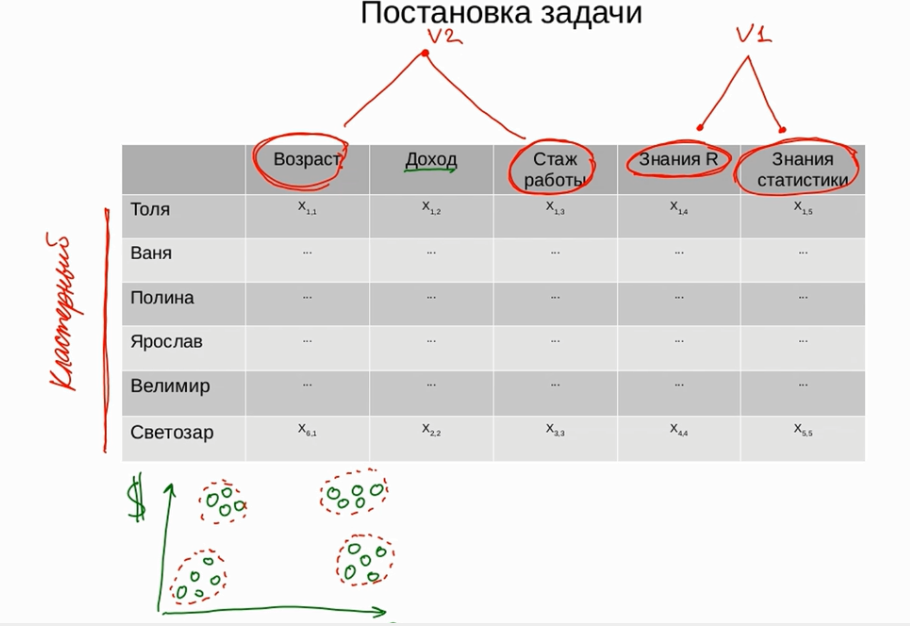
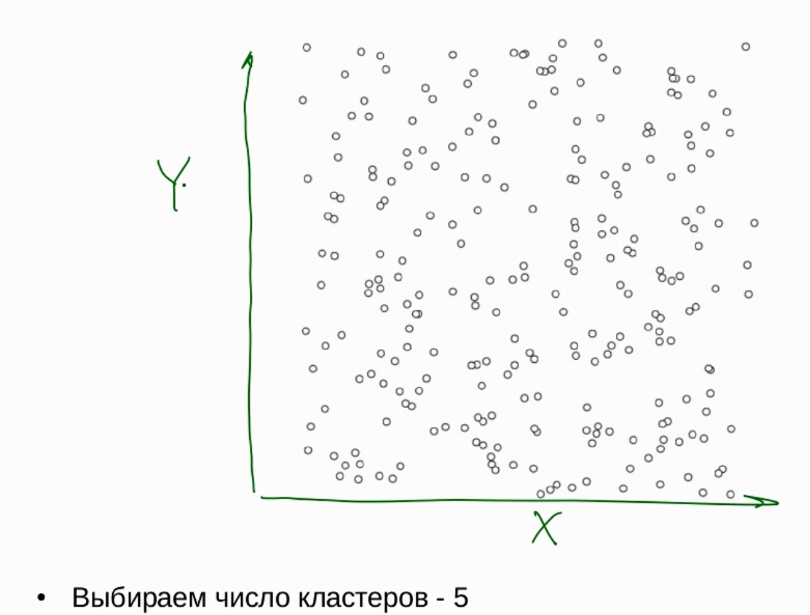
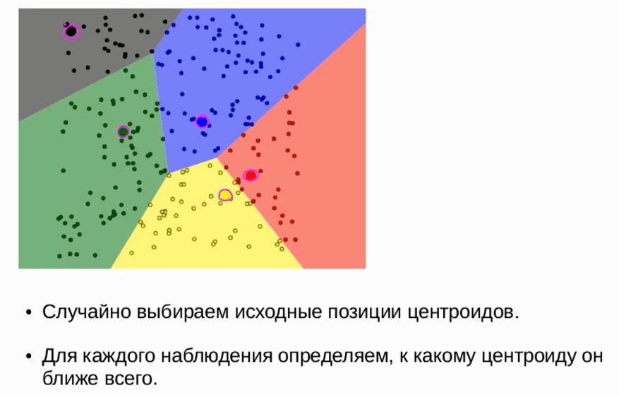
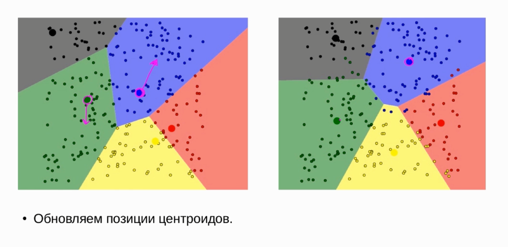

# Кластерный анализ и метод главных компонент

Два метода сами находят правильный ответ. Как всё это происходит?

## Постановка задачи

Представим исследование, в котором провели опрос людей и фиксировали некоторые параметры:

* Испытуемый

* Возраст

* Доход

* Стаж работы

* Знания R 

* Знания статистики

При некоторых группировках данных в визуализации появляются разные группы.

*Что будет делать кластерный анализ:*

Кластерный анализ будет бежать по нашим наблюдениям и пытаться ответить на вопрос --- есть ли у нас данных группировка наблюдений по разным кластерым. И сколько таких кластеров разумнее всего выделить.

*Что будет метод главных компонент:*

PCA будет смотреть на переменные и говорить, можно ли сократить размерность наших данных. Мы научимся группировать некоторые переменные. Мы научимся описывать взаимосвязанные переменные в интегративные переменные. Мы будем сокращать размерность.



## Кластерный анализ методом k-средних

При помощи кластерного анализа мы попробуем выяснить есть ли подгруппы в данных.

Это обучение без учителя --- мы изначально не знаем, есть ли какие-то подгруппы.

Регрессионный анализ --- обучение с учителям.

Перейдём к данным Ирис

```{r}
library(tidyverse)

data(iris)
```

Изобразим зависимость длины лепестка от толщины чашелистника

```{r}
ggplot(iris, aes(Sepal.Length, Petal.Width)) + geom_point()
```

Если мы посмотрим, то чисто на глаз, можно сказать что разделить можно на три вида --- снизу три, посередине и справа сверху.

Как мы можем решить задачу? Как раз методом k-средних

### Идея метода

* Решаем на сколько кластеров будем делить наблюдения

* Случайно выбираем начальные позиции цетроидов кластера

* Выводим центроиды на наилучшие позиции

Метод сам по себе не знает сколько кластеров.

Что такое центроида кластеров? Чтобы нести поднос со стаканами на одном пальце, нужно поставить палец в центр тяжести.

Как рассчитать центроиду? Чтобы найтри центроиду кластера можно рассчитать среднее арифметическое по двум измерениям в точках кластера.

### Как работает метод k-means

Метод k-means на первом этапе получает количество кластеров, на которое нужно поделить дата сет:



Далее мемтод берёт 5 случайных точек и говорит что это центроиды кластеров.



Теперь для каждого наблюдения определяем к какому центроиду он ближе всего. Для этого будем использовать геометрическое расстояние до точки. После этого скорректируем центроиды:



Но теперь, как только мы подвинули центриды, мы изменили баланс сил --- те точки, которые были раньше ближе к одним точкам, теперь ближе к другим. 

Т.е. теперь мы можем переопределить принадлежность класса. Итого:

1. Случайно выбрали цетроиды для указанного класса

2. Поместили в геометрический центр точек класса

3. Переопределили точки

4. Обновим положение центроид

5. когда остановится? Делаем до тех пор пока после очередного обновления центроидов ни одна точка не поменяет свою принадлежность.
