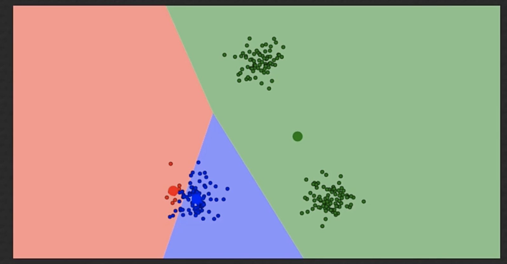
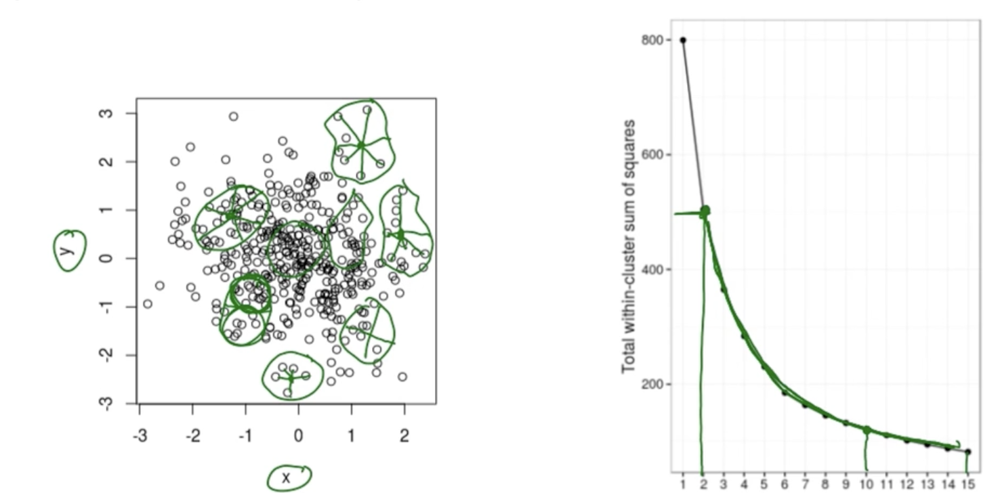
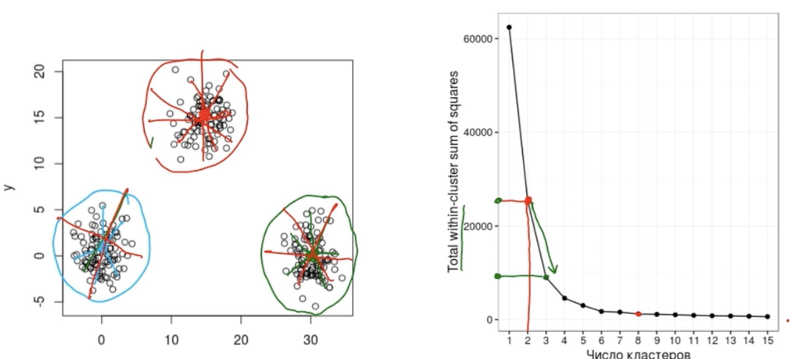

# Кластерный анализ и метод главных компонент

Два метода сами находят правильный ответ. Как всё это происходит?

## Постановка задачи

Представим исследование, в котором провели опрос людей и фиксировали некоторые параметры:

* Испытуемый

* Возраст

* Доход

* Стаж работы

* Знания R 

* Знания статистики

При некоторых группировках данных в визуализации появляются разные группы.

*Что будет делать кластерный анализ:*

Кластерный анализ будет бежать по нашим наблюдениям и пытаться ответить на вопрос --- есть ли у нас данных группировка наблюдений по разным кластерым. И сколько таких кластеров разумнее всего выделить.

*Что будет метод главных компонент:*

PCA будет смотреть на переменные и говорить, можно ли сократить размерность наших данных. Мы научимся группировать некоторые переменные. Мы научимся описывать взаимосвязанные переменные в интегративные переменные. Мы будем сокращать размерность.


## Кластерный анализ методом k-средних

При помощи кластерного анализа мы попробуем выяснить есть ли подгруппы в данных.

Это обучение без учителя --- мы изначально не знаем, есть ли какие-то подгруппы.

Регрессионный анализ --- обучение с учителям.

Перейдём к данным Ирис

```{r}
library(tidyverse)

data(iris)
```

Изобразим зависимость длины лепестка от толщины чашелистника

```{r}
ggplot(iris, aes(Sepal.Length, Petal.Width)) + geom_point()
```

Если мы посмотрим, то чисто на глаз, можно сказать что разделить можно на три вида --- снизу три, посередине и справа сверху.

Как мы можем решить задачу? Как раз методом k-средних

### Идея метода

* Решаем на сколько кластеров будем делить наблюдения

* Случайно выбираем начальные позиции цетроидов кластера

* Выводим центроиды на наилучшие позиции

Метод сам по себе не знает сколько кластеров.

Что такое центроида кластеров? Чтобы нести поднос со стаканами на одном пальце, нужно поставить палец в центр тяжести.

Как рассчитать центроиду? Чтобы найтри центроиду кластера можно рассчитать среднее арифметическое по двум измерениям в точках кластера.

### Как работает метод k-means

Метод k-means на первом этапе получает количество кластеров, на которое нужно поделить дата сет:


Далее мемтод берёт 5 случайных точек и говорит что это центроиды кластеров.


Теперь для каждого наблюдения определяем к какому центроиду он ближе всего. Для этого будем использовать геометрическое расстояние до точки. После этого скорректируем центроиды:


Но теперь, как только мы подвинули центриды, мы изменили баланс сил --- те точки, которые были раньше ближе к одним точкам, теперь ближе к другим. 

Т.е. теперь мы можем переопределить принадлежность класса. Итого:

1. Случайно выбрали цетроиды для указанного класса

2. Поместили в геометрический центр точек класса

3. Переопределили точки

4. Обновим положение центроид

5. когда остановится? Делаем до тех пор пока после очередного обновления центроидов ни одна точка не поменяет свою принадлежность.


## K-means продолжение

[визуализация работы алгоритма](https://www.naftaliharris.com/blog/visualizing-k-means-clustering/)

Вопрос номер один --- как понять что наш алгоритм сошёлся.

2. Правильно ли он сошёлся?

3. Какое число кластеров оптимальнее всего выбрать.

### Особенность
Действительно, интересной особенностью кластерного анализа k - means является тот факт, что он включает в себя элемент случайности при выборе исходных позиций центроидов. В результате при многократном повторении кластеризации на одних и тех же данных мы можем получать различные варианты кластерного решения. Чем менее явно представлена в наших данных кластерзация наблюдений, тем более существенными могут оказаться различия. 

```{r}
library(ggplot2)
d <- iris[, c("Sepal.Length", "Petal.Width")]

fit <- kmeans(d, 3)
d$clusters <- factor(fit$cluster)

ggplot(d, aes(Sepal.Length, Petal.Width, col = clusters))+
    geom_point(size = 2)+
    theme_bw() 
```


### Может ли кластерный анализ "ошибаться"?

Может. Вот например иллюстрация:



Что делать?

1. Первый способ --- воздействовать на первоначальное размещение центроид. Например, первоначальные точки ставить максимально далеко друг от друга. Но даже в этом случае можно не сойтись.

2. Второй способ --- многократное повторение алгоритма.

### Как выбрать число кластеров?

Можно выбрать оптимальное число кластеров.

В качестве понятия оптимальности будем использовать два понятия:

* Внутригрупповая сумма квадратов --- сумма квадратов отклонений каждого наблюдения от центроида кластера

* Общая внутригрупповая сумма квадратов --- будет получена если мы для каждого класстера рассчитаем его внутригрупповую сумму квадратов а потом просуммируем эти показатели.

Посдений показатель мы и будем использовать для оценки качества кластеризации.

Как это работает?

Идея --- если добавление ещё одного кластера в наши данные значительно понижает общую сумму квадртов --- это означает, что в увеличении числа кластеров есть смысл.

Если в структуре данных нет взаимосвязи, то уменьшение общей внутригруппово суммы квадратов будет происходить плавно



Посмотрим, что происходит, если в данных есть структура.




Если общая сумма плавно убывает --- значит нет структуры данных.

Если общая сумма скачкообразно изменяется --- значит количество кластеро выбрано оптимально.

В общей ситуации нужно искать оптимальное количество кластеров в точке излома графика общей суммы квадратов внутри групп.

Это общий подход.

Можно для определения оптимального числа кластеров воспользоваться пакетом NbClust:


```{r}
# install.packages("NbClust")
library(NbClust)
data(iris)
dt <- iris[, 1:4]
N <- NbClust(dt, distance = "euclidean",
             min.nc = 2, max.nc = 15, method = "complete", 
             index = "alllong")
```


### Задача 

Предположим есть один следующий кластер. Чему равна внутрикластерная сумма квадратов

```{r}
df <- data.frame(x=c(-3,1,2,3,5,6,7), y = c(3,4,6,8,2,11,1))
ggplot(df, aes(x,y)) + geom_point()
```

Всё просто:

```{r}
RES <- kmeans(df,1)
RES$withinss
```


## Иерархическая кластеризация

Метод ближайшего соседа (одиночной связи)

С самого начала алгоритм считает, что число кластеров = числу наблюдений.

Мы находим точки, которые ближе всего к друг другу и заменяет их центроидой.

Затем мы повторяем подход и считаем расстояние не до первых двух а уже для центроиды этих точек


И так повторяем  до тех пор пока не объединим все точке в кластер. Так и работает этот метода

Есть метод дальнего соседа --- он в последнюю очередь объединяет самые дальние в последнюю очередь.

На момент начала иерархической кластеризации ОВСК равна нулю (кластеров ровно столько, сколько наблюдений, и центроид каждого кластера совпадает с соответствующим наблюдением). А объединять надо такие кластеры, слияние которых приведет к наименьшему приросту ОВСК.

Полезно рисовать дендрограммы. Например вот тут нет чётко выраженной структуры:


### Итог

Можно комбинировать указанные способы кластеризации.

Особое внимание стоит уделить тому, как происходит выбор числа кластеров при иерархической кластеризации. Как я сказал, в этом случае у нас есть некоторая свобода в том, какое число кластеров выбрать, но то как исходные данные разделятся на выбранное число кластеров все-таки подчиняется логике работы алгоритма. Рассмотрим пример кластеризации следующего набора данных:


Например, если мы проведем данную кластеризацию в R и попросим выделить нам два кластера, то получим следующее решение:


Мы могли бы продолжить наше движение вниз, срезая все больше веток, и разделяя наши данные все на большее число кластеров.

```{r}
library(ggplot2) 
library(ggrepel) # для симпатичной подписи точек на графике

x <- rnorm(10)
y <- rnorm(10)
test_data <- data.frame(x, y)
test_data$labels <- 1:10

ggplot(test_data, aes(x, y, label = labels))+
    geom_point()+
    geom_text_repel()

d = dist(test_data)
fit <- hclust(d, method = "single")
plot(fit, labels = test_data$labels)
rect.hclust(fit, 2) # укажите желаемое число кластеров, сейчас стоит 2
```

## Введение в метод главных компонент

Предположим мы набрали 40 человек, и узнали как коррелирует знания статистики  со знанием R.


Что значит найти главную компоненту  наших данных? Главных компонент всегда столько же, сколько исходных переменных. Основная идея в том, чтобы нарисовать новые оси, которые лучше отображают изменчивость наших данных.

Итак, сейчас каждая точка задаётся двумя параметрами --- проекциями на оси абсцисс и ординат.


Теперь зададимся вопросом --- можем ли мы нарисовать на графике такую линию, проекция на которую макисмально точно предсказывать в каком месте будет наша точка на графике.

Это будет наша регрессионная прямая.

Регрессионная прямая будет служить нам новой осью. И теперь мы будем смотреть расстояние не до первоначальных осей а до новой оси.


Таким образом мы решаем обратную задачу: раньше мы зная корреляцию могли по значению одной переменной предсказать значение другой переменной.

А теперь мы проведя прямую восстанавливаем исходные значения изначальных переменных у этой точки. Если мы знаем что на новой компоненте высокой значение точки. То мы знаем, что и на первых двух осях значения будет большие. 

Посмотрим сколько бы измен чивости объяснила главная компонента.


Теперь осталось построить вторую ось --- она перпендикулярна второй оси


ТЕперь все наши данные объясняются на 100%.


