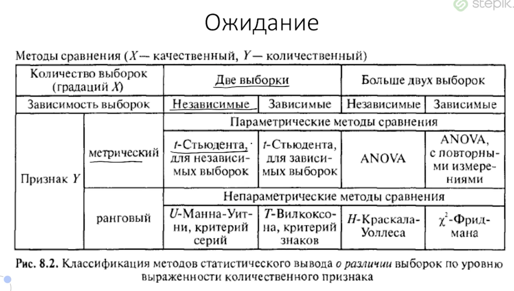
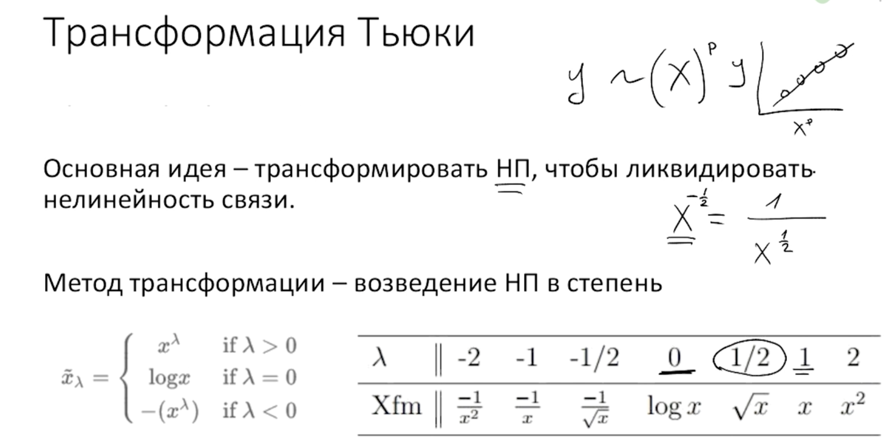
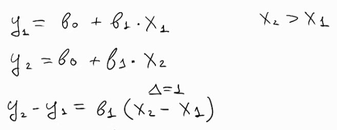
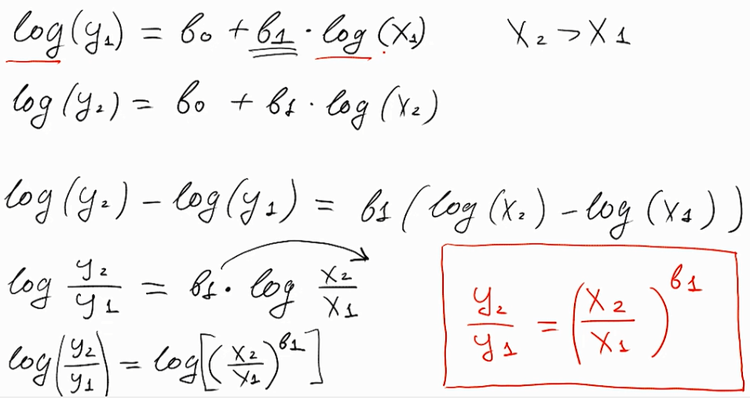
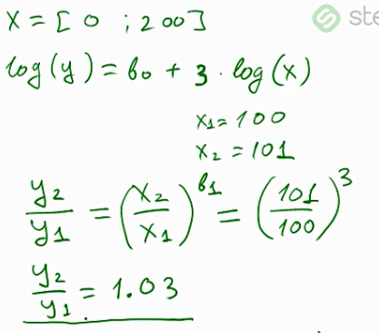
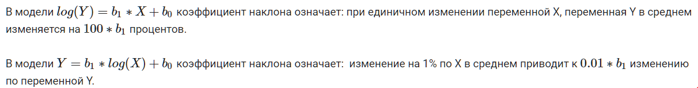
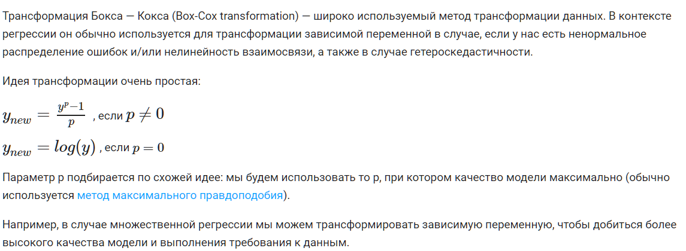
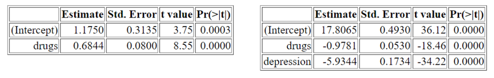
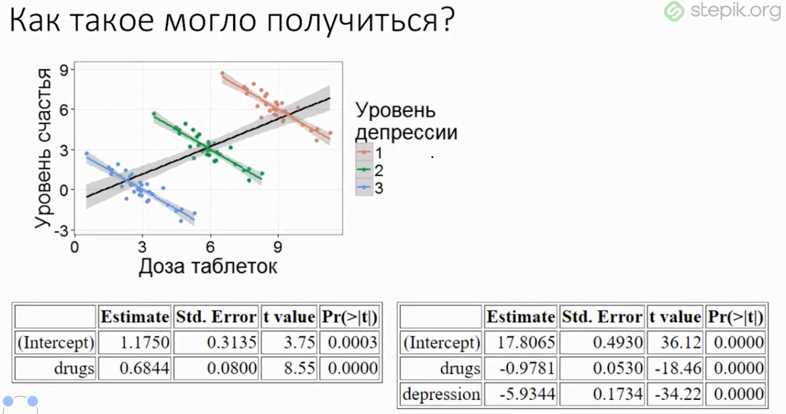
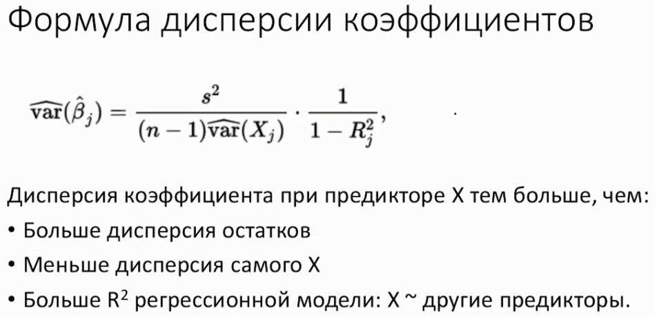

# Подробнее о линейной регрессии

Есть куча методов



Но оказывается всё можно свести к тому или иному выводу регрессионого анализа.

Регрессия это очень важный пункт. От него потом легче понимать машинное обучение.

### Ограничения 


* Линейность взаимосвязи ЗП и НП

Рассмотрим пример:

```{r}
library(tidyverse)
data(mtcars)
ggplot(mtcars, aes(hp, mpg)) + geom_point()
```

Мы можем записать уравнение линейной регрессии $mpg = b_0 + b_1 hp$

```{r}
ggplot(mtcars, aes(hp, mpg)) + geom_point() + geom_smooth(method = "lm")
```

Но и на графике, и по ошибкам на прямой выше, видно, что связь скорее всего не линейная

Поэтому в подобных случаях линейная регрессия не лучшее решение. Особенно, если мы хотим предсказывать значения.

Как бороться? Лучше сразу строить данные. Есть способы --- можно модифицировать зависимость.

### Трансформация Тьюки

Основная идея --- трансформировать независимую переменную (предиктор), чтобы  ликвидировать нелинейность связи. Возведением в степень.

Нюанс, если показатель степени $\lambda$ ниже нуля, то будем подставлять минус, чтобы перевернуть



Давайте реализуем несколько преобразований

```{r}
ggplot(mtcars, aes(hp^0.5, mpg)) + geom_point()
ggplot(mtcars, aes(hp^-0.5, mpg)) + geom_point()
ggplot(mtcars, aes(-hp^-0.5, mpg)) + geom_point()
```

Модели с трансформацией

```{r}
fit1 <- lm(mpg ~ hp, mtcars)
fit2 <- lm(mpg ~ I(-hp^-0.7), mtcars)
```


### Логарифмическая трансформация переменных

Что будет, если мы применим логарифмирование одновременно и к зависимой переменной и к независимой

```{r}
qplot(data = mtcars, x = log(hp), y = log(mpg))
```

На самом деле мы вроде как справились с нелинейностью взаимосвязи.

Создадим 

```{r}
fit3 <- lm(log(mpg)~log(hp), mtcars)
summary(fit3)
```

Что говорит коэффициент при log(hp) --- у нас при единичном изменении log(hp) значение log(mpg) будет уменьшаться на приблизительно 0.5. 
Можно перейти от оценки логарифмов к обычным значениям.

Вспмомним мат.основы регрессии. Если порядок иксов будет изменяться на единицу, то изменение предсказаний будет равно коэффициенту при иксах:



Что теперь? у нас исходная модель изменилась. У нас теперь логарифмы.

Теперь у нас коэффициент бэ один показывает на сколько процентов увеличится исходной переменной предиктор изменится на один процент



Т.е. как пример разберём вот такую ситуацию:



#### Вывод

Когда используем трансформацию и зависмой и независимой переменной, мы говорим, что коэффициент при логарифме икс это то на сколько процентов увеличится зависимой переменной, при условии что значение независимой переменной увеличится на один процент.

Т.е. в случае модели fit3 --- при единичном увеличении лошадинных сил на один  процент  значение расхода топлива уменьшита на пол.процента (-0.53009)

Т.е. если посмотреть на график рассеяния нелогарифмированных величин, то там видно что при нам такая трактовка и говорит что связь не линейна. Потому что чем дальше от исходного значения тем шире нужно сделать шажок для того чтобы было справедливо высказывание об угасании на пол.процента

Говоря об остальных трансформациях предикторов или зависимой переменной




### Распределение остатков

Очень часто, когда нелинейное распределение, у нас получается не нормальное распределение остатков.

Посмотрим на распределение остатков в наших моделях

```{r}
hist(fit1$residuals)
hist(fit2$residuals)
hist(fit3$residuals)
```

так сразу и не скажешь, но мы можем проверить при помощи тестов на нормальность. Наппример тест Шапиро-Вилко

```{r}
shapiro.test(fit1$residuals)
shapiro.test(fit2$residuals)
shapiro.test(fit3$residuals)
```

Видно что p уровень значимости всё возрастает, и если во второй и третьей моделях у нас нет оснований отвергуть нулевую гипотезу.
У нас в последней модели всё ещё лучше 


Когда есть подозрение о том что предикторы взаимосвязаны нелинейно с независимой переменной. Очень часто происходит так, что если мы посмотрим на распределение остатков, то оно будет не нормальным.

Самое правильное решение при этом --- трансформация переменных.

Способы описаны выше. Есть один из методов



### Промежуточный итог

Мы разобрали две проблемы --- нелинейность зависимости ЗП и НП. Ненормальность остатков 

Степенная трансформация переменных в регрессии не всегда позволит достичь увеличения качества регрессионной мождели (значения R квадрат).

Для некоторых значений показателя степени необходимо, чтобы значения переменной были неотрицательны.

Трансформация при помощи логарифма далеко не всегда позволит сделать взаимосвязь более линейной.

При использовании показателя степени меньше нуля мы берем значения переменной с другим знаком, чтобы сохранить исходное направление взаимосвязи

## Проблема гетероскедостичности

Для визуализации проблемы построим вот такой график

```{r}
diamonds_2 <- sample_n(diamonds, 500)
qplot(x = price, y = carat, data = diamonds_2) + 
  geom_smooth(method = lm)
```

Он показывает неравномерное распределение. Бриллиантов дешёвых гораздо больше чем дорогих. 

Проблема двоякий характер --- коэффициенты не самые лучшие а так же интерпретация получается неправильная. Предсказательная сила регрессии будет плохой.

Когда регрессоров много, строить их в n-мерном пространстве неудобно, неинформативно и ненужно --- можно построить график остатков.

```{r}
fit_1 <- lm(carat ~ price, diamonds_2)
plot(fit_1) # 1,2,3,4
```

Как только построили множественную модель --- строим график остатков. Там всё видно.

```{r}
summary(fit_1)
```

Тест Уайта проверяет нулевую гипотезу об отсутствии гетероскедастичности. Если результат теста оказался статистически значимым, то есть p-value < порогового (0.05 или меньше)  то мы нулевую гипотезу отвергаем.

Если мы построим регрессию, где зависимой переменной будет квадрат остатков модели y ~ x, а независимой переменной будет предиктор x, и в этой модели окажется высокий и значимый R квадрат, это означает, что в данных есть гетероскедастичность

Как быть? Поможет трансформация исходных переменных.

```{r}
qplot(x = log(price), y = log(carat), data = diamonds_2) + 
  geom_smooth(method = lm)
```

Формально, можно использовать тест Уайта

```{r}
fit_2 <- lm(log(carat) ~ log(price), diamonds_2)
library(lmtest)

bptest(fit_2)
```

Если p-value в тесте меньше 0.05, то мы отвергаем гипотезу о том, что у нас нет никакой зависимости с предикторами квадратичными. Т.е. у нас есть в данных гетероскедастичность.

# Мультиколлинеарность

Это наличие линейной зависимости между объясняющими переменными (факторами) регрессионной модели.

Бывает полная --- равняется единице. Самая простая ситуация. В таких случаях, мы получим пропущенные значения

```{r}
set.seed(42)
d <- tibble(y = rnorm(30),
                x_1 = rnorm(30),
                x_2 = x_1,
                x_3 = rnorm(30))
fit <- lm(y ~ ., d)
summary(fit)
```

Графики получаются вот такие штуки

```{r}
select(d, -y) %>% pairs()
```

Практический совет.

Если стоит задача построить регрессию --- строим тупую банальную регрессию. Если есть NA в коэффициентах то это абсолютно точно мультиколлинеарная переменная

NA --- потому что возникает неопределённость

## Почему мультиколлинеарность это плохо

Как можно объяснить тот факт, что коэффициент наклона при переменной число антидепрессантов изменил свой знак на противоположный после добавления в модель предиктора уровень депрессии?



Негативный коэффициент во второй модели говорит нам о том, что если мы зафиксируем переменную уровень депрессии, то число антидепрессантов будет негативно связано с зависимой переменной.



Регрессия отлично справляется, когда у нас есть мультиколлинеарность.

### Пример из эконометрики

мы можем использовать полученную модель в качестве предиктора, если R-квадрат статистически значим, даже если у нас все коэффициенты при независимых переменных статистически не значимы


```{r}
head(cars)
qplot(x = speed, y = dist, data = cars)
fit_1 <- lm(dist~speed, cars)
summary(fit_1)

# мы получили сильно значимый коэффициент при переменной speed
# можно принять альтернативную гипотезу, о том что существует значимая взаимосвязь между скоростью и тормозным путём

cars <- mutate(cars, speed_2 = speed^2, speed_3 = speed^3)

fit_2 <- lm(dist ~., cars)
summary(fit_2)
```

Получается при добавлении степеней скорости в модель, коэффициенты становтяс незначимыми, а R квардрат всё равно статистически значимый коэфф.

Когда получается такая штука --- будь уверен, столкнулся с проблемой мультиколлинеарности. Эта проблема затрагивает самое дорогое --- коэффициенты при предикторах.

Если мы хотим предсказывать значения нашей переменной, то мультиколлинеарность это не проблема. Проблема мы не можем сказать про то, как каждая фича связана с переменной.

### Формула дисперсии коэффициентов




```{r}
head(swiss)

fit_1 <- lm(Fertility ~., swiss)
summary(fit_1)

# Чтобы проверить корреляцию коэффициентов
cor.test(~Fertility + Examination, swiss)
```

Хороший шаг --- если предиктор незначим, не сразу выбрасывать его из модели.
Нужно сначала убедиться что в данных нет мультиколлинеарности.

## Как проверить данные на мультиколлинеарность

Вариант 1 --- Можно построить корреляционную матрицу

Вариант 2 --- Можно посмотреть, на сколько каждая фича объясняется другими фичами. Использовать коэффициент вздутия дисперсии $VIF= \frac{1}{(1-R^2)}$

Квадратный корень VIF показывает во сколько раз больше стала ошибка данного коэффициента, по сравнению с ситуацией, если бы данный предиктор был бы абсолютно независим от других предикторов.

```{r}
fit_2 <- lm(Fertility ~., select(swiss, -Examination))
summary(fit_2)

library("car")
vif(fit_2)

# Мы убрали коэффициент, но R adj остался такой же
```

Если VIF больше 10 то тогда имеет смысл --- предиктор исключить

Исходя из формулы стандартной ошибки среднего для коэффициента наклона при переменной X1 в регрессии, значение стандартной ошибки тем больше, чем больше дисперсия остатков, меньше дисперсия переменной Х1, больше значение VIF.

### Что делать на практике

Что делаем на практике --- смотрим VIF, если больше 10 то можно попробовать объединить компоненты методом PCA. 

Если стоит задача предсказания, то в этом ничего страшного нет

## Практические задачи

### Задача 1

Давайте реализуем простейший вариант теста для проверки наличия гетероскедастичности.  Напишите функцию hetero_test, которая получает на вход набор данных. Первая колонка в данных - зависимая переменная, остальные колонки - независимые. Функция строит регрессионную модель, используя эти переменные, а затем проверяет, есть ли в данных  гетероскедастичность.

Для этого функция строит вспомогательную регрессию, в которой зависимая переменная - это квадраты остатков исходной модели, а независимые переменные - это предикторы из исходной модели. Функция должна возвращать значение R квадрат этой вспомогательной модели.

```{r}
hetero_test <-  function(test_data){
    fit <- lm(test_data[,1] ~ ., test_data[-1])
    fit_2 <- lm(fit$residuals^2 ~.,test_data[-1])
    summary(fit_2)$r.squared 
}

hetero_test(mtcars)
```

### Задача 2

Самостоятельно реализуйте расчет показателя vif.  Напишите функцию VIF, которая получает на вход набор данных. Первая колонка в данных - зависимая переменная, остальные колонки - независимые. Функция строит регрессионную модель, используя эти переменные, а затем для каждой  независимой переменной рассчитывает показатель vif.

VIF для предиктора X рассчитывается по формуле:

де - R2x это R квадрат вспомогательной модели, в которой предиктор X зависимая переменная, а все остальные предикторы - независимые переменные. В формуле vif используется обычный R квадрат, а не исправленный.

Нужно сделать регрессию на все предикторы, кроме себя и самого первого предиката.

```{r}
VIF <-  function(test_data){
  # r2 it's function for easy calculate of r squared
  r2 <- function(mod) {
    y <- as.character(terms(mod))[2]
    ss_resid <- sum(mod$residuals^2)
    ss_total <- sum((mod$model[[y]] - mean(mod$model[[y]]))^2)
    1 - ss_resid / ss_total
  }
  data = test_data[-1]
  fit_list <- lapply(seq_along(data), function(x) lm(data = data[-x], data[,x] ~ .))
  vector <- 1/ (1 - sapply(fit_list, r2))
  names(vector) <- names(data)
  return(vector)
}

VIF(mtcars)
```