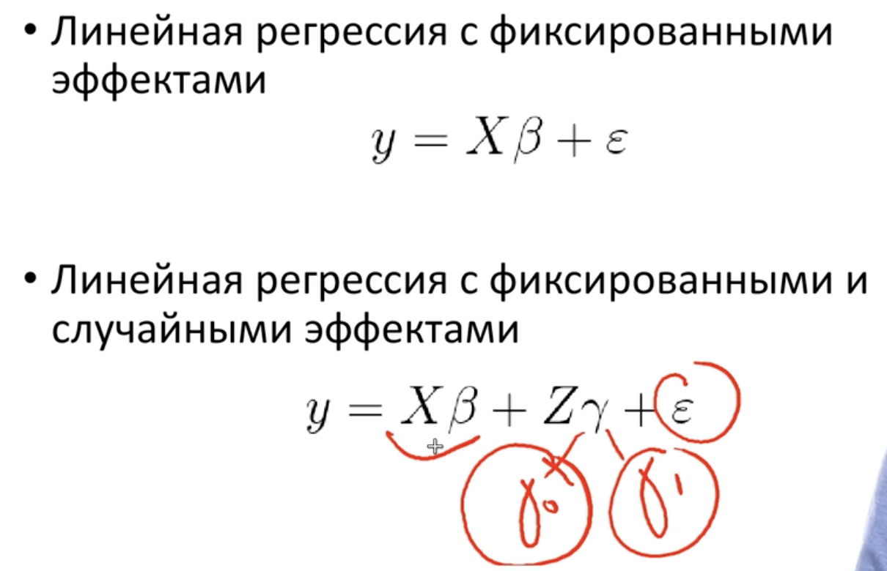
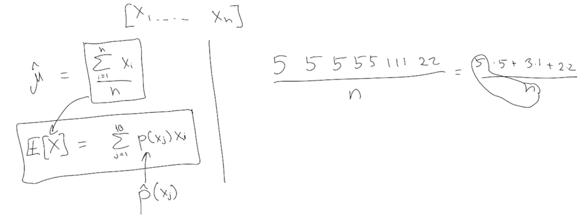
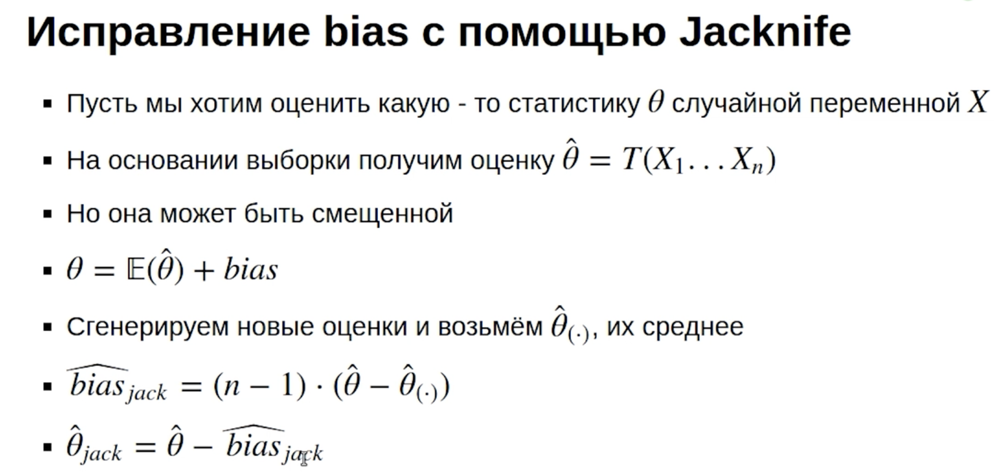
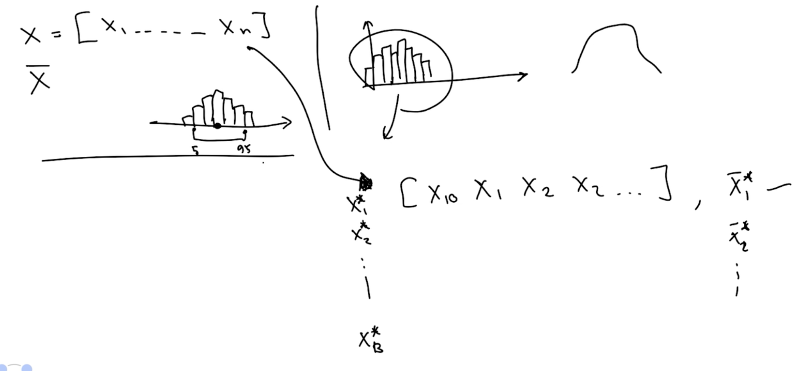

# Подробнее о линейной регрессии

Есть куча методов


Но оказывается всё можно свести к тому или иному выводу регрессионого анализа.

Регрессия это очень важный пункт. От него потом легче понимать машинное обучение.

### Ограничения 


* Линейность взаимосвязи ЗП и НП

Рассмотрим пример:

```{r}
library(tidyverse)
data(mtcars)
ggplot(mtcars, aes(hp, mpg)) + geom_point()
```

Мы можем записать уравнение линейной регрессии $mpg = b_0 + b_1 hp$

```{r}
ggplot(mtcars, aes(hp, mpg)) + geom_point() + geom_smooth(method = "lm")
```

Но и на графике, и по ошибкам на прямой выше, видно, что связь скорее всего не линейная

Поэтому в подобных случаях линейная регрессия не лучшее решение. Особенно, если мы хотим предсказывать значения.

Как бороться? Лучше сразу строить данные. Есть способы --- можно модифицировать зависимость.

### Трансформация Тьюки

Основная идея --- трансформировать независимую переменную (предиктор), чтобы  ликвидировать нелинейность связи. Возведением в степень.

Нюанс, если показатель степени $\lambda$ ниже нуля, то будем подставлять минус, чтобы перевернуть


Давайте реализуем несколько преобразований

```{r}
ggplot(mtcars, aes(hp^0.5, mpg)) + geom_point()
ggplot(mtcars, aes(hp^-0.5, mpg)) + geom_point()
ggplot(mtcars, aes(-hp^-0.5, mpg)) + geom_point()
```

Модели с трансформацией

```{r}
fit1 <- lm(mpg ~ hp, mtcars)
fit2 <- lm(mpg ~ I(-hp^-0.7), mtcars)
```


### Логарифмическая трансформация переменных

Что будет, если мы применим логарифмирование одновременно и к зависимой переменной и к независимой

```{r}
qplot(data = mtcars, x = log(hp), y = log(mpg))
```

На самом деле мы вроде как справились с нелинейностью взаимосвязи.

Создадим 

```{r}
fit3 <- lm(log(mpg)~log(hp), mtcars)
summary(fit3)
```

Что говорит коэффициент при log(hp) --- у нас при единичном изменении log(hp) значение log(mpg) будет уменьшаться на приблизительно 0.5. 
Можно перейти от оценки логарифмов к обычным значениям.

Вспмомним мат.основы регрессии. Если порядок иксов будет изменяться на единицу, то изменение предсказаний будет равно коэффициенту при иксах:


Что теперь? у нас исходная модель изменилась. У нас теперь логарифмы.

Теперь у нас коэффициент бэ один показывает на сколько процентов увеличится исходной переменной предиктор изменится на один процент


Т.е. как пример разберём вот такую ситуацию:


#### Вывод

Когда используем трансформацию и зависмой и независимой переменной, мы говорим, что коэффициент при логарифме икс это то на сколько процентов увеличится зависимой переменной, при условии что значение независимой переменной увеличится на один процент.

Т.е. в случае модели fit3 --- при единичном увеличении лошадинных сил на один  процент  значение расхода топлива уменьшита на пол.процента (-0.53009)

Т.е. если посмотреть на график рассеяния нелогарифмированных величин, то там видно что при нам такая трактовка и говорит что связь не линейна. Потому что чем дальше от исходного значения тем шире нужно сделать шажок для того чтобы было справедливо высказывание об угасании на пол.процента

Говоря об остальных трансформациях предикторов или зависимой переменной


### Распределение остатков

Очень часто, когда нелинейное распределение, у нас получается не нормальное распределение остатков.

Посмотрим на распределение остатков в наших моделях

```{r}
hist(fit1$residuals)
hist(fit2$residuals)
hist(fit3$residuals)
```

так сразу и не скажешь, но мы можем проверить при помощи тестов на нормальность. Наппример тест Шапиро-Вилко

```{r}
shapiro.test(fit1$residuals)
shapiro.test(fit2$residuals)
shapiro.test(fit3$residuals)
```

Видно что p уровень значимости всё возрастает, и если во второй и третьей моделях у нас нет оснований отвергуть нулевую гипотезу.
У нас в последней модели всё ещё лучше 


Когда есть подозрение о том что предикторы взаимосвязаны нелинейно с независимой переменной. Очень часто происходит так, что если мы посмотрим на распределение остатков, то оно будет не нормальным.

Самое правильное решение при этом --- трансформация переменных.

Способы описаны выше. Есть один из методов


### Промежуточный итог

Мы разобрали две проблемы --- нелинейность зависимости ЗП и НП. Ненормальность остатков 

Степенная трансформация переменных в регрессии не всегда позволит достичь увеличения качества регрессионной мождели (значения R квадрат).

Для некоторых значений показателя степени необходимо, чтобы значения переменной были неотрицательны.

Трансформация при помощи логарифма далеко не всегда позволит сделать взаимосвязь более линейной.

При использовании показателя степени меньше нуля мы берем значения переменной с другим знаком, чтобы сохранить исходное направление взаимосвязи

## Проблема гетероскедостичности

Для визуализации проблемы построим вот такой график

```{r}
diamonds_2 <- sample_n(diamonds, 500)
qplot(x = price, y = carat, data = diamonds_2) + 
  geom_smooth(method = lm)
```

Он показывает неравномерное распределение. Бриллиантов дешёвых гораздо больше чем дорогих. 

Проблема двоякий характер --- коэффициенты не самые лучшие а так же интерпретация получается неправильная. Предсказательная сила регрессии будет плохой.

Когда регрессоров много, строить их в n-мерном пространстве неудобно, неинформативно и ненужно --- можно построить график остатков.

```{r}
fit_1 <- lm(carat ~ price, diamonds_2)
plot(fit_1) # 1,2,3,4
```

Как только построили множественную модель --- строим график остатков. Там всё видно.

```{r}
summary(fit_1)
```

Тест Уайта проверяет нулевую гипотезу об отсутствии гетероскедастичности. Если результат теста оказался статистически значимым, то есть p-value < порогового (0.05 или меньше)  то мы нулевую гипотезу отвергаем.

Если мы построим регрессию, где зависимой переменной будет квадрат остатков модели y ~ x, а независимой переменной будет предиктор x, и в этой модели окажется высокий и значимый R квадрат, это означает, что в данных есть гетероскедастичность

Как быть? Поможет трансформация исходных переменных.

```{r}
qplot(x = log(price), y = log(carat), data = diamonds_2) + 
  geom_smooth(method = lm)
```

Формально, можно использовать тест Уайта

```{r}
fit_2 <- lm(log(carat) ~ log(price), diamonds_2)
library(lmtest)

bptest(fit_2)
```

Если p-value в тесте меньше 0.05, то мы отвергаем гипотезу о том, что у нас нет никакой зависимости с предикторами квадратичными. Т.е. у нас есть в данных гетероскедастичность.

# Мультиколлинеарность

Это наличие линейной зависимости между объясняющими переменными (факторами) регрессионной модели.

Бывает полная --- равняется единице. Самая простая ситуация. В таких случаях, мы получим пропущенные значения

```{r}
set.seed(42)
d <- tibble(y = rnorm(30),
                x_1 = rnorm(30),
                x_2 = x_1,
                x_3 = rnorm(30))
fit <- lm(y ~ ., d)
summary(fit)
```

Графики получаются вот такие штуки

```{r}
select(d, -y) %>% pairs()
```

Практический совет.

Если стоит задача построить регрессию --- строим тупую банальную регрессию. Если есть NA в коэффициентах то это абсолютно точно мультиколлинеарная переменная

NA --- потому что возникает неопределённость

## Почему мультиколлинеарность это плохо

Как можно объяснить тот факт, что коэффициент наклона при переменной число антидепрессантов изменил свой знак на противоположный после добавления в модель предиктора уровень депрессии?


Негативный коэффициент во второй модели говорит нам о том, что если мы зафиксируем переменную уровень депрессии, то число антидепрессантов будет негативно связано с зависимой переменной.


Регрессия отлично справляется, когда у нас есть мультиколлинеарность.

### Пример из эконометрики

мы можем использовать полученную модель в качестве предиктора, если R-квадрат статистически значим, даже если у нас все коэффициенты при независимых переменных статистически не значимы


```{r}
head(cars)
qplot(x = speed, y = dist, data = cars)
fit_1 <- lm(dist~speed, cars)
summary(fit_1)

# мы получили сильно значимый коэффициент при переменной speed
# можно принять альтернативную гипотезу, о том что существует значимая взаимосвязь между скоростью и тормозным путём

cars <- mutate(cars, speed_2 = speed^2, speed_3 = speed^3)

fit_2 <- lm(dist ~., cars)
summary(fit_2)
```

Получается при добавлении степеней скорости в модель, коэффициенты становтяс незначимыми, а R квардрат всё равно статистически значимый коэфф.

Когда получается такая штука --- будь уверен, столкнулся с проблемой мультиколлинеарности. Эта проблема затрагивает самое дорогое --- коэффициенты при предикторах.

Если мы хотим предсказывать значения нашей переменной, то мультиколлинеарность это не проблема. Проблема мы не можем сказать про то, как каждая фича связана с переменной.

### Формула дисперсии коэффициентов


```{r}
head(swiss)

fit_1 <- lm(Fertility ~., swiss)
summary(fit_1)

# Чтобы проверить корреляцию коэффициентов
cor.test(~Fertility + Examination, swiss)
```

Хороший шаг --- если предиктор незначим, не сразу выбрасывать его из модели.
Нужно сначала убедиться что в данных нет мультиколлинеарности.

## Как проверить данные на мультиколлинеарность

Вариант 1 --- Можно построить корреляционную матрицу

Вариант 2 --- Можно посмотреть, на сколько каждая фича объясняется другими фичами. Использовать коэффициент вздутия дисперсии $VIF= \frac{1}{(1-R^2)}$

Квадратный корень VIF показывает во сколько раз больше стала ошибка данного коэффициента, по сравнению с ситуацией, если бы данный предиктор был бы абсолютно независим от других предикторов.

```{r}
fit_2 <- lm(Fertility ~., select(swiss, -Examination))
summary(fit_2)

library("car")
vif(fit_2)

# Мы убрали коэффициент, но R adj остался такой же
```

Если VIF больше 10 то тогда имеет смысл --- предиктор исключить

Исходя из формулы стандартной ошибки среднего для коэффициента наклона при переменной X1 в регрессии, значение стандартной ошибки тем больше, чем больше дисперсия остатков, меньше дисперсия переменной Х1, больше значение VIF.

### Что делать на практике

Что делаем на практике --- смотрим VIF, если больше 10 то можно попробовать объединить компоненты методом PCA. 

Если стоит задача предсказания, то в этом ничего страшного нет

## Практические задачи

### Задача 1

Давайте реализуем простейший вариант теста для проверки наличия гетероскедастичности.  Напишите функцию hetero_test, которая получает на вход набор данных. Первая колонка в данных - зависимая переменная, остальные колонки - независимые. Функция строит регрессионную модель, используя эти переменные, а затем проверяет, есть ли в данных  гетероскедастичность.

Для этого функция строит вспомогательную регрессию, в которой зависимая переменная - это квадраты остатков исходной модели, а независимые переменные - это предикторы из исходной модели. Функция должна возвращать значение R квадрат этой вспомогательной модели.

```{r}
hetero_test <-  function(test_data){
    fit <- lm(test_data[,1] ~ ., test_data[-1])
    fit_2 <- lm(fit$residuals^2 ~.,test_data[-1])
    summary(fit_2)$r.squared 
}

hetero_test(mtcars)
```

### Задача 2

Самостоятельно реализуйте расчет показателя vif.  Напишите функцию VIF, которая получает на вход набор данных. Первая колонка в данных - зависимая переменная, остальные колонки - независимые. Функция строит регрессионную модель, используя эти переменные, а затем для каждой  независимой переменной рассчитывает показатель vif.

VIF для предиктора X рассчитывается по формуле:

де - R2x это R квадрат вспомогательной модели, в которой предиктор X зависимая переменная, а все остальные предикторы - независимые переменные. В формуле vif используется обычный R квадрат, а не исправленный.

Нужно сделать регрессию на все предикторы, кроме себя и самого первого предиката.

```{r}
VIF <-  function(test_data){
  # r2 it's function for easy calculating r-squared
  r2 <- function(mod) {
    y <- as.character(terms(mod))[2]
    ss_resid <- sum(mod$residuals^2)
    ss_total <- sum((mod$model[[y]] - mean(mod$model[[y]]))^2)
    1 - ss_resid / ss_total
  }
  data = test_data[-1]
  fit_list <- lapply(seq_along(data), function(x) lm(data = data[-x], data[,x] ~ .))
  vector <- 1/ (1 - sapply(fit_list, r2))
  names(vector) <- names(data)
  return(vector)
}

VIF(mtcars)
```

### Задача 3

Усложним предыдущую задачу, а также используем нашу функцию VIF. Напишите функцию smart_model, которая на вход получает набор данных. Первая колонка в данных - зависимая переменная, остальные колонки - независимые. Функция строит регрессию с этими переменными и проверяет есть ли в модели переменные с показателем vif больше 10. Если хотя бы у одной переменной vif > 10, то из регрессионной модели удаляется переменная с максимальным показателем vif, если после этого в новой модели все еще остались переменные с vif больше 10, то мы опять исключаем из модели переменную с максимальным vif. Таким образом, мы исключаем по одной переменной за раз, пока в модели не останутся независимые переменные с vif не больше 10.

Особая ситуация - это когда в модели два предиктора, и для обоих vif одинаковый и больше 10, в этом случае можно исключить любой из предикторов.

Функция должна возвращать коэффициенты регрессии финальной модели.

```{r}
fit <- lm(data = mtcars[c(-2,-3)], mpg~.)

VIF(mtcars[c(-2,-3)])

mtcars[names(which(VIF(mtcars) == max(VIF(mtcars))))]

mtcars["disp"]


VIF(mtcars) == max(VIF(mtcars))

mtcars[, -which(names(mtcars) %in% c(names(which(VIF(mtcars) == max(VIF(mtcars))))))]


max(VIF(mtcars)) > 10
```

```{r}
smart_model <-  function(test_data){
  # initiate VIF-function
  VIF <-  function(test_data){
    # r2 it's function for easy calculating r-squared
    r2 <- function(mod) {
      y <- as.character(terms(mod))[2]
      ss_resid <- sum(mod$residuals^2)
      ss_total <- sum((mod$model[[y]] - mean(mod$model[[y]]))^2)
      1 - ss_resid / ss_total
      }
    data = test_data[-1]
    fit_list <- lapply(seq_along(data), function(x) lm(data = data[-x], data[,x] ~ .))
    vector <- 1/ (1 - sapply(fit_list, r2))
    names(vector) <- names(data)
    return(vector)
    }
  # Запускаем поиск переменных с VIF больше 10
  while (max(VIF(test_data)) > 10) {
    # проверяю случай, когда только два предиктора
    if (ncol(test_data) == 3){
      test_data <- test_data[-2]
      break
      } else {
        # если есть переменная с VIF больше 10, то ищем её имя и удаляем из исходного набора
        test_data <- test_data[, -which(names(test_data) %in% 
                                          c(names(which(VIF(test_data) == max(VIF(test_data))))))]
      }
    }
  fit <- lm(test_data[,1] ~ ., test_data[-1])
  return(fit$coefficients)
}
```

Проверяем работу

```{r}
smart_model(mtcars)

set.seed(42)
test_data <- data.frame(y = rnorm(30, 5), x1 = rnorm(30, 5))
test_data$x2 <- test_data$x1^2
smart_model(test_data)
```


### Задача 4

Давайте реализуем поиск наиболее подходящей степени для трансформации независимой переменной в обычной регрессии, с одним предиктором.

Ваша функция transform_x получает на вход набор данных из двух колонок, первая колонка y и вторая x. Функция должна найти такой показатель степени для трансформации x, при котором между x и y будет максимальное абсолютное значение корреляции. Правило трансформации, как мы разбирали на лекциях:

Функция должна вернуть трансформированную переменную x. Обратите внимание, что вместо возведения в нулевую степень мы будем логарифмировать переменную.  В этом примере давайте ограничимся показателями степени от -2 до 2 с шагом 0.1.  

```{r}

transform_x <- function(test_data){
# задаём последовательность с шагом
lambda <- seq(-2, 2, 0.1)
# возвожу в степень, согласно условию Трансформации Тьюки
for (i in lambda) {
  if (i > 0){
    test_data <- cbind(test_data, i = test_data$x^i)
  } else if (i == 0){
    test_data <- cbind(test_data, i = log(test_data$x))
  } else {
    test_data <- cbind(test_data, i = -1/(test_data$x^-i))
  }
}
# строю вектор, в котором все моделуи значений корреляции  
vector <- abs(sapply(test_data, function(x) cor.test(x, test_data$y)$estimate))
# не беру первое значение, потому что это кореляция самого на себя и получаю вектор булевых значений 
index <- max(vector[-1]) == vector 
  return(test_data[,index])
}

# тестируем
set.seed(42)
test_data <- data.frame(y = rnorm(10, 10, 1), x = rnorm(10, 10, 1)) 
transform_x(test_data)

```
# Смешанные регрессионные модели

Как бороться с тем, что нарушено допущение о независимости измерений.
Как раз смешанными регрессионными моделями.

## Нарушение допущения о независимости наблюдений

Пример про быка и Фрэнсиса Гальтона --- мудрость толпы.

Средняя оценка могла бы значительно отклониться от реального показателя, т.к. индивидуальные качества Карла как наблюдателя и могли бы послужить источником систематической ошибки.

За счёт чего работает эффект мудрости толпы --- за счёт того что, ошибки между собой не связаны и не суммируются.

Зависимости которые мы встречаем в исследованиях:

1. Повторные измерения --- допустим, когда мы измеряем на одном человеке дважды два разных лекарства.

2. Повторные пробы --- несколько измерений разных уровней одной и той же переменной на одном и том же испытуемом.

3. Кластеризация данных --- например данные из интернета. Случаи когда одно и то же исследование проводилось в разных клиниках --- например платная и бесплатная клиники.

### Проблемы порождаемые нарушениями

* Повторные измерения:
  
  * Снижение чувствительности теста
  * Искусственное увеличение мощности теста (псевдорепликация)
  
* Несбалансированный дизайн или кластеризация данных:
  
  * Искажение результатов

## Смешанные регрессионные модели. Реализация в R

Для начала немного вводных данных


Теперь основной принцип --- для построения случайной регрессионной модели, мы вводим дополнительный члены для случайных эффектов.



### Небольшой пример на понимание:

Исследователи решили проверить, есть ли взаимосвязь между первым предметом, который видит ребенок после рождения, и первым словом, которое он произносит. В ряде клиник врачи показывали детям разные объекты и фиксировали этот факт. Через некоторое время авторы исследования собрали данные о том, какие слова были первыми у этих детей. 

Выберите из списка случайные эффекты в данном исследовании:

* Клиника, в которой родился ребенок --- и это услучайный эффект

* Объект, который показывали --- это наш фиксированный объект. То что мы варьируем, изменяем, и влияние чего мы хотим изучить

* Врач, который показывал ребёнку объект --- а это случайный эффект

## Реализация на R

Подгрузим библиотеки

```{r}
# install.packages('lme4')  # наиболее полный пакет для создания смешанных регрессионных моделей
# install.packages('mlmRev') # дата сет с примером
# install.packages('lmerTest')

library(mlmRev)
library(lme4)
library(tidyverse)
```

Итак общий синтаксис для моделей выглядит следующим образом

Синтаксис для смешанных регрессионных моделей в пакете 'lme4'

$$lmer(DV ~ IV + (1 + IV | RV), data = mydata)$$

Подгрузим датасет

```{r}
data("Exam")
str(Exam)
# help(Exam)
```

Мы будем изучать влияние входной оценкци `standLRT` на `normexam` --- выпускная оценка школьника

```{r}
ggplot(data = Exam, aes(x = standLRT, y = normexam)) + 
  geom_point()

ggplot(data = Exam, aes(x = standLRT, y = normexam, col = school)) + 
  geom_point() # представлены данные из 65 школ
```

### Обычная регрессия

Начнём моделировать. Создадим простую линейную регрессию с одним главным эффектом.

```{r}
Model1 <- lm(normexam ~ standLRT, data=Exam)
summary(Model1) # коэффициент значим


Exam$Model1_pred <- predict(Model1)


ggplot(data = Exam, aes(x = standLRT, y = normexam)) + 
  geom_point() + 
  geom_line(data = Exam, aes(x = standLRT, y = Model1_pred), col = 'blue', size = 1)
```

### Главный эффект + случайный свободный член

Теперь построим модель, со случайным эффектом

```{r}
Model2 <- lmer(normexam ~ standLRT + (1|school), data=Exam) # 1 это значение свободного члена
summary(Model2)
```

Построим предсказанные данные

```{r}
Exam$Model2_pred <- predict(Model2)
ggplot(data = Exam, aes(x = standLRT, y = normexam)) + 
  geom_point(alpha = 0.2) + 
  geom_line(data = Exam, aes(x = standLRT, y = Model2_pred, col = school))
```

Построено для каждой школы регрессионная прямая.


### Главный эффект + случайный свободный член + случайный угловой коэффициент

Учитываем факт того, что взаимосвязь между вступительным и выпускным экзаменом может различаться


```{r}
Model3 <- lmer(normexam ~ standLRT + (1 + standLRT|school), data=Exam)
summary(Model3)

Exam$Model3_pred <- predict(Model3)
ggplot(data = Exam, aes(x = standLRT, y = normexam)) + 
  geom_point(alpha = 0.2) + 
  geom_line(data = Exam, aes(x = standLRT, y = Model3_pred, col = school))
```

Фактически мы сделали для каждой школы свою регрессионную модель

### Главный эффект + случайный угловой коэффициент

Мы предполагаем что на самом деле свободный член для случайного эффекта не очень важен,  а вот угловой коэффициент важен. Делается это вот так

```{r}
Model4 <- lmer(normexam ~ standLRT + (0 + standLRT|school), data=Exam)
summary(Model4)

Exam$Model4_pred <- predict(Model4)
ggplot(data = Exam, aes(x = standLRT, y = normexam)) + 
  geom_point(alpha = 0.2) + 
  geom_line(data = Exam, aes(x = standLRT, y = Model4_pred, col = school))
```

### Нескоррелированные случайные эффекты

Задаются они следующим образом

```{r}
Model5 <- lmer(normexam ~ standLRT + (1|school) + (0 + standLRT|school), data=Exam)
summary(Model5)

Exam$Model5_pred <- predict(Model5)
ggplot(data = Exam, aes(x = standLRT, y = normexam)) + 
  geom_point(alpha = 0.2) + 
  geom_line(data = Exam, aes(x = standLRT, y = Model5_pred, col = school))
```

Модель, предсказывающая standLRT по normexam с учётом того, что все школы различаются по среднему уровню сдачи выпускного экзамена (один случайный эффект: свободный член по переменной “school”)

```{r}
fit1 <- lm(standLRT ~ normexam + school, data = Exam)
summary(fit1)
```

Модель, предсказывающая standLRT по normexam с учётом того, что разные школы отличаются по взаимосвязи между предиктором и зависимой переменной (один случайный эффект: угловой коэффициент по переменной “school”)

```{r}
fit2 <- lm(standLRT ~ normexam + school:normexam, data = Exam)
summary(fit2)
```

Модель, предсказывающая standLRT по normexam с учётом того, что разные школы отличаются по среднему уровню сдачи выпускного экзамена, а также по взаимосвязи между предиктором и зависимой переменной (два случайных эффекта: свободный член и угловой коэффициент по переменной “school”)

```{r}
fit3 <- lm(standLRT ~ normexam*school, data = Exam)
summary(fit3)
```

## Статистическая значимость, обобщённые модели и случайные эффекты

чтобы решить включать в модель предиктор или нет --- можно сравнить две модели, одну с ним а другую без.

```{r}
Model2 <- lmer(normexam ~ standLRT + (1|school), REML = FALSE, data=Exam)
summary(Model2)

Model0 <- lmer(normexam ~ 1 + (1|school), REML = FALSE, data = Exam)
summary(Model0)

anova(Model0, Model2)
```

Тут говорится, что по уровню p-значения, лучше выбрать вторую модель

```{r}
library(lmerTest)

Model2 <- lmer(normexam ~ standLRT + (1|school), data=Exam)
summary(Model2)
```

### Обобщённые смешанные модели

```{r}
Exam$school_type <- ifelse(Exam$type == 'Mxd', 1, 0)

Model5 <- glmer(school_type ~ normexam + (1|school), family = "binomial", data = Exam)

summary(Model5)
```

### Предсказания новых данных

Если нужно предсказать новые данные, для уровней, которых может не быть в исходных данных, можно воспользоваться параметром `allow.new.levels`

```{r}
head(predict(Model2, Exam))


new_Exam <- Exam[sample(1:nrow(Exam), 100), ]
new_Exam$school <- sample(101:200)

head(predict(Model2, new_Exam, allow.new.levels = T)) # 
```

### Исследование случайных эффектов

```{r}
fixef(Model3) # фиксированные эффекты
ranef(Model3) # рандомные эффекты
```

## Практические задания

### Задача 1

```{r}
exp_data <- read.csv("http://www.bodowinter.com/tutorial/politeness_data.csv")
str(exp_data)

ggplot(data = exp_data, aes(factor(scenario), frequency, fill = attitude)) + geom_boxplot()
```


### Задача 2

```{r}
ggplot(data = exp_data, aes(frequency, fill = subject, alpha = 0.5)) + 
  geom_density() +
  facet_grid(gender~.)
```

### Задача 3

Итак, ваша задача — построить следующую регрессионную модель: 

* зависимая переменная — frequency, 

* фиксированный эффект — attitude,

* а также добавлен случайный intercept для переменных subject и scenario.

```{r}
library(lme4)

fit1 <- lmer(data = exp_data, frequency ~ attitude + (1|subject) + (1|scenario))
```

### Задача 4

Ваша задача — построить следующую регрессионную модель:

* зависимая переменная — frequency,

* фиксированный эффект — attitude,

* фиксированный эффект — gender,

* а также добавлен случайный intercept для переменных subject и scenario.

вы уже, наверное, догадались, что не существует четкой границы между фиксированными и случайными эффектами. В каком-то исследовании пол может выступать как случайный эффект, однако в этом исследовании авторы включили его в список основных эффектов. 

```{r}
fit2 <- lmer(data = exp_data, frequency ~ attitude +  gender + (1|subject) + (1|scenario))
```

### Задача 5

Усложним нашу модель! Давайте теперь добавим случайный коэффициент наклона к нашим двум случайным эффектам. Сохраните финальную модель в переменную fit_3. 

Ваша задача — построить следующую регрессионную модель:

зависимая переменная — frequency,
фиксированный эффект — attitude,
фиксированный эффект — gender,
а также добавлен случайный intercept и slope для переменных subject и scenario. Теперь, когда в модели два фиксированных эффекта, мы можем по разному записать случайные эффекты. 
В этом исследовании нас интересует случайный эффект для социальной ситуации (attitude).

```{r}
fit_3 <- lmer(data = exp_data, frequency ~ attitude +  gender + (1 + attitude|subject) + (1 + attitude|scenario))
```


# Введение в bootstrap

## Складной нож (jackknife)

Разница мат.ожидания и среднего значения --- мат.ожидание это про вероятности, а среднее это то к чему мы привыкли.



Мю с крышкой это оценка мат.ожидания.

Как работает этот метод --- чтобы 




Тета --- эта любая статистика, максимум, минимум или что-то ещё.

Мы сформируем n-выборок, на каждой выборке мы выкинем одно значение и посчитаем эту статистику для каждой выборки.

Теперь возьмём среднее этих оценок. И в конце вычтем эту статистику из изначальной оценки.

Так мы получим несмещённую оценку.

## Реализация на R

```{r}
library(ggplot2)

bad_var_estimator <- function(x) {
  n <- length(x)
  return(var(x)*(n-1)/n)
}

JN_bias_correction <- function(x, estimator){
  n <- length(x)
  theta_stars <- vector("numeric",n)
  ind <- c(1:n)
  
  for(i in ind) {
    sample <- x[ind != i]
    theta_stars[i] <- estimator(sample)
  }
  
  theta_hat <- estimator(x)
  theta_dot <- mean(theta_stars)
  
  bias_jack <- (theta_dot - theta_hat)*(n-1)
  theta_hat_jack <- theta_hat - bias_jack
  return(theta_hat_jack)
}


# Симуляция оценки
start <- 3

sample_sizes <- c(start:50)
test <- 100

results_good <- sample_sizes
results_bad <- sample_sizes
results_corrected <- sample_sizes

for (n in sample_sizes){
  samples <- matrix (rnorm(n*test), n)
  
  good_estimations <- apply (samples, 2, var)
  bad_estimations <- apply (samples, 2, bad_var_estimator)
  corrected_estimations <- apply(samples, 2, JN_bias_correction, estimator = bad_var_estimator)
  
  results_good[n-start+1] <- mean(good_estimations)
  results_bad[n-start+1] <- mean(bad_estimations)
  results_corrected[n-start+1] <- mean(corrected_estimations)
}

df <- data.frame(x = rep(sample_sizes,3),
                 y = c(results_good,results_bad, results_corrected),
                 gr = factor(rep(1:3, each = length(sample_sizes)),
                 labels = c("results_good","results_bad","results_corrected")))

ggplot(df, aes(x, y, col = gr))+
  geom_jitter()
```

## Bootstrap

Мы из исходной выборки многократно и с повторениями извлекаем числа и строем бутстрапированные выборки.
После этого мы сможем получить некоторое распределение случайных величин среднего значения.
Если мы возьмём у этой выборки 5 и 95 процентиль, то это будет Перцентильный Бутстрап



Метод не очень хорошо --- если выборки распределены не нормально.


### Задачи на R

В этой задаче вам необходимо оценить 95% интервал для медианы при помощи basic bootstrap. Напишите функцию median_cl_boot, которая получает на вход числовой вектор произвольной длины и возвращает вектор из двух значений - верхней и нижней границы доверительного интервала для медианы.

Для расчета доверительного интервала используйте симуляцию из 1000 бутстрапированных выборок.

```{r}
median_cl_boot <- function(x) {
  n <- length(x)
  bs.medians <- sapply(1:1000, function(i) median(sample(x, n, replace = T)))
  quantile(median(x) - bs.medians, probs = c(0.975, 0.025)) + median(x)
}
```

Порядок в общем случае такой:

* находим медиану вектора - МЕД

* с помощью sapply для вектора с числами от 1 до 1000 вычисляем медианы для sample из начального вектора и отнимаем от него МЕД.

* теперь полученый вектор с отклонениями от медианы сортируем

* отрезаем 50 и 950 значения вектора

* прибавляем к ним МЕД - это и есть ответ

### Задачи на R 2

В этой задаче вам необходимо оценить 95% интервал для коэффициента наклона в линейной регрессии при помощи basic bootstrap. Напишите функцию slope_cl_boot, которая получает на вход dataframe с двумя переменными x и y произвольной длины и возвращает вектор из двух значений - верхней и нижней границы доверительного интервала для коэффициента наклона в модели y ~ x.

Для расчета доверительного интервала используйте симуляцию из 1000 бутстрапированных выборок.

Подсказка: как в данном случае извлекать бутсрапированную выборку? В отличии от предыдущего задания мы теперь должны случайно извлекать пары x и y, иными словами - строки из dataframe.

```{r}
slope_cl_boot <- function(df){
  # Bootstrap 95% CI for coeff lm
  library(boot)
  # function to obtain statistics
  rsq <- function(formula, data, indices) {
    d <- data[indices,] # allows boot to select sample 
    fit <- lm(formula, data=d)
    return(summary(fit)$coefficients[2,1])
  } 
  # bootstrapping with 1000 replications 
  results <- boot(data=df, statistic=rsq, 
                  R=1000, formula=y~x)
  # get 95% confidence interval 
  boot.ci(results, type="basic")[4]$basic[4:5]
}
```


