# Корреляция и регрессиия

## Понятие корреляции

Есть три основных паттерна корреляции двух количественных признаков между собой

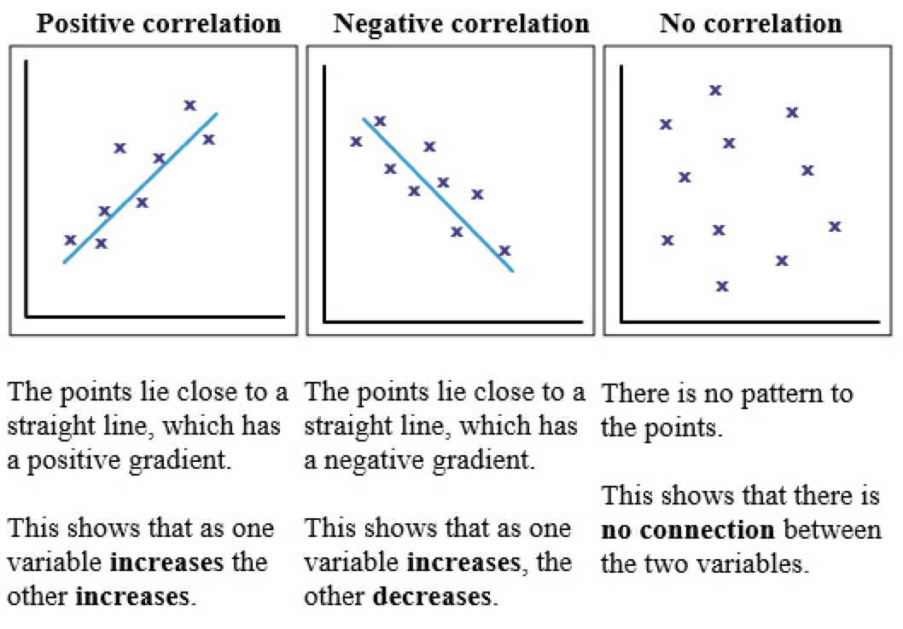

Выведем коэффициент корреляции

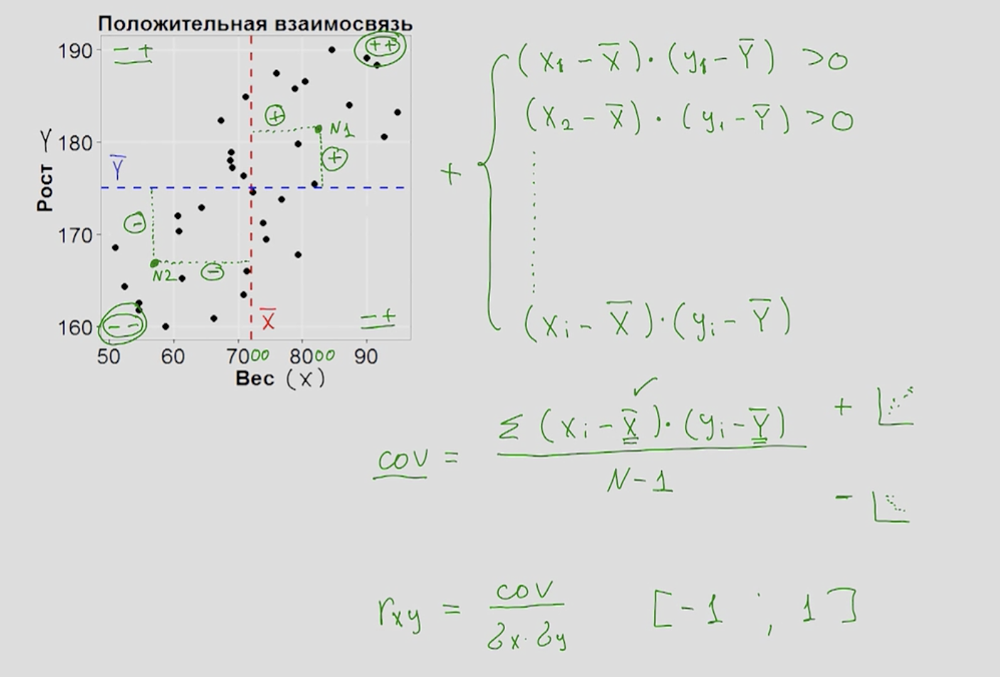

Чтобы получить коэффициент корреляции "как в учебниках" проделаем следующее

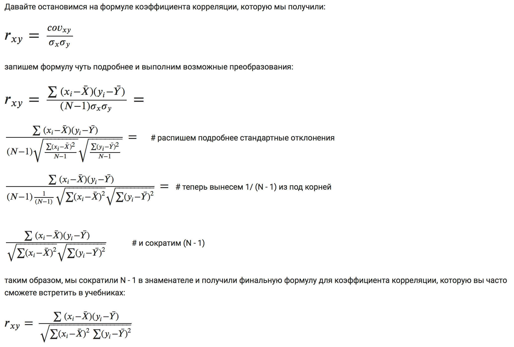

Cсылка на визуализацию использованную в этом уроке: <https://rpsychologist.com/d3/correlation/>

Крутая игра, в которой можно попробовать угадывать коэффициент корреляции <http://guessthecorrelation.com>

### Задача

Так как появилось две переменные, то для получения числа степеней свободы, нужно вычитать 2, а не один.

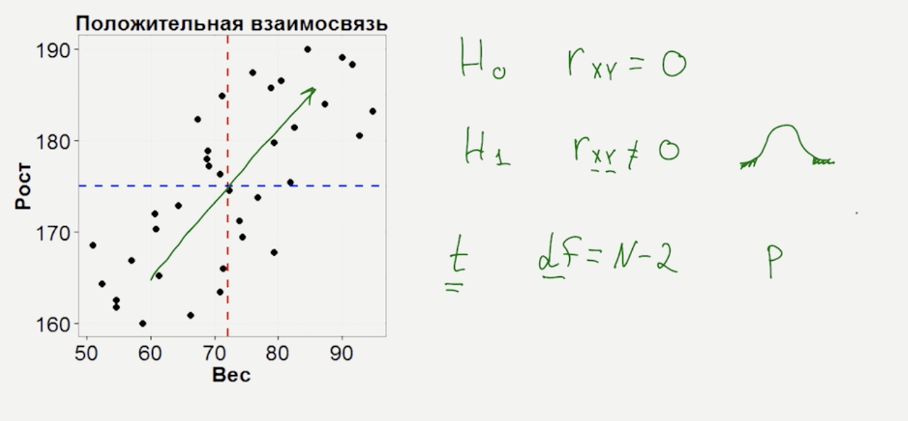

Но для визуализации мы возьмём тренировочные данные

```{r}
N <- 50
x <- rnorm(n = N, mean = 0, sd  = 1)
y <- rnorm(n = N, mean = 0, sd  = 1)
plot(x, y, lwd=5)
cor.test(x, y)
```

## Условие применения коэффициента корреляции

1. Характер взаимодействия --- линейный и монотонный. Более сложные зависимости не могут быть замечены этим коэффициентом


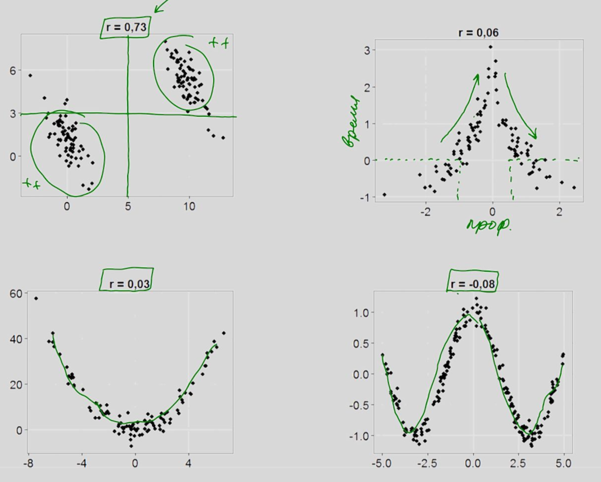

2. Характеристики переменных должны иметь нормальные распределения. Выбросы, ассиметрия, бимодальность --- критично влияет на коэффициент корреляции

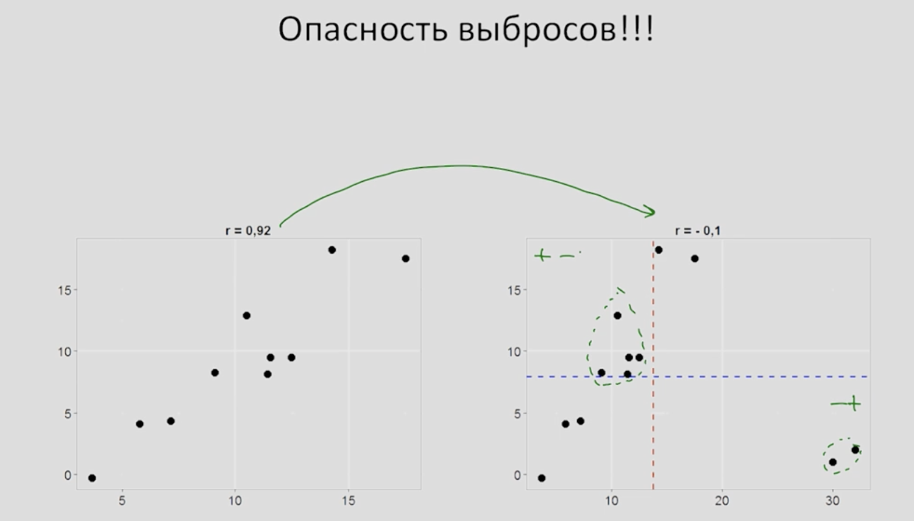

3. Перед тем как считать линейный коэффициент корреляции Пирсона необходимо строить диаграммы рассеивания


## Непараметрический коэффициенты корреляции

1. Спирмана

2. Кендалла

Суть --- переход от реальных значений к ранжированным.

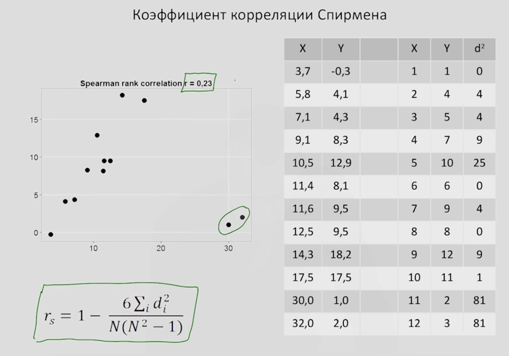

$d^2$ --- Разность рангов возведённая в квадрат

### Интерпретация

Ошибка корреляции --- наличие корреляции не обязательно означает причинно-следственную связь между переменными

Влияние третье переменной. Размер ноги школьника коррелирует со знанием математики. Но тут третья переменная --- возраст.

Показывает силу и направление.

Используем параметрический Пирсона --- если соблюдаются критерии нормальности, если нет переходи к непараметрическим Кендаллу или Спирману.

## Одномерный регрессионный анализ

Одномерным регрессионный анализ, позволяет проверять гипотезы о взаимосвязи одной  количественной зависимой переменной и нескольких независимых.

Сначала мы познакомимся с самым простым вариантом -  *простой линейной регрессией*, при помощи которой можно исследовать взаимосвязь *двух переменных*. Затем перейдем к множественной регрессии с несколькими независимыми переменными.


Базовое понятие --- линия регрессии

По игрику откладываем зависимую переменную. По иксу независимую переменную (предиктор).
Их суть --- как одна переменная позволяет предсказать, объяснить другую переменную.

Например, как зависит качество товара от его цены. Объект нашего интереса --- качество товара. А цена --- определяющий фактор.

Удобно изобразить линию --- линия проходила через самый центр рассеиваемых точек.

Каждая линия описывается формулой

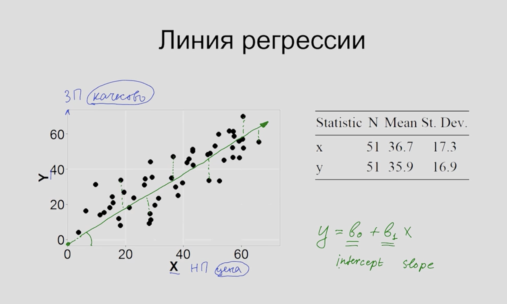


$b_0$ --- это свободный член, отвевчает за то где прямая линия пересекает ось `Y`

$b_1$ --- отвечает за направление, а так же за угол наклона которая прямая образует с осью `Х`

### Метод построения регрессионой прямой --- метод наименьших квадратов

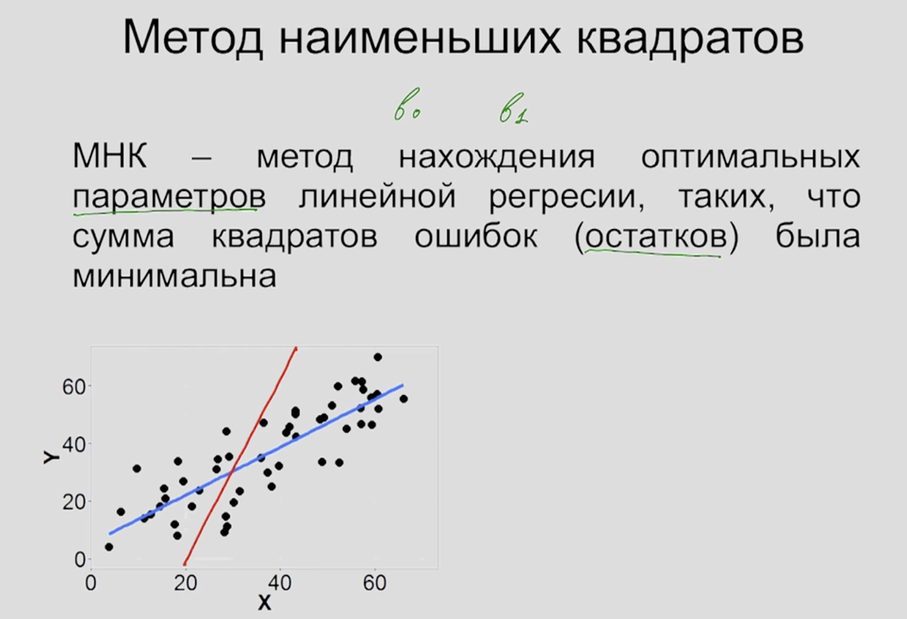

Предположим у нас есть две линии *красная* и *синяя* и обе спорят за то, кто является прямой регрессии.

Остаток --- это расстояние от реального значения минус значение которое предсказывает регрессионая прямая.

Качество регрессионной прямой можно оценить, если возвести разность в квадрат.

МНК позволяет подобрать такую прямую, которая максимально близко находились к точкам.

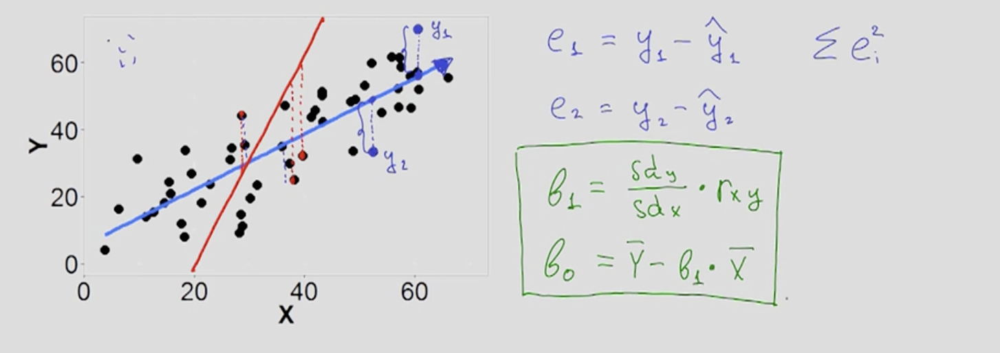

Если коэффициент корреляции равен нулю, т.е наши переменные никак не связаны, то коэффициент по приведённой выше формуле тоже $b_1$ равен нулю.

Тогда $b_0$ равен среднему по выборке. И чтобы проверять эту гипотезу, используется t-критерий.
Который говорит о том на сколько выборочное $b_1$ отклоняется от ожидаемого среднего. А так же проверяет гипотезу о том, что $b_1$ равен нулю

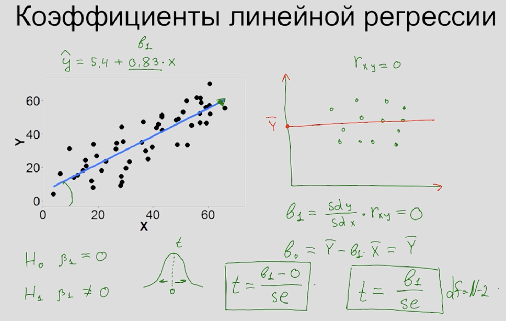

Отклонив нулевую гипотезу, о том что $b_1 = 0$ мы можем сделать следующий вывод: Обнаружена значимая взаимосвязь двух переменных

Таким образом регрессионная модель позволяет построить модель взаимосвязи двух количественных переменных , проверить гипотезу о наличии взаимосвязи, расчитав соответствующий p-уровень значимости.

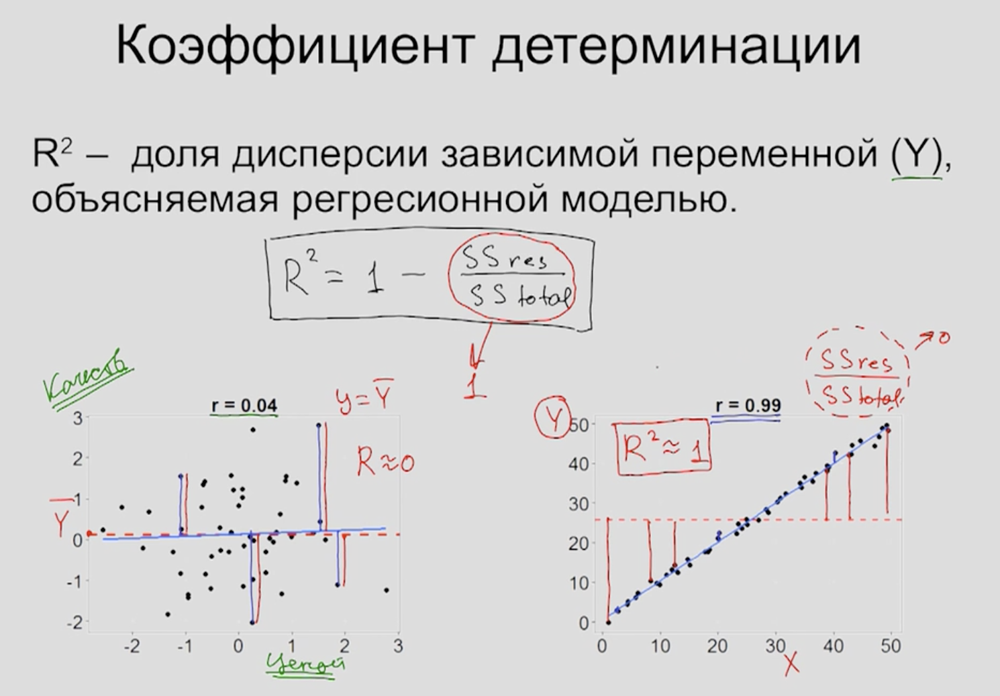

При отсутствии корреляции прямая регрессии очень близка к прямой среднего значения. И тогда коэффциент детерминации очень близок к нулю. 

Напротив, если Есть очень хорошая корреляция, то разость суммы квадратов до прямой регрессии будет меньше чем разность суммы квадратов до прямой среднего значения.

Чем больше коэффициент детерминации, тем большая часть дисперсии зависимой переменной обусловлена взаимосвязью с независимой переменной

Если коэффициент детерминации равен нулю, то и коэффициент b1 (slope) также равен нулю

### Основные требования к регрессионому анализу

Для двух параметров.

1. Линейная взаимосвязь 

2. Нормальное распределение остатков 

3. Гомоскедастичность --- постоянная изменчивость остатков на всех уровнях независимой переменной

Посмотреть можно на этом приложении <https://gallery.shinyapps.io/slr_diag/>


## Применение регрессионного анализа и интерпретация результатов

```{r}
library(tidyverse)
state <- read_csv("http://d396qusza40orc.cloudfront.net/statistics/lec_resources/states.csv")
```

metro_res --- какой процент живет в столичной области

white --- белокожий процент населения 

hs_grad --- процент людей имеющих среднее образование

poverty --- процент людей проживающих в бедности

female_house --- процент семей, где женщины домохозяйки


Итак, первая задача как взаимосвязаны бедность и уровень образования

```{r}
ggplot(state, aes(hs_grad, poverty)) + 
  geom_point() +
  labs(x = "Среднее образование, %",
       y = "Бедность, процент")
```

Прогядывается отрицательная связь.

Итак сформулируем гипотезы. В качестве зависимой переменной выступает прцоент бедности.
В качестве предиктора выступает процент среднего образования.

1. Необходимо построить регрессионнуюю модель. Для того чтобы это сделать нужно построить прямую по формуле

$$\hat{y} = b_0 + b_1x$$

Для этого нужно посчитать два коэффициента $b_0$ и $b_1$.

2. Нужно выяснить на сколько хорошо модель обхясняет поведение зависимой переменной. Для этого рассчитаем коэффициент детерминации $R^2$.

Тогда нулевая гипотеза 

$$H_0: b_1 = 0$$
3. Будем выполнять задачу предсказания. Как основываясь на данных независимой переменной, будем считать поведение зависимой переменной в дальнейшем


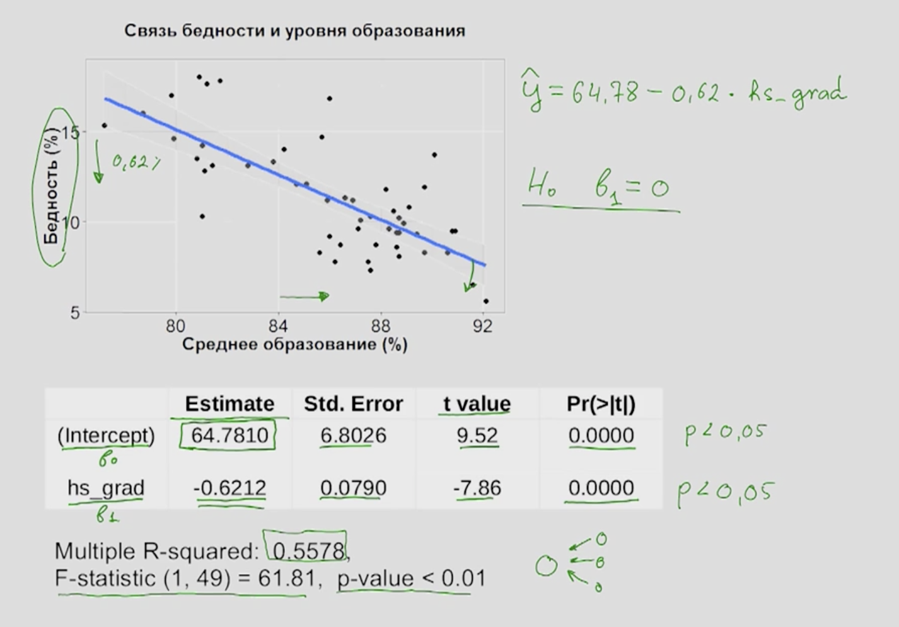

Подведём итоги.

1. Мы решили выяснить при помощи регриссионного анализа как между собой связаны две переменные. Процент бедности и среднее образование

2. Мы смогли посмотреть на сколько значима оказалась эта связь --- она оказалась отрицательна

3. Мы смогли построить линейную модель

4. Выяснить какой прцоент дисперсии обсулавливается взаимосвязью с другой переменной

5. На сколько мы будем ожиждать изменение уровня бедности с единичным изменением уровня образования

### Анализ остатков

Построим как остатки распредилилсь вокруг регрессионой прямой. В целом изменчиовость остатков на протяжении всего признака одинакова. То есть выполнено требование гомоскедостичности

Если построим распроеделение остатков, видим что в целом распределение нормальное, за исключением нескольких выбросов.

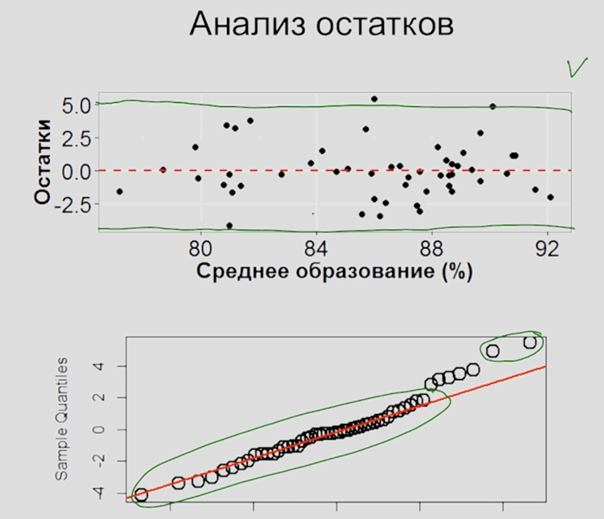

Это говорит о том что применение регрессионого анализа было обосновано.

### Задача предсказания значений зависимой переменной

Регрессионную прямую часто называют линией тренда.

У нас нет данных для точки в 95% среднего образования, но если бы она была, то мы могли бы предсказать какой уровень бедности бы соответствовал этой точке.

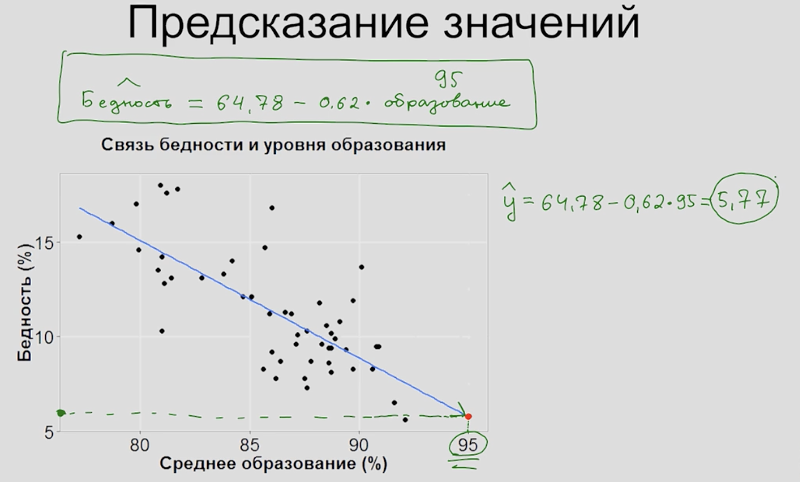

Задача предскозания сопряжена с некоторыми ограничениями

1. Бывает бессмысленные интерпретации например % населения не может быть меньше нуля

2. Бывает что связь не всегда линейна.


Линейная регрессия с одним предиктором.

```{r}
64.78 - (62*0.62)
```

## Регрессионный анализ с несколькими независимыми переменными

Множественная регрессия

В общем виде можно добавлять множество параметров чтобы оценить как влияет каждый

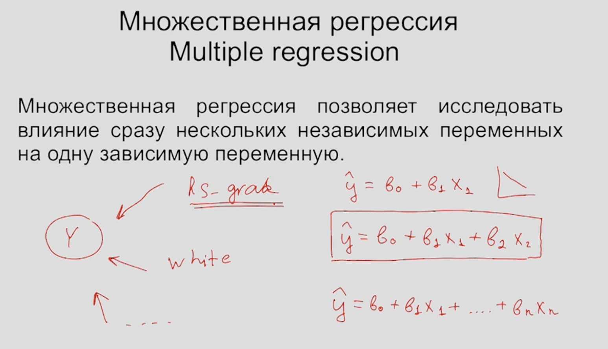

Допустим к уже имеющейся регрессии мы захотим посмотреть как влияет процент белого населения

Плоскость подбираем таким образом чтобы она была построена наиболее оптимальным пособом по отношению ко всем точкам.

```{r}
lm.out=lm(poverty~metro_res+white+hs_grad+female_house,data=state)
summary(lm.out)
```


Estimate --- коэффициенты.

Коэффициент 3.66  при независимой переменной cost (бюджет фильма) демонстрирует нам: Насколько изменяется ожидаемое значение кассовых сборов фильма при единичном изменении независимой переменной cost при условии, что все остальные независимые переменные не изменяются

```{r}
(150 - ((0.82*8) + 36.6 + 7.68)) / 7.62
```

## Выбор наилучшей модели

Мультиколлениарность --- наличие линейной зависимости между объясняющими переменными (факторами) регрессионной модели. 